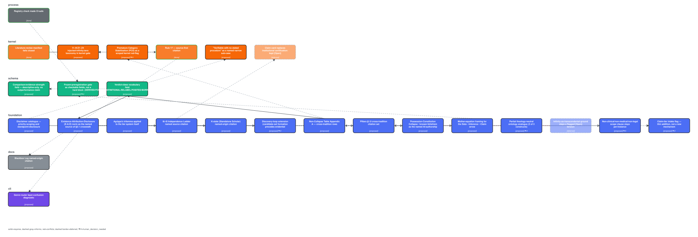
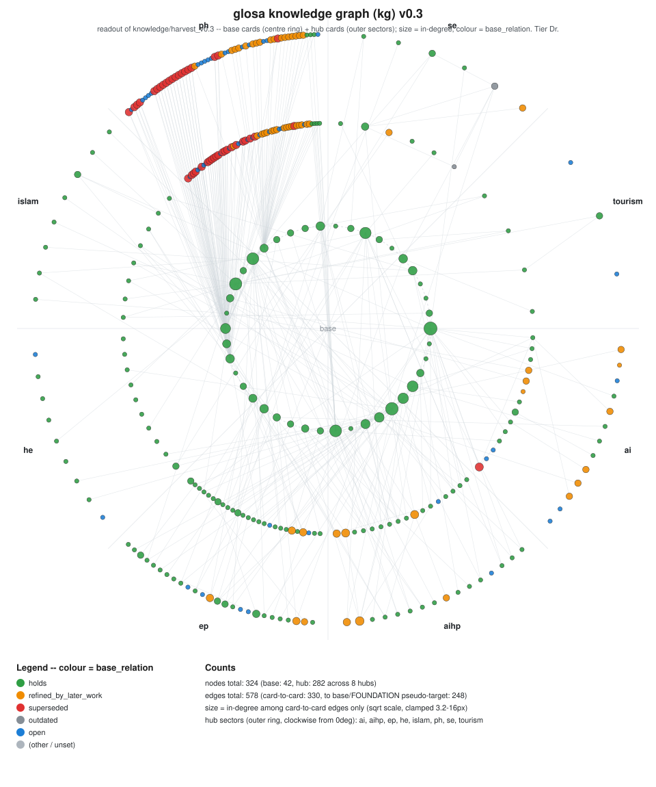

# glosa — ความเข้มงวดโดยไม่มีโครงสร้างค้ำ (Rigour Without Infrastructure)

> **สถานะ: K0 — เผยแพร่สาธารณะเป็นฉบับทำงาน (timestamped, อ้างอิงได้, ยังไม่ผ่าน peer review, ยังไม่มีการตรวจสอบอิสระ)** (tier: Dr) · v0.4.0 · ทุกอย่างในนี้คือ readout ไม่ใช่ความจริงสุดท้าย

**glosa** (สเปนยุคกลาง: "คำอธิบายข้างขอบ" ที่นักปราชญ์เขียนแนบตัวบท) คือระเบียบวิธีสำหรับคนที่ไม่มีมหาวิทยาลัย ไม่มีแล็บ ไม่มีทีมวิจัย ที่จะผลิตความรู้จากพื้นที่ของตนเองร่วมกับ AI อย่างเข้มงวด โดยทุกข้ออ้างต้องตอบย้อนกลับได้ว่า **เราเห็นอะไรจริง · ข้อมูลแยกอะไรได้ · AI เติมอะไร · สมมติอะไรไว้ · เคยเจอหลักฐานหรือคำคัดค้านอิสระหรือยัง**

งานนี้ตอบแค่ 3 คำถาม: **แก้ปัญหาอะไร · ด้วยวิธีไหน · เพื่อนบ้านใกล้เคียงทำเหมือนหรือต่างอย่างไร** เราไม่อ้างความใหม่ ไม่แข่งกับอำนาจความรู้ และบอกไว้ว่าอะไรจะทำให้เราผิด

## Install (ติดตั้ง — one line, no ssh, no root)
```bash
curl -fsSL https://raw.githubusercontent.com/morrocwi/glosa/main/install.sh | bash
```
Then `glosa doctor` · Claude Code: `claude plugin marketplace add morrocwi/glosa` + `claude plugin install glosa@yaoharee-lahtee-glosa` (new session) · other AIs: `plugins/glosa/PROMPT_PACKET.md` · full guide: `INSTALL.md`.

## เริ่มอ่านที่ไหน
- มนุษย์: `design/FOUNDATION_v0.6.md` (รากฐานทั้งระบบ — สเปกเดียวที่ใช้งานจริง ดู `design/CURRENT_SPEC.txt`) → `templates/knowledge/blackbox_note.yaml` (บันทึกกล่องดำ: เสียงดิบ + การปรุง) → `templates/paper/` (LaTeX arXiv 1/2 คอลัมน์ compile แล้ว)
- AI ทุกยี่ห้อ: `AGENTS.md` / `CLAUDE.md` / `GEMINI.md` (บล็อกเดียวกัน) และ `llms.txt`

## หาคำสั่งได้จากไหน (CLI discoverability)
ทุกคำสั่งที่ใช้งานได้จริงอยู่ในที่เดียว ไม่ต้องเดา: รายการเต็มอยู่ที่ `cli/README.md`, และ
`./cli/glosa --help` คือแหล่งความจริงที่เป็นปัจจุบันที่สุด (README อาจตกยุคได้ แต่ `--help` อ่านจากโค้ดตรง ๆ).
ตัวอย่างเริ่มต้น: `./cli/glosa intake new --project <name> --human-owner <you>`.

## ผู้ทำ
แนวคิดและทิศทาง: Yaoharee Lahtee (มนุษย์ ผู้รับผิดชอบ) · AI ช่วยสำรวจ ร่าง จัดโครง และตรวจฝ่ายค้าน (ดู `blackbox/`) — AI ไม่ใช่ผู้เขียน

## สัญญาอนุญาต
CC BY 4.0 ทั้ง repository (`LICENSE`)

---

## English (rewritten, not translated)

**glosa** is a methodology for people with no university, lab, or research team to co-produce
rigorous knowledge with AI from their own ground. Every claim must answer five questions (what was
actually seen · what the data separates · what the AI filled in · what was assumed · whether it
has met independent evidence or objection), bound to the Readout Condition (existence /
attribution / disclosure of every distinction). The work answers three questions only — which
problem, by which method, how the nearest neighbours do it the same or differently — and makes no
priority claim. Status: K0 public working release (timestamped, citable, not peer reviewed, no
independent check), tier Dr. Canonical spec pair (named in `design/CURRENT_SPEC.txt`):
`design/FOUNDATION_v0.6.md` + `design/REPO_SPEC_v0.6.md`.

### The spine, with the pre-readout layer

A problematic state exists in the world **before** any knower acts on it. "Observation" is not the
starting node — it is the first *verb* a knower performs on that pre-existing state. The spine's
own head (FOUNDATION §2.1a) makes that layer explicit:

```
Problem state (unread, pre-subjective — no record exists of it yet)
        │
        ▼
First human readout (the Blackbox Note's raw line — verbatim, untranslated; this IS
        │  "observation" as a verb, not a noun)
        ▼
Human-language question (question_human)
        │  [lens-in: Lens Law]
        ▼
Hypothesis (lens-out, signed — hypothesis_world.signature)
        │
        ▼
Evidence (five_questions.tested) → claim card (tiered, disclaimed, gated)
        │
        ▼
Genre route → rigorous method (tiers, maker/checker/approver, independent-check ladder,
disclaimers, gates) → paper (genre-routed)
        │
        ▼
Zenodo + GitHub (K1 once a real I3 cross-vendor check has run)
```

LRS (literature review) and hypothesis selection are named stages of this spine itself, not an
appendage — full detail in FOUNDATION §7.9 and `design/S14_literature-review-system.md`. The raw
voice box is the **Blackbox Note (บันทึกกล่องดำ)**: raw verbatim lines, never edited in place, plus
an append-only cooking log of every later transformation.

### Install — one line, Claude Code, and other AIs

```bash
curl -fsSL https://raw.githubusercontent.com/morrocwi/glosa/main/install.sh | bash
```
- **Claude Code:** `claude plugin marketplace add morrocwi/glosa` then
  `claude plugin install glosa@yaoharee-lahtee-glosa` (open a new session, then `/glosa`).
- **Other AIs** (Codex, Gemini, ChatGPT, local models): hand the AI
  `plugins/glosa/PROMPT_PACKET.md` — the vendor-neutral equivalent of every skill; the gate files
  (`CLAUDE.md` = `AGENTS.md` = `GEMINI.md`) are identical for every vendor. MCP clients point at
  `mcp/glosa_mcp_server.py`. Full guide, troubleshooting table, and what the install test
  guarantees: `INSTALL.md`.

### CLI discoverability

Every real command lives in one place — no guessing which doc is current: the full list is at
`cli/README.md`, and `./cli/glosa --help` is the up-to-date source of truth (it reads the live
argparse dispatch, so it cannot go stale the way prose can). Starting example:
`./cli/glosa intake new --project <name> --human-owner <you>`.

### What a run produces

A completed pass through the spine produces, per project (`registry/RESEARCH_REGISTRY.yaml`
tracks each one's `spine_stage`): a problem card, a Blackbox Note (raw lines + cooking log), a
signed hypothesis, a literature-review manifest (citation cards, each rule-17 source-first
verified), one or more claim cards (five-questions, tiered, schema-validated by
`kernel/glosa_kernel.py`, disclaimer-computed), independent-check route packets and their
`review_report.yaml` verdicts (I0–I5 ladder), and a genre-routed paper draft with a mandatory
Blackbox Note appendix. Nothing in that chain is released without a distinct maker, checker, and
approver (§7.2) and a passing publish gate (R1–R7, leak scan included).

### The improvement DAG



**Legend (6 lines):**
1. Each box is one DAG node (`design/DAG_v0.3.yaml`, prose in `design/DAG_v0.3.md`) — a proposed
   or already-shipped change to FOUNDATION, the schema, or the kernel.
2. **Border color/opacity — status:** solid green (opacity 0.85) = `done` (already shipped,
   3 nodes) · solid black (opacity 1) = `proposed` (21 nodes) · dashed grey (opacity 0.55) =
   `deferred` (2 nodes, kept `[Open]`, no build this pass).
3. **`⚑H` badge** = `human_decision_needed: true` — a founder-decision node (6 of the 26: the PCS
   red-flag, the per-instance scope clause, the LRS claim-tier intake flag, the verdict-class
   prereg gate, the partial theology-neutral ontology analogue, the LRS discovery-loop extension).
   None of these six is built until the founder rules on it (`EPIS-KNOWLEDGE-VALIDATION` — the
   founder is the internal decision owner, never an outside validator).
4. **Edge style:** solid = requires (a hard build-order dependency) · dashed grey = informs
   (citation/terminology dependency only) · red = conflicts.
5. A node's status here is the DAG's own field, kept current by `design/DAG_v0.3.yaml`, not
   re-derived from prose — regenerate with `docs/gen_dag_svg.py`.
6. This DAG diagram is a readout of `design/DAG_v0.3.yaml` at the time it was rendered, not a
   live view — check the `.yaml` file directly for anything more recent than this SVG's own
   render date.

### The knowledge graph



324 knowledge-card nodes, 578 edges (`docs/kg_v0.3.json`, rendered by `docs/gen_kg_svg.py`;
`svg_bytes: 133722`) — built from every `kc-*.yaml` card under `knowledge/harvest_v0.3/`
(`ai/aihp/base/ep/he/islam/ph/se/tourism`, 324 cards total) and its `base_relation`/`glosa_use`
judgment against the DAG. Full, generated, one-row-per-card table (never hand-edited): flat index
`knowledge/harvest_v0.3/INDEX.md`; narrative discussion per hub:
`knowledge/harvest_v0.3/KNOWLEDGE_STATUS_v0.3.md`.

### Documents of record

- **Repository DOI (this release):** 10.5281/zenodo.22334376 (concept DOI
  10.5281/zenodo.22301059).
- **Concept paper (v0.2.0):** 10.5281/zenodo.22307841 — English, arXiv two-column; source
  `paper/glosa-concept-paper/main.tex`; claims `projects/GLS-2026-001_rigour-without-infrastructure/claims/`;
  literature review `records/lit/rigour-without-infrastructure/` (48 VERIFIED citation cards);
  nine cross-vendor review reports in
  `projects/GLS-2026-001_rigour-without-infrastructure/reviews/`.
- **Blackbox Log** (ปูมกล่องดำ, founder voice only, Thai): concept DOI 10.5281/zenodo.22302518 ·
  local `blackbox/log/`.
- **Series hub — "When AI Expands Human Potential":** 10.5281/zenodo.22308201 (this release and
  the concept paper are both listed members of that hub; the hub is a cluster pointer, not a
  claim about this release's own standing).
- Earlier design-science draft (v0.1.0, superseded): `dist/glosa-paper-0.1.0-en.pdf` /
  `-th.pdf`, source `paper/main_en.md` / `main_th.md` — kept for lineage.
- Installable skills: `plugins/glosa/skills/` (Claude plugin), `mcp/glosa_mcp_server.py` (MCP),
  `cli/glosa` (CLI). Toolchain list: `TOOLCHAIN.md`.

### K-state and registry status

**K0** — the three claim cards behind the concept paper were reviewed by cross-vendor routes (I3)
and revised; a fresh, independent (I2+) check has **not** run on this v0.4.0 pass itself (no
kernel-closure rule, no pending-founder text block, no DAG-citation addition here has been
independently checked yet — same-model self-review does not count, per this repo's own
maker-checker discipline). K1 requires a real cross-vendor I3 check to run and pass; K2 requires
I5. `registry/RESEARCH_REGISTRY.yaml`'s `GLS-2026-001` entry currently reads `spine_stage:
released`, `k_state: K0` — read that file directly for anything more current than this line.

### What changed in 0.3.0

- **FOUNDATION_v0.6.md / REPO_SPEC_v0.6.md** assembled from v0.5 plus every `ready` section of
  `design/FOUNDATION_v0.6_PATCH.md` / `design/REPO_SPEC_v0.6_PATCH.md`; `design/CURRENT_SPEC.txt`
  now names this pair.
- **Rules 18–28, shipped this pass:** rule 18 (injected-infinity/zero taxonomy, typed I1–I4/Z1–Z4),
  rule 19 (Fail-Able Gate Law, Type-P/Type-U), rule 20 (rejects the forbidden-word list on the new
  `comparison` field), rule 21 (genre/register layer-confusion diagnostic, warning-only), rule 23
  (verdict-class six-value enum, schema-only), rule 26 (composite-quote detector), rule 27
  (hidden-AI-fill detector), rule 28 (inflated-bearing detector) — rules 26 and 28 close two of the three K4 sim-report defect classes (composite_quote, inflated_bearing: 9/9 on the tracked corpus); rule 27 (hidden_ai_fill) fires only when a card declares five_questions.seen.ai_assisted_fields — the tracked corpus fixture predates that marker, so the current sim still reports 0/9 for it (open S4b item) that survived
  the two ship-recommended S4 prototypes.
- **Rules 22, 24, 25 — pending-founder, specified not built:** rule 22 (LRS claim-tier intake
  flag), rule 24 (Premature Category Stabilization red-flag), rule 25 (LRS discovery-routing gate)
  carry `TODO(<dag-node-id>)` markers — rule 24 in `kernel/glosa_kernel.py`, rules 22 and 25 in `schema/litreview_manifest.schema.json` (`$comment`) — pointing at their DAG node
  — none is committed to `DECISIONS.yaml` or built until the founder rules on it.
- **Sim regression:** the S4 prototype harness and its 180-card fixed synthetic corpus moved from
  `sim/v0.3/` into the tracked test suite (`tests/sim/`) and now runs under CI as
  `tests/test_sim_regression.py` — it asserts the current kernel does not regress below the
  last-recorded `tests/sim/baseline.json` numbers on that one fixed corpus. Tier of every number
  in that corpus's report: `finite_diagnostic`, scoped to this one fixed 180-card corpus, this
  run — never a general kernel-quality claim.
- **I3 route:** two corrections were caught by a cross-vendor review response and folded back into
  `design/FOUNDATION_v0.6_PATCH.md` before this pass shipped — rule 18's scan was corrected from a
  mis-scoped extension of an unrelated existing scan into its own standalone rule, and its taxonomy
  was corrected from an invented vocabulary to `kc-base-016`'s real, verbatim taxonomy, cited
  correctly.
- Appendix A gains Family J (`NC-74`..`NC-76`; 76 rows across nine families, up from 73/eight).

### Limits

No independent (I2+) check has run on this synthesis pass, on the three kernel-closure rules
(26–28), or on the six pending-founder recommended-text blocks — every one of them is K0/Dr,
single-pass, same-model. A held-out, differently-worded fixture batch (`tests/sim/corpus_v2/`,
planned, not built) is required before several acceptance tests — the layer-confusion diagnostic
(§6), the verdict-class literal enum test, the discovery-routing precision/recall comparison — can
be honestly re-run past their current same-lexicon self-tests. `scripts/check_leak.sh` and
`scripts/check_forbidden_words.sh` both still exit non-zero against the pre-existing corpus; this
pass did not touch either script. The layer-confusion diagnostic (rule 21) is a keyword/marker
match calibrated against one synthetic corpus's own generator vocabulary and is expected to
under-generalize to differently-worded real cards until a held-out batch says otherwise. See
`CHANGELOG.md`'s `0.3.0` entry for the complete, unabridged list.
