# Ecosystem map — the Human-AI Readout Programme

This is a readout of the programme's repositories as they stood on 2026-09-07, not a
declaration of how they must stay. Every interface claim below cites the file that defines
it (path relative to its own repo) plus that repo's public URL where the repo is public.
Private repos are named with their fixed role only — their internals are not described here.

## 1. The map in one screen

**Roles and sources of record** (fixed by founder ruling — Toledo `EQUATION_SOURCE_POLICY.md`,
glosa's role-fixing rulings, and the corresponding rulings ledger entry):

| Role | Held by | Public? |
|---|---|---|
| Equation source of record + lookup gate (MCP/static API/CLI) | **Toledo** (`github.com/morrocwi/toledo`) | yes |
| Mathematical floor (readout-first number ladder, Coq) | **information-discrete-math (IDM)** (`github.com/morrocwi/information-discrete-math`) | yes |
| Ontology | **readout_genesis** (`github.com/morrocwi/readout_genesis`) | yes |
| Epistemology | **readout_universe** (`github.com/morrocwi/readout_universe`) | yes |
| Method + human-AI/collaboration lens | **glosa** (`github.com/morrocwi/glosa`, this repo) | yes |
| Record (assembled, deposited book-length artifacts) | a **textbook artifact** built inside the private research workspace (no dedicated public repo of its own was found — see gap 7) | mixed |
| Deposits | **Zenodo** (external deposit service, not a repo in this workspace) | external |
| Command center (governance, coordination, operations) | **command center (private)** | private |

Everything else in the inventory is a downstream product, a method-family sibling, or a
research/paper repo that consumes one or more of the above roles without itself being a
fixed role.

### Diagram — repositories and who calls/cites whom

```mermaid
flowchart TB
    subgraph ROLES["Fixed roles"]
        TOLEDO["Toledo (public)<br/>equation source of record<br/>+ MCP / static API / CLI gate"]
        IDM["information-discrete-math (public)<br/>math floor"]
        RG["readout_genesis (public)<br/>ontology"]
        RU["readout_universe (public)<br/>epistemology"]
        GLOSA["glosa (public)<br/>method / human-AI lens"]
        TEXTBOOK["textbook artifact<br/>(record; assembled inside a<br/>private research workspace)"]
    end

    ZRC["zero-readout-certifies (public)<br/>Coq companion to IDM"]
    ZENODO[["Zenodo<br/>(external deposit service)"]]

    subgraph PRIVATE["Private components (name + role only)"]
        CMDC["command center (private)"]
        CPGRJ["cpg_research_journal — research journal"]
        SALAMXP["salamxp — ops/documentation workspace"]
        SOLVER["solver arc (private) — equation-derivation repository"]
    end

    subgraph SIBLINGS["Method-family siblings and downstream products (public)"]
        SKILLME["skillme"]
        BIRCA["birca"]
        PURAG["the RAG product (private)"]
        RETPHE["RE_T-PHE"]
    end

    TOLEDO -.->|"policy fixes this as the ontology lens"| RG
    TOLEDO -.->|"policy fixes this as the epistemology lens"| RU
    TOLEDO -.->|"policy fixes this as the method/collaboration lens"| GLOSA
    GLOSA -->|"equation_registry_row.schema.json referenced by"| TOLEDO
    TOLEDO -.->|"independently re-implements the Resistance Ladder rung logic (compute_resistance.py), no shared import"| GLOSA
    ZRC -->|"keystone Coq result cited from"| IDM
    RU -->|"imports a descriptive, non-authoritative equation-stream copy from"| SOLVER
    BIRCA -->|"vendors a pinned commit of"| RG
    BIRCA -->|"vendors code (compute/birca_math) from"| SOLVER
    CPGRJ -->|"tracks / assesses as a research artifact"| GLOSA
    PURAG -.->|"documents as an example integration point"| CMDC
    SKILLME -.->|"self-describes as built on the same readout-first foundation as (doc reference, not a code dependency)"| IDM
    SKILLME -.->|"self-describes as built on the same readout-first foundation as (doc reference, not a code dependency)"| RG
    TEXTBOOK -->|"cites codes from"| TOLEDO
    TEXTBOOK -->|"deposited to"| ZENODO
    GLOSA -->|"claim card / release manifest feeds"| ZENODO
    ZRC -->|"deposited to"| ZENODO
    RETPHE -.->|"deposits independently; no role-chain link found"| ZENODO
    SALAMXP -.->|"shares one WordPress control-surface file verbatim with a sibling private site workspace (see gap 10)"| CMDC
```

Dotted edges are policy/documentation references rather than a running call; solid edges are
a file dependency, an import, or a vendoring relationship found in the repos themselves.

## 2. Interfaces

### 2a. Public interfaces (every one found)

Contract and consumer text is condensed from each repo's own files. "coding-agent" below
means an AI coding-agent host in general — no vendor or model is named, consistent with the
publish rule for this document.

| Repo | Kind | Name | Entry | Contract (condensed) | Consumers (condensed) |
|---|---|---|---|---|---|
| toledo | mcp_server | toledo (stdio, 19 tools) | — | Search/get/status/check/lineage/ancestors/descendants/neighbours/by-root/by-domain/by-record/by-raw-key/lineage-window/counts/index-status/show-verdict-rules/register-proposal/list-proposals/proposal-status over the registry; read-only except —, which drops a review file for a human registrar and never edits the registry itself. | Any coding-agent session in this or a dependent repo; the command center (private) and other repos under the equation-source policy |
| toledo | cli | toledo (mcp-package CLI) | `mcp/toledo_mcp/cli.py` | find/show/ancestry/descendants/neighbours/by-root/by-domain/by-record/export plus verdict-aware check/status/proposals/index-status/show-verdict-rules, from the cached/indexed layer. | Operators; CI (`toledo-mcp-ci` build-index job) |
| toledo | cli | scripts/toledo (registry-owning CLI) | `scripts/toledo` | find/show/ancestry/descendants/neighbours/by-root/by-domain/by-record/export read from the generated `registry/TOLEDO.json` + `graph/toledo_graph.json`, never `registry/CANONICAL.json` directly; separate tool from the mcp-package's own `toledo` CLI of the same name. | Registry maintainers; `make build`/`make test`/`make verify` |
| toledo | build_script | toledo_build.py | `scripts/toledo_build.py` | `registry/CANONICAL.json` + `registry/genesis_root.json` → `registry/TOLEDO.json`, `registry/entries/*.json`, `vault/*.md`, `site/*.html`, `graph/toledo_graph.json`/`.graphml`/`.ttl`, `registry/EQ_LIBRARY.md`, `latex/catalogue.pdf`. | `scripts/toledo` CLI; site docs; test suite; CI |
| toledo | static_http_api | Toledo static read API | `mcp/toledo_mcp/export_static.py`, published at `https://morrocwi.github.io/toledo/`, contract in `mcp/docs/STATIC_API.md` | HTTP GET on `manifest.json`, `search-index.json`, `counts.json`, `verdict-rules.json`, `resistance-summary.json`, `entries/`, `by-root/`, `by-domain/`; rebuilt on every push touching `mcp/**` or `registry/**`. | Any external caller without MCP access; the human-facing site build |
| toledo | ci_workflow | toledo-mcp-ci | `.github/workflows/toledo-mcp-ci.yml` | test / leak-scan / build-index / export-static+build-site → assemble-pages → deploy-pages, scoped to `mcp/` and `site/` only. | `morrocwi.github.io/toledo` |
| toledo | data_contract | registry/CANONICAL.json + LINEAGE.jsonl | `registry/CANONICAL.json`, `registry/genesis_root.json`, `registry/LINEAGE.jsonl`, `registry/SCHEMA.md` | One entry per coded equation reading with status/origin/parents/children/coq_status; lineage log is append-only (assigned/revised/retired/merged/split/occurrence_added). Hand/tool-maintained; the single source every downstream surface is generated from. | `scripts/toledo_build.py`; downstream repos citing Toledo codes |
| toledo | policy_document | Toledo Equation Source Policy | — | Fixes Toledo as the sole authoritative source for existing equations/definitions/derivations; fixes ontology → readout_genesis, epistemology → readout_universe, human-AI/collaboration → glosa; an entry backed by the private solver repository is written as "solver arc (private)", never named. | Every repo doing equation work, including the command center (private) |
| glosa | mcp_server | glosa MCP server | — | Stdio JSON-RPC 2.0 server, protocol version 2025-06-18, 12 tools (—, —, —, —, —, —, —, —, —, —, —, —, —); state-changing tools require caller_role/caller_identity and reject on maker/checker/approver id mismatch; every call is logged to —. | Coding-agent hosts via stdio spawn; the command center (private) as an orchestrating client |
| glosa | cli | glosa CLI | `cli/glosa` | intake/session/claim/review/readiness/release-gate/defeater/genre/cite/ces/ret/lit/kg/advise/schema/self-test/demo subcommands, each printing one JSON object and logging to `./logbook.jsonl`. No network calls. | Researchers/founder; `install.sh`; CI |
| glosa | python_package_api | glosa kernel | `kernel/glosa_kernel.py` | Schema validation, maker/checker/approver separation (`mc01_check`), claim-card validation (~30 rule checks), review-report validation, release gating, disclaimer computation, genre routing, defeater routing, independence-ceiling and silent-lift checks, lit-review gate logic. | `cli/glosa`; `mcp/glosa_mcp_server.py`; test suite |
| glosa | plugin | glosa marketplace + plugin | plugin-marketplace manifest and plugin manifest (`.claude-plugin/marketplace.json`, `plugins/glosa/.claude-plugin/plugin.json`) | Marketplace entry publishing one plugin bundling 10 skill files teaching the method (claim cards, Blackbox Note discipline, an independent-check ladder, literature review, publish gate, project advisor) to a coding-agent session. | Coding-agent sessions that install the marketplace/plugin |
| glosa | schema | glosa schema set | `schema/*.schema.json` (20 schemas) | JSON Schema for every artifact type the method produces/consumes (claim cards, review reports, citation cards, blackbox notes, release manifests, knowledge-graph nodes/edges, literature-review manifests, etc.), each with a passing and a failing example. | `kernel/glosa_kernel.py`; `cli/glosa`; Toledo (`equation_registry_row.schema.json`) |
| glosa | ci_workflow | glosa CI | `.github/workflows/ci.yml` | Repo-consistency, version-consistency, forbidden-words scan, leak scan, unit tests + regression, findings-completeness gate, schema validation, a fail-closed guard with the optional schema validator uninstalled, optional paper build. Documented as not itself a release certification. | GitHub Actions on this repo |
| glosa | ci_workflow | glosa install-test | `.github/workflows/install-test.yml` | Verifies the installer works from a fresh clone with no elevated access, then runs `glosa doctor` and `glosa demo`. | GitHub Actions on this repo |
| glosa | cli_installer | install.sh | `install.sh` | HTTPS-only installer, no elevated access required, installs a `glosa` launcher locally. | End users; install-test CI |
| glosa | data_contract | logbook.jsonl | `logbook.jsonl`, `mcp/logbook.jsonl` | Append-only ledger of every CLI/MCP call (success, refusal, error). | Human auditors; the reproduction-ledger review process |
| glosa | knowledge_graph_data_contract | kg/ nodes+edges | `kg/` (generated), `schema/kg_node.schema.json`, `schema/kg_edge.schema.json` | Generated-only `kg/nodes.jsonl` / `kg/edges.jsonl` produced by `glosa kg merge`, checked by `glosa kg validate` for schema conformance and cycle-freedom. | `docs/gen_kg_svg.py`; harvested knowledge cards |
| information-discrete-math | python-package-api | idm facade | `idm/__init__.py` | `idm.solve(...)` returns a typed result/verdict tagged with a tier (Th_coqc / exact / finite_diagnostic / an ℝ-Open marker); re-exports parse/describe/schema/example and per-domain helpers. | `idm.server`; `idm.__main__`; `idm.ai`; test/verification scripts; external installers |
| information-discrete-math | http-api | idm.server REST API | `idm/server.py` | Zero-dependency stdlib HTTP server exposing `/health`, `/`, `/docs`, `/openapi.json`, `/kinds`, `POST /solve`, `POST /parse`; console script `idm-serve`. | External HTTP clients |
| information-discrete-math | cli | idm CLI | `idm/__main__.py` | `idm list/kinds/describe/example`, console script `idm`. | Developers/CI; users exploring the registry |
| information-discrete-math | ai-gateway | idm.ai (AI Gateway) | `idm/ai.py` | `idm.ai.run(op, **kwargs)` routes a reduced set of operation names to the underlying solve registry, with structured errors and suggestions on an unknown op. | Small/model callers wanting a reduced surface; the benchmark harness |
| information-discrete-math | data-contract | capabilities.json | `capabilities.json` | Static manifest of interfaces and domain→kind groupings across the solver registry. | Documentation generators; external tooling |
| information-discrete-math | plugin/skill | information-discrete-math skill | plugin manifest (`plugins/information-discrete-math/.claude-plugin/plugin.json`), `.../skills/information-discrete-math/SKILL.md` | Loads before math/physics/geometry work; a contaminated-concept → discrete-replacement table and pre-write checklist tied to the discrete number ladder. | Coding-agent sessions that install it |
| information-discrete-math | ci-workflow | verify (ci.yml) | `.github/workflows/ci.yml` | Runs the proof/verification scripts, tool self-checks, validation suite, pytest, and an install job that verifies a built wheel imports standalone. | Repo maintainers/CI |
| information-discrete-math | formal-verification | formal/ Coq theorem set | `formal/IDM_*.v` | Axiom-free proofs backing the Th_coqc tier of the number ladder and solver kinds. | Tier assignment in `idm.solve`; the CLI's `describe` output; the plugin/skill |
| readout_genesis | ci-workflow | Biology Translation v0.2 gate | `.github/workflows/biology-translation-v0-2.yml` | Runs the domain's own test script on changes to that domain path. | Contributors to that domain |
| readout_genesis | ci-workflow | Order Vacuum Threshold Closure gate | `.github/workflows/order-vacuum-threshold-closure.yml` | Runs a threshold-report script then a regression test script, uploading the JSON report as a CI artifact. | Contributors to the standard_model domain |
| readout_genesis | ci-workflow | Primitive Branch Parameter Reduction gate | `.github/workflows/primitive-branch-parameter-reduction.yml` | Runs a fixture script then a regression test script. | Contributors to the standard_model domain |
| readout_genesis | data-contract | Domain claim/drift registry files | `domains/*/CLAIM_BOUNDARY.json`, `.../DRIFT_CONTRACT.json`, `.../RULE_REGISTRY.json`, `.../CLOSURE_AUDIT.json` | Per-domain JSON ledgers of claim tier, drift contract, active rules, closure-audit status. | Anyone citing a domain's closure percentage — re-read the file, don't cite from memory |
| readout_genesis | verification-scripts | Root-level cross-domain gates | `scripts/*.py` | Standalone exact-rational scripts checking cross-domain structural properties; run manually. | Maintainers verifying cross-domain consistency before a release |
| readout_universe | plugin/skill | readout-universe skill | plugin manifest (`plugins/readout-universe/.claude-plugin/plugin.json`), `.../skills/readout-universe/SKILL.md` | Loads before stating a claim's evidentiary status; tags it with a tier label (Th_coqc, finite_diagnostic, Dr, Open, fit_calibrated, definition). | Coding-agent sessions that install it; other repos referencing the tier discipline |
| readout_universe | cli | native_logic proof kernel CLI | `native_logic/kernel.py` | Takes a Claim IR JSON file, produces a JSON proof object (own Verdict vocabulary). | `omega` package via a bridge; test suite; CI |
| readout_universe | python-package-api | omega (translation protocol runner) | `omega/__init__.py`, `omega/run.py`, `omega/gates.py`, `omega/claim_ir.py`, `omega/schemas.py` | Runs an Issue through an extraction protocol, honestly recording any of its declared gates that are not yet implemented rather than fabricating a result. | The native_logic bridge; test suite; CI |
| readout_universe | schema/data-contract | Gate typing law + declarations | `gates/GATE_DECLARATIONS.txt`, `scripts/check_gate_typing.py`, `docs/GATE_TYPING_LAW.md` | Enforces that a valid gate declares both a genuine negative control and a genuine positive control. | CI; self-test |
| readout_universe | ci-workflow | verify workflow | `.github/workflows/verify.yml` | 7 checks: a logic-proof battery, a Coq file compile, an evidence Coq chain, a pytest suite, gate-typing self-test and law check, translation/native-logic tests; pinned Coq version, fails loudly on drift. | README status badge; maintainers |
| readout_universe | data-contract/ledger | Executed-run ledger | `docs/VERIFIED_RUNS.md` | Every executed/numeric result cited in the docs is logged here before it is cited. | All docs citing a number |
| zero-readout-certifies | coq-theorem-module | IDM_KeystoneKernel | `coq/IDM_KeystoneKernel.v` | Proves a finite weighted comparison operator's zero fibre is exactly the constant-on-components case for positive edge weights. | The companion paper; the claim-matrix doc |
| zero-readout-certifies | coq-theorem-module | Examples | `coq/Examples.v` | Boundary/worked examples exercising the keystone theorem's hypotheses. | The assumptions-check script |
| zero-readout-certifies | coq-theorem-module | ReaderTwoLevels | `coq/ReaderTwoLevels.v` | Formalizes the two-level reader/accumulator separation. | The companion paper; theorem docs |
| zero-readout-certifies | coq-audit-module | CheckAssumptions | `coq/CheckAssumptions.v` | Runs `Print Assumptions` over every audited theorem into a report; the verify gate requires a closed context with no axioms. | `scripts/check_assumptions.sh`; CI |
| zero-readout-certifies | cli-script | check_assumptions.sh | `scripts/check_assumptions.sh` | Compiles the four `.v` files and fails on any Axiom/Parameter/Conjecture/Admitted. | Makefile; CI; container build |
| zero-readout-certifies | cli-script | check_repo.sh | `scripts/check_repo.sh` | Asserts required files exist, no stray build artifacts are checked in, deposit metadata parses. | Makefile; CI |
| zero-readout-certifies | cli-script | check_version.py | `scripts/check_version.py` | Validates version consistency across version-bearing files. | Release CI |
| zero-readout-certifies | build-interface | Makefile targets | `Makefile` | `make verify` (proof audit), `make paper` (PDF build with a page-count contract), `make audit`, `make check`. | README instructions; CI |
| zero-readout-certifies | ci-workflow | verify.yml | `.github/workflows/verify.yml` | Proof compilation across two proof-checker versions via container, PDF build with page-count contract, metadata validation, repository audit. | Downstream PDF-publish workflow; README badge |
| zero-readout-certifies | ci-workflow | rocq.yml | `.github/workflows/rocq.yml` | Compiles/audits the Coq sources under one checker version only. | README badge |
| zero-readout-certifies | ci-workflow | publish-pdfs.yml | `.github/workflows/publish-pdfs.yml` | On a successful verify run on the main branch, rebuilds and commits the paper PDFs. | Main branch's PDF files |
| zero-readout-certifies | ci-workflow | release.yml | `.github/workflows/release.yml` | Validates version consistency as part of cutting a release. | GitHub releases of this repo |
| zero-readout-certifies | data-contract | deposit metadata | `.zenodo.json` | Static metadata consumed by Zenodo's GitHub integration to mint/refresh the archival DOI on release. | The Zenodo deposit record; README DOI badge; `CITATION.cff` |
| the RAG product (private) | python-package-api | rag_solver.solve | —, — | — returns a solution object with a verdict (TRUTH/QUALIFIED/HOLD/REJECT/ESCALATE), answer, claim tier, citations. | Downstream repos that pip-install this package by tag |
| the RAG product (private) | mcp-server | rag MCP server | —, — | Stdio JSON-RPC 2.0; tools for a full solve, a fast evidence check, corpus stats, calibrated candidates, a risk-coverage operating point; every response carries a fixed honesty envelope. | Any agent session registering it, per its own docstring naming the command center (private) as an example |
| the RAG product (private) | http-api | REST API | — | —, —, —, —, —; fail-closed on bad input; optional bearer token; server-side model selection only. | HTTP clients operators choose to expose |
| the RAG product (private) | cli | console scripts | — → —, —, —, — | Query, ingest, bring-your-own-corpus ingest, language-bridge utility. | Operators/downstream repos installing the pip package |
| the RAG product (private) | ci-workflow | Release workflow | — | On a version tag: install, test, then create a GitHub release with generated notes. | Downstream repos pinning a tag |
| the RAG product (private) | data-contract | RELEASE_MANIFEST.yaml | — | Release ledger with gate status and history, including a retracted-release trail. | Release gate reviewers; downstream repos choosing a tag |
| skillme | plugin/marketplace | skillme marketplace + plugin | plugin-marketplace manifest and plugin manifest (`.claude-plugin/marketplace.json`, `plugins/skillme/.claude-plugin/plugin.json`) | Git-subdir-sourced plugin installable via a marketplace entry. | Coding-agent sessions that install it |
| skillme | skill | skillme SKILL.md | `plugins/skillme/skills/skillme/SKILL.md` | Two-question intake gate, retained-difference framing, stakeholder/agency map, evidence-challenged hypotheses, a three-lane candidate portfolio; flagged as design-rationale, not a proven theorem. | Any session with the plugin installed |
| skillme | hooks | plugin hooks | `plugins/skillme/hooks/hooks.json` | Hooks on skill invocation, shell commands, task creation, and session stop tied to protocol enforcement. | The plugin runtime |
| skillme | cli/kernel | skillme_protocol_kernel.py | `skillme_protocol_kernel.py` | Stdlib-only validator for a checkpoint's structure (fields, enums, cross-references, gate order); explicitly does not verify domain truth or legality. | `doc_ecosystem_bridge/bridge.py`; CI self-test; `run_pipeline.py` indirectly |
| skillme | cli/orchestrator | run_pipeline.py | `run_pipeline.py` | Shells out to the glossary pipeline's own scripts plus an optional bridge-attach step, from a validated checkpoint. | Users running the full pipeline in one command |
| skillme | data-pipeline | communication_glossary (4 layers) | `communication_glossary/kg_extract.py`, `kg_accumulate.py`, `build_glossary.py`, `skill_plan.py` | Deterministic word-graph extraction → manual expert-framework layer → glossary → skill-plan hypothesis cards, from a validated checkpoint. | `doc_ecosystem_bridge/bridge.py`; `run_pipeline.py` |
| skillme | integration-bridge/CLI | doc_ecosystem_bridge | `doc_ecosystem_bridge/bridge.py` | Validates a checkpoint, scaffolds a target project's documentation tree, appends logbook/decision rows (always as "Open", never a settled decision), optionally attaches glossary output and drafts source-of-truth docs flagging unverified citations. | `run_pipeline.py`; projects using that documentation scaffold |
| skillme | tool/generator | generate_field_reference.py | `tools/generate_field_reference.py` | Regenerates the field-reference doc directly from the kernel's own constants; CI fails if it drifts. | CI; anyone reading the field/enum contract |
| skillme | CI workflow | CI | `.github/workflows/ci.yml` | Runs pytest, the kernel self-test, and the field-reference regeneration-diff check. | GitHub, gating merges |
| birca | mcp-server | birca MCP server | `mcp_server/server.py` | Serves the system prompt as an MCP prompt, serves spec/evidence-source/legal-disclaimer docs as resources, and exposes a deterministic regex safety check plus four compute tools (math-consistency, evidence-quotient, drug-food lane plan, docking admission), each a thin wrapper over a vendored script. Never calls a model itself. | Any MCP-capable host that installs birca |
| birca | cli/install-script | birca install.sh | `install.sh` | Extracts the fenced instruction block from the system prompt and installs it as a local command, or prints it. | Operators installing birca into a project or another host's system prompt |
| birca | skill | birca native skill | `SKILL.md` | Points to the system prompt as the source of truth for a four-layer intake/safety/clinical-info/loop protocol. | Skill marketplaces; any operator installing it as a native skill |
| birca | schema/data-contract | birca_universal_skill.yaml | `spec/birca_universal_skill.yaml` | Defines provenance and a mathematical-consistency finding later verified by the compute layer. | The MCP server (served as a resource); the compute layer |
| birca | research-tool/cli | evidence-quotient runtime | `compute/rg_qor/RG_QOR_v0.5.0_STANDALONE.py` | Offline citation-validation check catching uncited or value-mismatched claims. | The MCP server's evidence-check tool |
| birca | research-tool/cli | drug-food-lane compiler | `compute/rg_open_science/rg_open_science_runner.py` | Research-only lane-planning CLI, network disabled by default, restricted to research turns by its own forbidden-outputs list. | The MCP server's lane-plan tool; the docking bridge |
| birca | research-tool/cli | molecular docking admission bridge | `compute/docking/docking_admission.py` | Re-docks an already-known ligand into its own crystal binding site as a docking-software accuracy check; never generates new molecules or receptors. | The MCP server's docking tool |
| birca | research-tool/module | repair-equation solvers + health atlas | `compute/birca_math/birca_repair.py`, `compute/birca_math/health_atlas.py` | Re-derived fixes and a model atlas verifying the mathematical-consistency finding declared in the skill spec. | The MCP server's math-consistency tool |
| RE_T-PHE | cli | build_library.py | `tools/build_library.py` | Reads per-angle search/verify record pairs, admits only records with a keep/fix verdict, de-duplicates, writes the evidence library files. | CI (reproducibility diff); human readers of the generated library |
| RE_T-PHE | cli | verify.sh | `tools/verify.sh` | Checks the abstract PDF against its checksum, then diffs the normalized abstract text against the PDF's extracted text. | CI integrity gate |
| RE_T-PHE | ci-workflow | verify | `.github/workflows/verify.yml` | Runs the integrity check, reruns the library build and fails on drift, and greps tracked text for anything private that should not be tracked. | Merge gate on this repo |
| RE_T-PHE | schema/data-contract | library.json | `library/library.json` | Per-category admitted-record counts. | The generated library README; downstream readers |
| RE_T-PHE | schema/data-contract | knowledge graph | `library/kg/graph.json` | Nodes/edges encoding the programme theory's claim structure. | The graph overview doc; readers of the theory |

### 2b. Private components (name and role only)

| Name | Role |
|---|---|
| the command center (private) | Command center — governance, coordination, and operations hub for the programme. |
| cpg_research_journal | Research journal / internal knowledge-development workspace for the Human-AI epistemic architecture programme. |
| salamxp | Documentation/ops workspace for a tourism-platform cluster. |
| solver arc (private) | Equation-derivation repository; referred to only as "solver arc (private)" per policy, never by its own name. |

## 3. How a question travels

### Flow A — an agent writing an equation

1. The agent has a candidate equation or derivation step it wants to use.
2. It begins with a Toledo lookup — MCP tool or CLI `find`/`show`/`check` against
   `registry/CANONICAL.json` via the cached index (`mcp/toledo_mcp/index.py`) — and gets a
   per-row verdict: usable / superseded / not-a-formula / candidate / `NOT_REGISTERED`
   (`mcp/toledo_mcp/verdict.py`).
3. If the verdict is `NOT_REGISTERED`, the agent does not use it silently. It may call
   `toledo_register_proposal`, which writes a review file under `mcp/proposals/` for a human
   registrar — Toledo's only write path, and it never edits the registry itself.
4. In parallel, the write-up goes through glosa's Core Epistemic Structure: a claim card
   (`schema/claim_card.schema.json`) is filled in and validated
   (`glosa_validate_claim_card` / `cli/glosa claim`), tagged with a tier
   (Th_coqc / finite_diagnostic / Dr / Open), and checked for maker/checker/approver identity
   separation (`mc01_check`) before release.
5. Once Toledo returns a usable verdict (directly, or after a human registrar accepts the
   proposal) and the claim card passes `glosa_gate_release`, the artifact is deposited to
   Zenodo, citing the Toledo code and the glosa claim-card id, both recorded in
   `logbook.jsonl`.
6. If the write-up needs ontological or epistemological framing, that is cited from
   readout_genesis or readout_universe directly — Toledo's own policy document forbids it
   from carrying that prose itself.

### Flow B — a reader checking a claim

1. The reader starts from the textbook (the deposited record) or a paper's own citation.
2. They follow the citation to its Zenodo deposit — per the reproduction-ledger discipline,
   every number in the document should already exist in an executed-run ledger
   (readout_universe's `docs/VERIFIED_RUNS.md` is the pattern this follows) rather than being
   asserted from memory.
3. From the deposit or the paper text, they resolve the cited Toledo code through the static
   read API (`https://morrocwi.github.io/toledo/`) or the CLI/MCP, landing on that entry's
   status, origin, and lineage in `registry/CANONICAL.json`.
4. If the entry is Th_coqc-tier, they follow it to the actual Coq file (IDM's `formal/`,
   readout_genesis's domain proofs, zero-readout-certifies's `coq/`, or readout_universe's
   `evidence/*.v`, whichever applies) and run `Print Assumptions` to confirm it is axiom-free.
5. If the entry sits at finite_diagnostic, Dr, or Open, the reader walks glosa's Resistance
   Ladder (`methodology/P23_resistance_ladder.md`, rungs R0–R6) to see exactly how much
   resistance the claim has survived so far — the ladder takes readout_universe's own tier
   vocabulary (Th_coqc > finite_diagnostic > Dr > Open) as one input signal among several
   (Coq closure, a reproduction card, a reviewer record) — and treats anything below Th_coqc
   as still open, never as settled by an outside opinion (per the horizontal-knowledge-
   validation stance: only more resistance — more proof, more independent check — moves a
   tier up).

### Flow C — a new draft entering the system

1. A new manuscript or claim draft is authored.
2. Its content is routed against the founder's role-fixing rulings before anything is
   accepted into a given lens: equations → Toledo, ontology framing → readout_genesis,
   epistemology/tier framing → readout_universe, method/collaboration framing → glosa itself,
   record/assembly → the textbook.
3. The draft then passes glosa's own mechanical gates: schema validation of its claim,
   review, and citation cards; the independence-ceiling, defeater-route, and silent-lift
   checks; and finally `glosa_gate_release`. A further checkpoint sits at this stage —
   `methodology/P22_reproduction_ledger.md` — in binding order: pre-register a prediction
   (`glosa repro new`), run it once immutably (`glosa repro run`), have someone other than the
   maker independently re-run and verify it (`glosa repro verify`), then feed the result into
   RET-Check provenance (`glosa repro to-ret`). The same checkpoint stage also carries
   `methodology/P23_resistance_ladder.md` (the Resistance Ladder, `glosa score`), which reports
   which of rungs R0–R6 the draft holds rather than a single scalar.
4. A passing release gate produces a release manifest
   (`schema/release_manifest.schema.json`); only then is the draft eligible for deposit to
   Zenodo, or for citation from the textbook, or for registering a new Toledo entry.
5. Before any actual publish action (a push to a public remote, a Zenodo deposit, an artifact
   publish), the standing rule for this workspace requires an independent adversarial review
   pass and strips any AI-vendor attribution — neither step is a glosa mechanism by itself,
   but both gate the same publish moment as glosa's own release gate.

## 4. Contracts and invariants

- **Toledo-first.** No equation may be used unregistered. Toledo is declared the sole
  authoritative source for existing equations, definitions, and derivations across the
  programme (`toledo/EQUATION_SOURCE_POLICY.md`).
- **Single writer of the registry.** `registry/CANONICAL.json`, `registry/genesis_root.json`,
  and the append-only `registry/LINEAGE.jsonl` are maintained by the registry-owning lane
  only; every downstream surface (`TOLEDO.json`, the vault, the site, the graph exports, the
  static API) is generated from them by `scripts/toledo_build.py`. The MCP server's only
  write path drops a proposal file for a human registrar and never touches the registry
  files directly.
- **DOI-or-anchor citations.** A finding is expected to resolve either to a Zenodo DOI or to
  a stable in-repo anchor (a Toledo code, a named Coq theorem, a dated file+line) — never to
  an unlinked assertion. Observed: zero-readout-certifies and glosa each carry their own
  deposit metadata/DOI; Toledo carries deposit metadata of its own (.zenodo.json and CITATION.cff) with a concept DOI 10.5281/zenodo.22537318 and a per-version DOI ledger.
- **Core Epistemic Structure.** Every claim card passes schema validation and
  maker/checker/approver identity separation before release; the same identity approving its
  own work is rejected by `mc01_check`.
The ladder score reads three signals only: Toledo's coq_status (R2), Reproduction Card fields (R1/R3/R4), and a review report's independence class (R5/R6 through the AOWC gate).
  Dr > Open, plus fit_calibrated/definition) is the vocabulary for stating how proven a
  claim is. A tier rises only by surviving more resistance — more proof, more independent
  check — never by an outside party's say-so (the horizontal, never vertical,
  knowledge-validation stance).
- **Resistance ladder.** A separate glosa mechanism (`methodology/P23_resistance_ladder.md`,
  `kernel/glosa_kernel.py`, `cli/glosa score`) that reports a set of R0–R6 rungs held, each
  with an evidence pointer, never a single scalar. It consumes readout_universe's tier
  vocabulary above as one signal among several — Coq closure, a reproduction card
  (`methodology/P22_reproduction_ledger.md`), and a reviewer record are the others. Toledo's
  own `scripts/compute_resistance.py` writes the same R0–R6 rung logic as a per-entry
  `resistance` block into `registry/CANONICAL.json`/`registry/genesis_root.json`, from which
  the static API republishes it per entry and as a corpus-wide tally at
  `mcp/dist/static-api/v1/resistance-summary.json` (see §2a). Toledo's script independently
  re-implements the same rung logic rather than importing it from glosa (the two repos have
  no package dependency between them by design, per `compute_resistance.py`'s own docstring),
  so the two need to be kept in step by hand, not by a shared import.
- **AI = 0 reproduction.** Every reproduction/verification path found across Toledo, IDM,
  readout_universe, zero-readout-certifies, and RE_T-PHE runs on a deterministic toolchain
  (a proof checker, pytest, a stdlib script) with no model call required to reproduce the
  result.

## 5. Gaps and duplications found (for the TODOLIST)

1. **Two same-named Toledo CLIs.** `mcp/toledo_mcp/cli.py` (console script `toledo`, reads
   the cached/indexed layer) and `scripts/toledo` (a separate stdlib script, reads
   `registry/TOLEDO.json`/`graph/toledo_graph.json` directly) share the name `toledo` but are
   explicitly documented as separate, untouched-by-each-other tools. A person or agent typing
   `toledo` could reasonably expect one canonical behavior; today there are two. Source:
   toledo's own interface notes for both entries.
2. **A synced, non-authoritative equation-stream copy sits outside Toledo.**
   readout_universe carries a root-to-Standard-Model equation-stream markdown file (its
   filename bears the solver arc's own name, so it is not reproduced here) as a descriptive
   import from the solver arc (private), cited by `v2/DOMAIN_LEDGER.md` and other files by
   EQ-ID. No automated check was found confirming those EQ-IDs still resolve to live Toledo
   codes, so this copy can drift silently from the registry it is meant to defer to.
3. **A private repo's own git remotes contradict its declared visibility.**
   cpg_research_journal's README repeatedly declares itself private/internal/not for public
   release, yet its git configuration lists a public GitHub remote alongside its internal
   one. Flagged by the inventory pass itself as needing founder verification before any
   public document makes a visibility claim about this repo.
4. **The command center does not cite the role chain it sits above.** No reference to
   Toledo, IDM, readout_genesis, readout_universe, glosa, the textbook, Zenodo, or the solver
   arc was found inside the command center (private)'s own tracked files, despite the command center (private) being the fixed command center
   for the whole programme. The linkage, if it exists operationally, is not visible from
   the command center (private)'s own repository content.
5. **An unverified cross-repo dependency claim.** `the RAG product (private)`'s MCP server
   docstring and protocol doc reference two specific MCP servers living in the command center (private)
   (`tools/anse_sync/mcp_server.py`, `tools/office_core/mcp_server.py`) as example peers, but
   that cross-repo reference was not independently verified from the the command center (private) side during this
   inventory pass.
6. **P22/P23 are not yet reflected in the diagram or interface table.**
   `methodology/P22_reproduction_ledger.md` (the Reproduction Ledger, `glosa repro
   new/run/verify/to-ret`) and `methodology/P23_resistance_ladder.md` (the Resistance
   Ladder, R0–R6 rungs, `glosa score`) exist in this repo's own `methodology/` folder and are
   cited in Flow C step 3 above, but neither one has its own row in the interface table (§2)
   or its own node/edge in the diagram (§1) — a reader scanning only those two sections would
   miss both mechanisms entirely.
7. **The "record" role has no dedicated repo of its own.** Toledo, IDM, readout_genesis,
   readout_universe, and glosa each have a public repository carrying their fixed role. The
   textbook/record role does not — the one textbook project found in this inventory
   ("Written by AI. Still True.") lives inside the private research-journal workspace, not as
   its own repository. If the record role is meant to be as independently checkable as the
   others, this is a structural gap, not just a naming one.
8. **No drift check on vendored code.** `birca` vendors a pinned commit of readout_genesis
   and code from the solver arc (private) into its `compute/` layer, but no CI workflow was
   found in birca itself that re-checks those pins against upstream, so a fix or correction
   made upstream would not automatically surface as stale in birca.
9. **Equations verified in a downstream repo are not shown as Toledo-registered.** birca's
   `compute/birca_math` re-derives and fixes several equations from its source monograph, but
   no evidence was found that those corrected equations are looked up against or registered
   into Toledo, even though birca sits downstream of the same programme Toledo is meant to
   gate.
10. **One WordPress control-surface file is duplicated verbatim across two repos.** The ANSE
    MCP plugin file exists as an identical copy in the command center (private)'s `webops_workspace/wp-plugins/anse-mcp/`
    and in salamxp's `docs/ops/mu-plugins/anse-mcp-plugin/`, with no single tracked source
    each copy is generated from — a manual edit to one has no automatic path to the other.
11. **the command center (private) carries a public mirror despite a fixed-private role.** the command center (private) is founder-ruled
    private despite an existing public GitHub mirror of the same repository; no check was
    found in this inventory pass that diffs or filters what the mirror exposes against the
    internal original.

## 6. Toledo positioning

**How each other component cites Toledo:**

- **glosa** contributes the schema Toledo entries of a certain shape are expected to conform
  to (`schema/equation_registry_row.schema.json`) — it does not keep a competing equation
  list of its own.
- **readout_universe** cites specific Toledo codes from its domain-ledger documents, and
  keeps its solver-arc-sourced equation-stream copy explicitly as a non-authoritative,
  descriptive import relative to Toledo (see gap 2).
- **readout_genesis** and **information-discrete-math** are cited *by* Toledo's own policy
  document as the ontology and math-floor lenses; Toledo does not restate their theorems.
- **birca** re-derives and verifies specific equations but was not found to register or
  check them against Toledo (gap 9).
- **command center (private)**, the command center, was not found to reference Toledo anywhere in its own tracked
  files (gap 4).

**What Toledo must never absorb**, per its own policy document and the founder's role-fixing
rulings:

- No theories — ontology stays in readout_genesis, epistemology stays in readout_universe.
- No prose or narrative — the method/human-AI collaboration lens is glosa's job, not
  Toledo's.
- No record-keeping of the collaboration process itself — that is glosa's Core Epistemic
  Structure and reproduction ledger.
- No deposits — that is Zenodo's job; Toledo cites a deposit, it does not hold one.
- No command-center or governance logic — that is the command center (private)'s job.

Toledo's own policy document states its scope plainly: it holds the registry, the lineage
log, and the lookup gate over both — nothing else.
