# Knowledge graph — Zenodo library "When AI Expands Human Potential"

This graph on Zenodo: https://doi.org/10.5281/zenodo.22341671 (concept 10.5281/zenodo.22341670) · Hub record: https://doi.org/10.5281/zenodo.22308201 · built 2026-09-05 from live Zenodo metadata · 30 member records, 47 nodes, 334 edges.

**How to read this (for an AI).** Every node is one Zenodo record (a DOI). Every edge is a relation the author wrote into that record's `related_identifiers` on Zenodo, except edges labelled `(derived)`, which come from Zenodo's own concept ids (two records of the same concept = versions of one work). Nothing here was inferred from paper content. Treat the graph as a readout of the metadata on the build date, not as truth about the papers, and do not read edge counts as importance. To cite a work, use its DOI URL (`@id`); to cite the latest version of a work, follow the `isVersionOf(derived)` edge to its target. Machine files: `aihp_kg.json` (nodes+edges, JSON-LD flavoured), `aihp_kg_edges.jsonl` (one edge per line).

**สำหรับผู้อ่านไทย.** กราฟนี้คือแผนที่ห้องสมุด Zenodo ของ เยาฮารี แหละตี เรื่องมนุษย์–AI: จุด = record หนึ่งชิ้น (DOI), เส้น = ความสัมพันธ์ที่ผู้เขียนใส่ไว้ใน metadata ของ Zenodo เอง (ต่อจาก / อ้างถึง / เป็นส่วนหนึ่งของ) ไม่ได้เดาจากเนื้อหา อ่านเป็น readout ไม่ใช่ความจริงสุดท้าย

## Relation vocabulary

| relation | meaning | count |
|---|---|---|
| `references` | this work cites the target | 187 |
| `isPartOf` | member → hub or programme index | 82 |
| `hasPart` | hub → member (library membership) | 30 |
| `isSupplementedBy` | inverse | 8 |
| `isSupplementTo` | note/annex attached to the target | 7 |
| `isVersionOf(derived)` | older version → latest version of the same concept (from Zenodo concept id) | 7 |
| `continues` | this work continues the target (reading order: target first) | 5 |
| `isContinuedBy` | inverse of continues | 4 |
| `isIdenticalTo` |  | 3 |
| `isReferencedBy` | inverse of references | 1 |

## Lineage chains (authored `continues` edges, oldest → newest)

- [Epistemic Fusion or Epistemic Tunnel: A Phenomenology-Anchor](https://doi.org/10.5281/zenodo.22331922) → [CTSA Human-Return Readout: A Session-Boundary Measurement Ar](https://doi.org/10.5281/zenodo.22339909)
- [From Problem to Hypothesis: Dynamic Semantic Mobility, Bound](https://doi.org/10.5281/zenodo.22307148) → [Knowledge Topology and the First Passage to Usable Hypothese](https://doi.org/10.5281/zenodo.22307561) → [Before Evidence Can Decide: Candidate-Set Formation, Discove](https://doi.org/10.5281/zenodo.22307564) → [The Epistemic Chain Reaction: Human-AI Multiplication from Q](https://doi.org/10.5281/zenodo.22308072)
- [When AI Expands Human Potential: Reflective Dissonance, Epis](https://doi.org/10.5281/zenodo.19215748) → [Human Learning as Epistemic Architecture: A Method for Word ](https://doi.org/10.5281/zenodo.22341297)

## Member records (newest first)

| date | title | DOI | version-of | out-edges |
|---|---|---|---|---|
| 2026-09-05 | CTSA Human-Return Readout: A Session-Boundary Measurement Architecture for Retained Human  | [zenodo.22339909](https://doi.org/10.5281/zenodo.22339909) | latest | 9 |
| 2026-09-05 | Rigour Without Infrastructure: Three Propositions on Claim-Card Discipline as a Substitute | [zenodo.22307841](https://doi.org/10.5281/zenodo.22307841) | latest | 10 |
| 2026-09-05 | Epistemic Fusion or Epistemic Tunnel: A Phenomenology-Anchored, Global-Literature-Constrai | [zenodo.22331922](https://doi.org/10.5281/zenodo.22331922) | latest | 16 |
| 2026-09-05 | glosa — Rigour Without Infrastructure: A Standalone Scholar Methodology for Human–AI Knowl | [zenodo.22340255](https://doi.org/10.5281/zenodo.22340255) | latest | 8 |
| 2026-09-05 | ปูมกล่องดำ — บันทึกเสียงดิบ ข้อค้นพบ และคำถามรายวันของ เยาฮารี แหละตี (Blackbox Log, Yaoha | [zenodo.22334420](https://doi.org/10.5281/zenodo.22334420) | latest | 4 |
| 2026-09-04 | The Epistemic Chain Reaction: Human-AI Multiplication from Questions to Readout-Distinguis | [zenodo.22308072](https://doi.org/10.5281/zenodo.22308072) | latest | 13 |
| 2026-09-04 | State of Evidence for the Readout Hypothesis-Generation Programme: A Shared Evidence Regis | [zenodo.22308066](https://doi.org/10.5281/zenodo.22308066) | latest | 11 |
| 2026-09-04 | Before Evidence Can Decide: Candidate-Set Formation, Discovery Routing, and Unconceived Al | [zenodo.22307564](https://doi.org/10.5281/zenodo.22307564) | latest | 13 |
| 2026-09-04 | Knowledge Topology and the First Passage to Usable Hypotheses: A Readout Theory of Discove | [zenodo.22307561](https://doi.org/10.5281/zenodo.22307561) | latest | 13 |
| 2026-09-04 | From Problem to Hypothesis: Dynamic Semantic Mobility, Bounded Knowers, and the Readout-Di | [zenodo.22307148](https://doi.org/10.5281/zenodo.22307148) | latest | 12 |
| 2026-08-31 | The Readout Condition: Distinguishability, Access, and Epistemic Warrant | [zenodo.22301318](https://doi.org/10.5281/zenodo.22301318) | latest | 7 |
| 2026-08-31 | Written by AI. Still True. Knower Fetishism, Epistemic Pedigree, and the Human Face as a B | [zenodo.22301202](https://doi.org/10.5281/zenodo.22301202) | latest | 5 |
| 2026-08-29 | ปัญญาประดิษฐ์กับอารยธรรมความรู้: การลืมสถานะการเป็นตัวเลือกและความรับผิดชอบของมนุษย์ในสังค | [zenodo.22302410](https://doi.org/10.5281/zenodo.22302410) | latest | 11 |
| 2026-08-29 | ปัญญาประดิษฐ์กับอารยธรรมความรู้: การลืมสถานะการเป็นตัวเลือกและความรับผิดชอบของมนุษย์ในสังค | [zenodo.22301886](https://doi.org/10.5281/zenodo.22301886) | latest | 11 |
| 2026-08-29 | The Standalone Scholar: A Dual-Track Architecture for AI-Native Scholarship | [zenodo.22163849](https://doi.org/10.5281/zenodo.22163849) | latest | 5 |
| 2026-07-24 | Readout Genesis Standalone Synthesis: Information Epistemic Foundation, Conditioned Agency | [zenodo.21529456](https://doi.org/10.5281/zenodo.21529456) | latest | 5 |
| 2026-07-18 | Experience Is the Human LoRA: A Readout–Retention Theory of Selective Model Change | [zenodo.21425420](https://doi.org/10.5281/zenodo.21425420) | latest | 6 |
| 2026-06-28 | Human Learning as Epistemic Architecture: A Method for Word Mapping, Life-Concept Graphs,  | [zenodo.22341297](https://doi.org/10.5281/zenodo.22341297) | latest | 3 |
| 2026-04-18 | Mind as Information Horizon: From Primordial Difference to Expertise Formation on the Disc | [zenodo.19640361](https://doi.org/10.5281/zenodo.19640361) | latest | 6 |
| 2026-03-25 | When AI Expands Human Potential: Reflective Dissonance, Epistemic Agency, and Constraint | [zenodo.19215748](https://doi.org/10.5281/zenodo.19215748) | latest | 5 |
| 2026-03-23 | Constraint-First Epistemology: Normativity, Conditioned Agency, and the Non-Zero Kantian F | [zenodo.19205869](https://doi.org/10.5281/zenodo.19205869) | latest | 6 |
| 2026-03-23 | The Architecture of Mediated Agency: Beyond the Misframing of Free Will and Truth | [zenodo.19176260](https://doi.org/10.5281/zenodo.19176260) | latest | 6 |
| 2026-03-10 | The Civilization of Knowledge: Who Has the Authority to Interpret the World | [zenodo.18943971](https://doi.org/10.5281/zenodo.18943971) | latest | 6 |
| 2026-03-09 | Knowledge as Stabilized Translation: Toward an Observer-Constrained Epistemology | [zenodo.18925129](https://doi.org/10.5281/zenodo.18925129) | latest | 6 |
| 2026-02-20 | Learning Under Generative Abundance: A Structural Law of Epistemic Stabilization | [zenodo.18711408](https://doi.org/10.5281/zenodo.18711408) | latest | 6 |
| 2026-02-07 | AI, Translation, and Access to Event-Specific Contex | [zenodo.18517054](https://doi.org/10.5281/zenodo.18517054) | latest | 6 |
| 2025-10-09 | AI–Cognitive Interaction: Activating Youth Potential through Reflective Dialogue and Lingu | [zenodo.22308448](https://doi.org/10.5281/zenodo.22308448) | latest | 2 |
| 2025-10-08 | Operational Linguistic Wisdom: Elective Connectivity and Linguistic Capital Activation in  | [zenodo.22308446](https://doi.org/10.5281/zenodo.22308446) | latest | 2 |
| 2025-10-06 | The Dialogue as the Ground of Enlightenment: Religious and Cognitive Frameworks for Unders | [zenodo.22308451](https://doi.org/10.5281/zenodo.22308451) | latest | 2 |
| 2025-10-06 | The Language Bridge: Expanding Human Potential in the Age of AI | [zenodo.17280546](https://doi.org/10.5281/zenodo.17280546) | latest | 0 |

## Referenced records outside the hub (one hop)

- 2025-02-06 · Social Enterprise Survival Under Realistic Margins via Lead Multiplier, Growth Cost, and A · https://doi.org/10.5281/zenodo.18506938 · role=referenced_not_member
- 2026-07-29 · What a Zero Readout Certifies Zero as the failure locus of retained distinction · https://doi.org/10.5281/zenodo.21665100 · role=referenced_not_member
- 2026-08-27 · When Interpretation Hardens: Epistemic Authority, Asymmetric Revisability, and Conflict in · https://doi.org/10.5281/zenodo.22129490 · role=referenced_not_member
- 2026-08-31 · Faqr, Scholarly Authority, and Non-Transferable Responsibility · https://doi.org/10.5281/zenodo.22206607 · role=referenced_not_member
- 2026-09-01 · Why We Became a Social Enterprise: Positional Governance, Dual Costs, and a Toolkit for th · https://doi.org/10.5281/zenodo.22227005 · role=referenced_not_member
- 2026-09-04 · glosa — Rigour Without Infrastructure: A Standalone Scholar Methodology for Human–AI Knowl · https://doi.org/10.5281/zenodo.22301060 · role=referenced_not_member
- 2026-09-04 · Readout Universe — Epistemology programme index (Yaoharee Lahtee, 2026) · https://doi.org/10.5281/zenodo.22301459 · role=referenced_not_member
- 2026-09-04 · Readout Universe — Artificial intelligence & knowledge programme index (Yaoharee Lahtee, 2 · https://doi.org/10.5281/zenodo.22301552 · role=referenced_not_member
- 2026-09-04 · Readout Universe — Islam, Muslim society & knowledge authority programme index (Yaoharee L · https://doi.org/10.5281/zenodo.22301554 · role=referenced_not_member
- 2026-09-04 · Readout Universe — Social enterprise programme index (Yaoharee Lahtee, 2026) · https://doi.org/10.5281/zenodo.22301566 · role=referenced_not_member
- 2026-09-04 · The Epistemic Chain Reaction: Human-AI Multiplication from Questions to Readout-Distinguis · https://doi.org/10.5281/zenodo.22307751 · role=referenced_not_member
- 2026-09-05 · ปูมกล่องดำ — บันทึกเสียงดิบ ข้อค้นพบ และคำถามรายวันของ เยาฮารี แหละตี (Blackbox Log, Yaoha · https://doi.org/10.5281/zenodo.22334420 · role=referenced_not_member
- 2026-09-05 · glosa — Rigour Without Infrastructure: A Standalone Scholar Methodology for Human–AI Knowl · https://doi.org/10.5281/zenodo.22307843 · role=referenced_not_member
- 2026-09-05 · glosa — Rigour Without Infrastructure: A Standalone Scholar Methodology for Human–AI Knowl · https://doi.org/10.5281/zenodo.22310837 · role=referenced_not_member
- 2026-09-05 · Epistemic Fusion or Epistemic Tunnel: A Phenomenologically Anchored, History-Shaped Archit · https://doi.org/10.5281/zenodo.22318040 · role=referenced_not_member
- 2026-09-05 · Epistemic Fusion or Epistemic Tunnel: A Phenomenology-Anchored, Global-Literature-Constrai · https://doi.org/10.5281/zenodo.22319715 · role=referenced_not_member

## Traversal recipes

1. **Start from the hub** and follow `hasPart` to enumerate the library.
2. **Reading order for a thread:** pick a member, follow `continues` backwards until no edge remains; read from that root forward.
3. **Latest version only:** drop any node that has an outgoing `isVersionOf(derived)` edge.
4. **Evidence base of a paper:** its `references` targets; for the methodology behind a paper look for the `glosa` software record and the `Blackbox Log` record among them.
5. **Do not infer** authority, quality, or priority from degree; the author's own status line inside each record (K0, not peer reviewed, tiers) is the claim ceiling.

## Mermaid (lineage + hub, latest versions only)

```mermaid
flowchart TB
  n22308201["When AI Expands Human Potential — series index: …<br/>22308201"]
  n22339909["CTSA Human-Return Readout: A Session-Boundary Me…<br/>22339909"]
  n22307841["Rigour Without Infrastructure: Three Proposition…<br/>22307841"]
  n22331922["Epistemic Fusion or Epistemic Tunnel: A Phenomen…<br/>22331922"]
  n22340255["glosa — Rigour Without Infrastructure: A Standal…<br/>22340255"]
  n22334420["ปูมกล่องดำ — บันทึกเสียงดิบ ข้อค้นพบ และคำถามราย…<br/>22334420"]
  n22308072["The Epistemic Chain Reaction: Human-AI Multiplic…<br/>22308072"]
  n22308066["State of Evidence for the Readout Hypothesis-Gen…<br/>22308066"]
  n22307564["Before Evidence Can Decide: Candidate-Set Format…<br/>22307564"]
  n22307561["Knowledge Topology and the First Passage to Usab…<br/>22307561"]
  n22307148["From Problem to Hypothesis: Dynamic Semantic Mob…<br/>22307148"]
  n22301318["The Readout Condition: Distinguishability, Acces…<br/>22301318"]
  n22301202["Written by AI. Still True. Knower Fetishism, Epi…<br/>22301202"]
  n22302410["ปัญญาประดิษฐ์กับอารยธรรมความรู้: การลืมสถานะการเ…<br/>22302410"]
  n22301886["ปัญญาประดิษฐ์กับอารยธรรมความรู้: การลืมสถานะการเ…<br/>22301886"]
  n22163849["The Standalone Scholar: A Dual-Track Architectur…<br/>22163849"]
  n21529456["Readout Genesis Standalone Synthesis: Informatio…<br/>21529456"]
  n21425420["Experience Is the Human LoRA: A Readout–Retentio…<br/>21425420"]
  n22341297["Human Learning as Epistemic Architecture: A Meth…<br/>22341297"]
  n19640361["Mind as Information Horizon: From Primordial Dif…<br/>19640361"]
  n19215748["When AI Expands Human Potential: Reflective Diss…<br/>19215748"]
  n19205869["Constraint-First Epistemology: Normativity, Cond…<br/>19205869"]
  n19176260["The Architecture of Mediated Agency: Beyond the …<br/>19176260"]
  n18943971["The Civilization of Knowledge: Who Has the Autho…<br/>18943971"]
  n18925129["Knowledge as Stabilized Translation: Toward an O…<br/>18925129"]
  n18711408["Learning Under Generative Abundance: A Structura…<br/>18711408"]
  n18517054["AI, Translation, and Access to Event-Specific Co…<br/>18517054"]
  n22308448["AI–Cognitive Interaction: Activating Youth Poten…<br/>22308448"]
  n22308446["Operational Linguistic Wisdom: Elective Connecti…<br/>22308446"]
  n22308451["The Dialogue as the Ground of Enlightenment: Rel…<br/>22308451"]
  n17280546["The Language Bridge: Expanding Human Potential i…<br/>17280546"]
  n22308072 -->|continues| n22307564
  n22308066 -->|isSupplementTo| n22307148
  n22308066 -->|isSupplementTo| n22307561
  n22308066 -->|isSupplementTo| n22307564
  n22307564 -->|continues| n22307561
  n22307561 -->|continues| n22307148
  n22302410 -->|isSupplementTo| n18943971
  n22301886 -->|isSupplementTo| n18943971
  n22341297 -->|continues| n19215748
  n22308201 -.-> n22339909
  n22308201 -.-> n22307841
  n22308201 -.-> n22331922
  n22308201 -.-> n22340255
  n22308201 -.-> n22334420
  n22308201 -.-> n22308072
  n22308201 -.-> n22308066
  n22308201 -.-> n22307564
  n22308201 -.-> n22307561
  n22308201 -.-> n22307148
  n22308201 -.-> n22301318
  n22308201 -.-> n22301202
  n22308201 -.-> n22302410
  n22308201 -.-> n22301886
  n22308201 -.-> n22163849
  n22308201 -.-> n21529456
  n22308201 -.-> n21425420
  n22308201 -.-> n22341297
  n22308201 -.-> n19640361
  n22308201 -.-> n19215748
  n22308201 -.-> n19205869
  n22308201 -.-> n19176260
  n22308201 -.-> n18943971
  n22308201 -.-> n18925129
  n22308201 -.-> n18711408
  n22308201 -.-> n18517054
  n22308201 -.-> n22308448
  n22308201 -.-> n22308446
  n22308201 -.-> n22308451
  n22308201 -.-> n17280546
```

_Built by `scripts/zenodo_library_kg.py` (glosa, CC BY 4.0) on 2026-09-05. Author of all records: Yaoharee Lahtee._
