# Knowledge graph — Zenodo library "When AI Expands Human Potential"

Hub record: https://doi.org/10.5281/zenodo.22308201 · built 2026-09-08 from live Zenodo metadata · 37 member records, 75 nodes, 544 edges.

**How to read this (for an AI).** Every node is one Zenodo record (a DOI). Every edge is a relation the author wrote into that record's `related_identifiers` on Zenodo, except edges labelled `(derived)`, which come from Zenodo's own concept ids (two records of the same concept = versions of one work). Nothing here was inferred from paper content. Treat the graph as a readout of the metadata on the build date, not as truth about the papers, and do not read edge counts as importance. To cite a work, use its DOI URL (`@id`); to cite the latest version of a work, follow the `isVersionOf(derived)` edge to its target. Machine files: `aihp_kg.json` (nodes+edges, JSON-LD flavoured), `aihp_kg_edges.jsonl` (one edge per line).

**สำหรับผู้อ่านไทย.** กราฟนี้คือแผนที่ห้องสมุด Zenodo ของ เยาฮารี แหละตี เรื่องมนุษย์–AI: จุด = record หนึ่งชิ้น (DOI), เส้น = ความสัมพันธ์ที่ผู้เขียนใส่ไว้ใน metadata ของ Zenodo เอง (ต่อจาก / อ้างถึง / เป็นส่วนหนึ่งของ) ไม่ได้เดาจากเนื้อหา อ่านเป็น readout ไม่ใช่ความจริงสุดท้าย

## Relation vocabulary

| relation | meaning | count |
|---|---|---|
| `references` | this work cites the target | 272 |
| `isPartOf` | member → hub or programme index | 150 |
| `hasPart` | hub → member (library membership) | 37 |
| `continues` | this work continues the target (reading order: target first) | 18 |
| `isContinuedBy` | inverse of continues | 13 |
| `isVersionOf(derived)` | older version → latest version of the same concept (from Zenodo concept id) | 12 |
| `isSupplementedBy` | inverse | 11 |
| `reviews` |  | 11 |
| `isSupplementTo` | note/annex attached to the target | 8 |
| `isDerivedFrom` |  | 4 |
| `cites` |  | 4 |
| `isIdenticalTo` |  | 3 |
| `isReferencedBy` | inverse of references | 1 |

## Lineage chains (authored `continues` edges, oldest → newest)

- [Master Equation River: A Provenance Audit Across the Human–A](https://doi.org/10.5281/zenodo.22644712) → [Before Meaning, Before Choice: A Readout-Native Derivation o](https://doi.org/10.5281/zenodo.22424434)
- [Epistemic Fusion or Epistemic Tunnel: A Phenomenology-Anchor](https://doi.org/10.5281/zenodo.22331922) → [CTSA Human-Return Readout: A Session-Boundary Measurement Ar](https://doi.org/10.5281/zenodo.22339909)
- [From Problem to Hypothesis: Dynamic Semantic Mobility, Bound](https://doi.org/10.5281/zenodo.22307148) → [Knowledge Topology and the First Passage to Usable Hypothese](https://doi.org/10.5281/zenodo.22307561) → [Before Evidence Can Decide: Candidate-Set Formation, Discove](https://doi.org/10.5281/zenodo.22307564) → [The Epistemic Chain Reaction: Human-AI Multiplication from Q](https://doi.org/10.5281/zenodo.22308072)
- [Experience Is the Human LoRA: A Readout–Retention Theory of ](https://doi.org/10.5281/zenodo.21425420) → [Meaning Before Naming: A Readout-Retention Architecture of A](https://doi.org/10.5281/zenodo.22410666) → [Experience Is Meaning-Giving: A Strong-Form Readout-Retentio](https://doi.org/10.5281/zenodo.22357744) → [Choice Begins Before Choice: Meaning-Shaped Accessibility, L](https://doi.org/10.5281/zenodo.22357788) → [Before Meaning, Before Choice: A Readout-Native Derivation o](https://doi.org/10.5281/zenodo.22424434)
- [When AI Expands Human Potential: Reflective Dissonance, Epis](https://doi.org/10.5281/zenodo.19215748) → [Human Learning as Epistemic Architecture: A Method for Word ](https://doi.org/10.5281/zenodo.22341297) → [Meaning Before Naming: A Readout-Retention Architecture of A](https://doi.org/10.5281/zenodo.22410666) → [Experience Is Meaning-Giving: A Strong-Form Readout-Retentio](https://doi.org/10.5281/zenodo.22357744) → [Choice Begins Before Choice: Meaning-Shaped Accessibility, L](https://doi.org/10.5281/zenodo.22357788) → [Before Meaning, Before Choice: A Readout-Native Derivation o](https://doi.org/10.5281/zenodo.22424434)
- [Violence as a Special Case of Instability in Finite–Memory C](https://doi.org/10.5281/zenodo.18383439) → [Potential as a Readout: Witnessed Envelopes, Two-Layer Agenc](https://doi.org/10.5281/zenodo.22361830) → [Choice Begins Before Choice: Meaning-Shaped Accessibility, L](https://doi.org/10.5281/zenodo.22357788) → [Before Meaning, Before Choice: A Readout-Native Derivation o](https://doi.org/10.5281/zenodo.22424434)
- [CAUSAL ETHICS : The Mathematics of Regime Choice and Surviva](https://doi.org/10.5281/zenodo.18444260) → [Potential as a Readout: Witnessed Envelopes, Two-Layer Agenc](https://doi.org/10.5281/zenodo.22361830) → [Choice Begins Before Choice: Meaning-Shaped Accessibility, L](https://doi.org/10.5281/zenodo.22357788) → [Before Meaning, Before Choice: A Readout-Native Derivation o](https://doi.org/10.5281/zenodo.22424434)
- [Causal Agency  A Persistence Control Theory of Adaptive Syst](https://doi.org/10.5281/zenodo.18897585) → [Potential as a Readout: Witnessed Envelopes, Two-Layer Agenc](https://doi.org/10.5281/zenodo.22361830) → [Choice Begins Before Choice: Meaning-Shaped Accessibility, L](https://doi.org/10.5281/zenodo.22357788) → [Before Meaning, Before Choice: A Readout-Native Derivation o](https://doi.org/10.5281/zenodo.22424434)
- [The Causal Grammar of Structured Coexistence: Conflict, Viol](https://doi.org/10.5281/zenodo.18925131) → [Potential as a Readout: Witnessed Envelopes, Two-Layer Agenc](https://doi.org/10.5281/zenodo.22361830) → [Choice Begins Before Choice: Meaning-Shaped Accessibility, L](https://doi.org/10.5281/zenodo.22357788) → [Before Meaning, Before Choice: A Readout-Native Derivation o](https://doi.org/10.5281/zenodo.22424434)

## Member records (newest first)

| date | title | DOI | version-of | out-edges |
|---|---|---|---|---|
| 2026-09-08 | Master Equation River: A Provenance Audit Across the Human–AI Readout Programme (Internal  | [zenodo.22644712](https://doi.org/10.5281/zenodo.22644712) | latest | 20 |
| 2026-09-06 | Before Meaning, Before Choice: A Readout-Native Derivation of Experience, Live Possibility | [zenodo.22424434](https://doi.org/10.5281/zenodo.22424434) | latest | 14 |
| 2026-09-06 | Operational Linguistic Wisdom: Elective Connectivity and Linguistic Capital Activation in  | [zenodo.22456487](https://doi.org/10.5281/zenodo.22456487) | latest | 9 |
| 2026-09-06 | AI–Cognitive Interaction: Activating Youth Potential through Reflective Dialogue and Lingu | [zenodo.22456414](https://doi.org/10.5281/zenodo.22456414) | latest | 9 |
| 2026-09-06 | The Dialogue as the Ground of Enlightenment: Religious and Cognitive Frameworks for Unders | [zenodo.22456564](https://doi.org/10.5281/zenodo.22456564) | latest | 12 |
| 2026-09-05 | Meaning Before Naming: A Readout-Retention Architecture of Affective-Semantic Reorganizati | [zenodo.22410666](https://doi.org/10.5281/zenodo.22410666) | latest | 8 |
| 2026-09-05 | Choice Begins Before Choice: Meaning-Shaped Accessibility, Live Possibility, and Effective | [zenodo.22357788](https://doi.org/10.5281/zenodo.22357788) | latest | 8 |
| 2026-09-05 | Experience Is Meaning-Giving: A Strong-Form Readout-Retention Theory of Phenomena, Resonan | [zenodo.22357744](https://doi.org/10.5281/zenodo.22357744) | latest | 9 |
| 2026-09-05 | Knowledge graph of the Zenodo library "When AI Expands Human Potential" — machine-readable | [zenodo.22341671](https://doi.org/10.5281/zenodo.22341671) | latest | 8 |
| 2026-09-05 | CTSA Human-Return Readout: A Session-Boundary Measurement Architecture for Retained Human  | [zenodo.22339909](https://doi.org/10.5281/zenodo.22339909) | latest | 13 |
| 2026-09-05 | Rigour Without Infrastructure: Three Propositions on Claim-Card Discipline as a Substitute | [zenodo.22307841](https://doi.org/10.5281/zenodo.22307841) | latest | 10 |
| 2026-09-05 | Potential as a Readout: Witnessed Envelopes, Two-Layer Agency, and the Measurement of Pseu | [zenodo.22361830](https://doi.org/10.5281/zenodo.22361830) | latest | 16 |
| 2026-09-05 | Epistemic Fusion or Epistemic Tunnel: A Phenomenology-Anchored, Global-Literature-Constrai | [zenodo.22331922](https://doi.org/10.5281/zenodo.22331922) | latest | 17 |
| 2026-09-05 | glosa — Rigour Without Infrastructure: A Standalone Scholar Methodology for Human–AI Knowl | [zenodo.22340255](https://doi.org/10.5281/zenodo.22340255) | latest | 9 |
| 2026-09-05 | ปูมกล่องดำ — บันทึกเสียงดิบ ข้อค้นพบ และคำถามรายวันของ เยาฮารี แหละตี (Blackbox Log, Yaoha | [zenodo.22334420](https://doi.org/10.5281/zenodo.22334420) | latest | 6 |
| 2026-09-04 | The Epistemic Chain Reaction: Human-AI Multiplication from Questions to Readout-Distinguis | [zenodo.22308072](https://doi.org/10.5281/zenodo.22308072) | latest | 13 |
| 2026-09-04 | State of Evidence for the Readout Hypothesis-Generation Programme: A Shared Evidence Regis | [zenodo.22308066](https://doi.org/10.5281/zenodo.22308066) | latest | 11 |
| 2026-09-04 | Before Evidence Can Decide: Candidate-Set Formation, Discovery Routing, and Unconceived Al | [zenodo.22307564](https://doi.org/10.5281/zenodo.22307564) | latest | 13 |
| 2026-09-04 | Knowledge Topology and the First Passage to Usable Hypotheses: A Readout Theory of Discove | [zenodo.22307561](https://doi.org/10.5281/zenodo.22307561) | latest | 13 |
| 2026-09-04 | From Problem to Hypothesis: Dynamic Semantic Mobility, Bounded Knowers, and the Readout-Di | [zenodo.22307148](https://doi.org/10.5281/zenodo.22307148) | latest | 12 |
| 2026-08-31 | The Readout Condition: Distinguishability, Access, and Epistemic Warrant | [zenodo.22301318](https://doi.org/10.5281/zenodo.22301318) | latest | 7 |
| 2026-08-31 | Written by AI. Still True. Knower Fetishism, Epistemic Pedigree, and the Human Face as a B | [zenodo.22301202](https://doi.org/10.5281/zenodo.22301202) | latest | 5 |
| 2026-08-29 | ปัญญาประดิษฐ์กับอารยธรรมความรู้: การลืมสถานะการเป็นตัวเลือกและความรับผิดชอบของมนุษย์ในสังค | [zenodo.22302410](https://doi.org/10.5281/zenodo.22302410) | latest | 11 |
| 2026-08-29 | ปัญญาประดิษฐ์กับอารยธรรมความรู้: การลืมสถานะการเป็นตัวเลือกและความรับผิดชอบของมนุษย์ในสังค | [zenodo.22301886](https://doi.org/10.5281/zenodo.22301886) | latest | 11 |
| 2026-08-29 | The Standalone Scholar: A Dual-Track Architecture for AI-Native Scholarship | [zenodo.22163849](https://doi.org/10.5281/zenodo.22163849) | latest | 5 |
| 2026-07-24 | Readout Genesis Standalone Synthesis: Information Epistemic Foundation, Conditioned Agency | [zenodo.21529456](https://doi.org/10.5281/zenodo.21529456) | latest | 5 |
| 2026-07-18 | Experience Is the Human LoRA: A Readout–Retention Theory of Selective Model Change | [zenodo.21425420](https://doi.org/10.5281/zenodo.21425420) | latest | 8 |
| 2026-06-28 | Human Learning as Epistemic Architecture: A Method for Word Mapping, Life-Concept Graphs,  | [zenodo.22341297](https://doi.org/10.5281/zenodo.22341297) | latest | 9 |
| 2026-04-18 | Mind as Information Horizon: From Primordial Difference to Expertise Formation on the Disc | [zenodo.19640361](https://doi.org/10.5281/zenodo.19640361) | latest | 6 |
| 2026-03-25 | When AI Expands Human Potential: Reflective Dissonance, Epistemic Agency, and Constraint | [zenodo.19215748](https://doi.org/10.5281/zenodo.19215748) | latest | 5 |
| 2026-03-23 | Constraint-First Epistemology: Normativity, Conditioned Agency, and the Non-Zero Kantian F | [zenodo.19205869](https://doi.org/10.5281/zenodo.19205869) | latest | 6 |
| 2026-03-23 | The Architecture of Mediated Agency: Beyond the Misframing of Free Will and Truth | [zenodo.19176260](https://doi.org/10.5281/zenodo.19176260) | latest | 6 |
| 2026-03-10 | The Civilization of Knowledge: Who Has the Authority to Interpret the World | [zenodo.18943971](https://doi.org/10.5281/zenodo.18943971) | latest | 9 |
| 2026-03-09 | Knowledge as Stabilized Translation: Toward an Observer-Constrained Epistemology | [zenodo.18925129](https://doi.org/10.5281/zenodo.18925129) | latest | 6 |
| 2026-02-20 | Learning Under Generative Abundance: A Structural Law of Epistemic Stabilization | [zenodo.18711408](https://doi.org/10.5281/zenodo.18711408) | latest | 6 |
| 2026-02-07 | AI, Translation, and Access to Event-Specific Contex | [zenodo.18517054](https://doi.org/10.5281/zenodo.18517054) | latest | 6 |
| 2025-10-06 | The Language Bridge: Expanding Human Potential in the Age of AI | [zenodo.17280546](https://doi.org/10.5281/zenodo.17280546) | latest | 3 |

## Abstracts (quoted from each record's own Zenodo metadata)

Each block below is copied verbatim from that record's own Zenodo abstract (truncated to 400 characters) — it is the record's own wording, not a glosa claim, and is quoted here only so an AI reading this guide does not have to re-fetch Zenodo. A forbidden word appearing inside one of these blocks (e.g. a record describing what it removed, in its own words) is third-party data under `scripts/check_forbidden_words.sh`'s `[QUOTED-SOURCE]` class, never a glosa-authored overclaim.

**When AI Expands Human Potential — series index: human–AI epistemic fusion, standalone scho** ([zenodo.22308201](https://doi.org/10.5281/zenodo.22308201))

> Quoted from the record's own abstract (verbatim, not a glosa claim):
> Programme index — เมื่อ AI ขยายศักยภาพมนุษย์ — ซีรีส์งานที่ทำให้มนุษย์กับ AI ผลิตความรู้ร่วมกันได้ (ฟิวชันทางญาณวิทยา): Standalone Scholar, glosa, Bounded Knower I–IV + State of Evidence, Written by AI Still True, Readout Condition, Human LoRA และงานที่เกี่ยวข้อง.  A navigation aid listing 22 works by the author in this programme area (a work may appear in several programme indexes). Inclusion i

**Master Equation River: A Provenance Audit Across the Human–AI Readout Programme (Internal ** ([zenodo.22644712](https://doi.org/10.5281/zenodo.22644712))

> Quoted from the record's own abstract (verbatim, not a glosa claim):
> Edition note (v1.6, 2026-09-08).  Every section, equation (1)–(79), table, fix box and reference of v1.5 is unchanged and in order. This edition completes Appendix C: the 24 equations left uncoded in v1.5 now carry their Toledo codes (21 recorded as occurrences of existing codes, 3 registered as new readings — Toledo v1.6.0, concept DOI 10.5281/zenodo.22537318); adds the programme's Core Epistem

**Before Meaning, Before Choice: A Readout-Native Derivation of Experience, Live Possibility** ([zenodo.22424434](https://doi.org/10.5281/zenodo.22424434))

> Quoted from the record's own abstract (verbatim, not a glosa claim):
> Status.  K0 root-to-domain conceptual and measurement architecture with an external-literature constraint review; version 1.1 is the glosa-checked source-lineage repair of the 6 September v1.0 (three citation defects repaired: the Readout Genesis whitepaper is cited by commit and blob on the public repository; the MEMK domain specification is cited from its public v0.2.0 tree by commit, blob and

**Operational Linguistic Wisdom: Elective Connectivity and Linguistic Capital Activation in ** ([zenodo.22456487](https://doi.org/10.5281/zenodo.22456487))

> Quoted from the record's own abstract (verbatim, not a glosa claim):
> Uplift edition 2026 (this version).  The 2025 paper re-read against the Human–AI Readout Programme's current spine (Master Equation River v1.1, DOI 10.5281/zenodo.22414412; Before Meaning, Before Choice v1.1, DOI 10.5281/zenodo.22424434). Every claim of the original is triaged in Appendix A as kept, reformulated with a stated falsifier, or dropped with a reason; nothing is raised above the origi

**AI–Cognitive Interaction: Activating Youth Potential through Reflective Dialogue and Lingu** ([zenodo.22456414](https://doi.org/10.5281/zenodo.22456414))

> Quoted from the record's own abstract (verbatim, not a glosa claim):
> Uplift edition 2026 (this version).  The 2025 paper re-read against the Human–AI Readout Programme's current spine (Master Equation River v1.1, DOI 10.5281/zenodo.22414412; Before Meaning, Before Choice v1.1, DOI 10.5281/zenodo.22424434). Every claim of the original is triaged in Appendix A as kept, reformulated with a stated falsifier, or dropped with a reason; nothing is raised above the origi

**The Dialogue as the Ground of Enlightenment: Religious and Cognitive Frameworks for Unders** ([zenodo.22456564](https://doi.org/10.5281/zenodo.22456564))

> Quoted from the record's own abstract (verbatim, not a glosa claim):
> Uplift edition 2026 (this version).  The 2025 paper re-read against the Human–AI Readout Programme's current spine (Master Equation River v1.1, DOI 10.5281/zenodo.22414412; Before Meaning, Before Choice v1.1, DOI 10.5281/zenodo.22424434). Every claim of the original is triaged in Appendix A as kept, reformulated with a stated falsifier, or dropped with a reason; nothing is raised above the origi

**Meaning Before Naming: A Readout-Retention Architecture of Affective-Semantic Reorganizati** ([zenodo.22410666](https://doi.org/10.5281/zenodo.22410666))

> Quoted from the record's own abstract (verbatim, not a glosa claim):
> Status.  K0 conceptual architecture and programme-extension paper in the Human-AI Readout Programme; part of the series  When AI Expands Human Potential  (index DOI 10.5281/zenodo.22308201). Programme extension from Human Learning, Human LoRA, Readout Genesis, and Epistemic Fusion/Tunnel; continued by  Experience Is Meaning-Giving  (DOI 10.5281/zenodo.22357744). The paper does not propose a new

**Choice Begins Before Choice: Meaning-Shaped Accessibility, Live Possibility, and Effective** ([zenodo.22357788](https://doi.org/10.5281/zenodo.22357788))

> Quoted from the record's own abstract (verbatim, not a glosa claim):
> Status.  K0 strong-form conceptual and measurement architecture. A strong-form synthesis of Agency Potential (see  Potential as a Readout , DOI 10.5281/zenodo.22345709),  Experience Is Meaning-Giving , Human LoRA, Fusion/Tunnel, and CTSA Human Return; part of the series  When AI Expands Human Potential  (index DOI 10.5281/zenodo.22308201) and  Society, Justice, Peace &amp; Violence  (index DOI 1

**Experience Is Meaning-Giving: A Strong-Form Readout-Retention Theory of Phenomena, Resonan** ([zenodo.22357744](https://doi.org/10.5281/zenodo.22357744))

> Quoted from the record's own abstract (verbatim, not a glosa claim):
> Status.  K0 strong-form conceptual and measurement architecture, revised after adversarial peer review without withdrawing the paper's central claims. Programme synthesis from Readout Genesis, Human LoRA, Human Learning, Meaning Before Naming, Fusion/Tunnel, and CTSA Human Return; part of the series  When AI Expands Human Potential  (index DOI 10.5281/zenodo.22308201). Internal programme manuscr

**Knowledge graph of the Zenodo library "When AI Expands Human Potential" — machine-readable** ([zenodo.22341671](https://doi.org/10.5281/zenodo.22341671))

> Quoted from the record's own abstract (verbatim, not a glosa claim):
> What this is.  A knowledge graph of the series index  When AI Expands Human Potential  (hub DOI 10.5281/zenodo.22308201): every member record is a node (its DOI), every relation the author wrote into a record's Zenodo  related_identifiers  is an edge ( hasPart ,  isPartOf ,  continues ,  references ,  isSupplementTo …), plus version edges derived from Zenodo concept ids. Built from live Zenodo m

**CTSA Human-Return Readout: A Session-Boundary Measurement Architecture for Retained Human ** ([zenodo.22339909](https://doi.org/10.5281/zenodo.22339909))

> Quoted from the record's own abstract (verbatim, not a glosa claim):
> Status.  Final author draft of a K0 conceptual and measurement architecture in the Human-AI Readout Programme. "Final" denotes the present manuscript state, not empirical validation, publication, or independent certification. Programme continuation of  Epistemic Fusion or Epistemic Tunnel  v8.1 (DOI 10.5281/zenodo.22319715); part of the series  When AI Expands Human Potential  (index DOI 10.5281

**Rigour Without Infrastructure: Three Propositions on Claim-Card Discipline as a Substitute** ([zenodo.22307841](https://doi.org/10.5281/zenodo.22307841))

> Quoted from the record's own abstract (verbatim, not a glosa claim):
> Status.  GLOSA K0 concept paper — timestamped and citable, not peer reviewed; the three claim cards behind it were reviewed by three cross-vendor AI routes (I3) and revised; independent_check PENDING (no external human check). Produced by running the glosa methodology on itself (repository DOI 10.5281/zenodo.22301060, GitHub morrocwi/glosa: project projects/GLS-2026-001_rigour-without-infrastruc

**Potential as a Readout: Witnessed Envelopes, Two-Layer Agency, and the Measurement of Pseu** ([zenodo.22361830](https://doi.org/10.5281/zenodo.22361830))

> Quoted from the record's own abstract (verbatim, not a glosa claim):
> Status.  K0 final author draft in the series  Society, Justice, Peace &amp; Violence  (index DOI 10.5281/zenodo.22342043) and  When AI Expands Human Potential  (index DOI 10.5281/zenodo.22308201). "Final" names the manuscript state, not validation, publication, or independent certification. Definitions at tier definition, interpretations at Dr; the only executed result is a two-node fixture at f

**Epistemic Fusion or Epistemic Tunnel: A Phenomenology-Anchored, Global-Literature-Constrai** ([zenodo.22331922](https://doi.org/10.5281/zenodo.22331922))

> Quoted from the record's own abstract (verbatim, not a glosa claim):
> Series.  Standalone epistemic note of the Human–AI Readout programme; member of the Zenodo library  When AI Expands Human Potential  (hub DOI 10.5281/zenodo.22308201). Builds on the Bounded Knower sequence I–IV, Experience Is the Human LoRA, The Language Bridge, Operational Linguistic Wisdom, The Dialogue as the Ground of Enlightenment, and the Readout Genesis / Readout Condition base; methodolo

**glosa — Rigour Without Infrastructure: A Standalone Scholar Methodology for Human–AI Knowl** ([zenodo.22340255](https://doi.org/10.5281/zenodo.22340255))

> Quoted from the record's own abstract (verbatim, not a glosa claim):
> v0.1.0 — K0 public working release (v0.2.0: glosa applied to itself — concept paper DOI 10.5281/zenodo.22307841, 48 VERIFIED citation cards, cross-vendor reviewed claim cards; rules 15-17 and gate rule 9 added) — timestamped and citable, NOT peer reviewed, no independent check yet (K1 in glosa requires a cross-vendor I3 check that has not run), tier Dr. Methodology + skill + tools for co-producing…

**ปูมกล่องดำ — บันทึกเสียงดิบ ข้อค้นพบ และคำถามรายวันของ เยาฮารี แหละตี (Blackbox Log, Yaoha** ([zenodo.22334420](https://doi.org/10.5281/zenodo.22334420))

> Quoted from the record's own abstract (verbatim, not a glosa claim):
> ปูมกล่องดำ (Blackbox Log)  — บันทึกเสียงดิบ ข้อค้นพบ และคำถามรายวันของผู้เขียน ตามที่พูดจริง (verbatim) ไม่ผ่านการปรุงและไม่ผ่านการตรวจอิสระ (tier: positional/Dr) บันทึกเพิ่มได้อย่างเดียว ไม่แก้ไม่ลบ; อัปเดตเป็นเวอร์ชันใหม่ของ record เดียวกัน เลนส์ที่ใช้มองปัญหา: Readout Universe — Yaoharee Lahtee. ระบบที่เก็บ: glosa (github.com/morrocwi/glosa). เวอร์ชันนี้: 120 บันทึก ถึง 2026-09-05.   Blackbox

**The Epistemic Chain Reaction: Human-AI Multiplication from Questions to Readout-Distinguis** ([zenodo.22308072](https://doi.org/10.5281/zenodo.22308072))

> Quoted from the record's own abstract (verbatim, not a glosa claim):
> Series.  Paper IV of the Bounded Knower sequence. Paper I: From Problem to Hypothesis (DOI 10.5281/zenodo.22307148). Paper II: Knowledge Topology and the First Passage to Usable Hypotheses (DOI 10.5281/zenodo.22307561). Paper III: Before Evidence Can Decide (DOI 10.5281/zenodo.22307564).   Status.  GLOSA K0 conceptual and agenda paper — timestamped and citable, not independently reviewed, no pri

**State of Evidence for the Readout Hypothesis-Generation Programme: A Shared Evidence Regis** ([zenodo.22308066](https://doi.org/10.5281/zenodo.22308066))

> Quoted from the record's own abstract (verbatim, not a glosa claim):
> Series.  Companion evidence registry for the four-paper Bounded Knower / Readout hypothesis-generation programme: Paper I (DOI 10.5281/zenodo.22307148), Paper II (DOI 10.5281/zenodo.22307561), Paper III (DOI 10.5281/zenodo.22307564), Paper IV (DOI 10.5281/zenodo.22307751). Files: the State of Evidence synthesis (PDF) and Claim_Registry_E01_E25.csv (25 evidence claims: id, status, evidence streng

**Before Evidence Can Decide: Candidate-Set Formation, Discovery Routing, and Unconceived Al** ([zenodo.22307564](https://doi.org/10.5281/zenodo.22307564))

> Quoted from the record's own abstract (verbatim, not a glosa claim):
> Series.  Paper III (agenda paper) of the three-paper Bounded Knower sequence. Paper I: From Problem to Hypothesis (DOI 10.5281/zenodo.22307148). Paper II: Knowledge Topology and the First Passage to Usable Hypotheses (DOI 10.5281/zenodo.22307561). Paper IV: The Epistemic Chain Reaction (DOI 10.5281/zenodo.22307751).   Status.  GLOSA K0 — timestamped and citable, not independently reviewed, no pr

**Knowledge Topology and the First Passage to Usable Hypotheses: A Readout Theory of Discove** ([zenodo.22307561](https://doi.org/10.5281/zenodo.22307561))

> Quoted from the record's own abstract (verbatim, not a glosa claim):
> Series.  Paper II of the three-paper Bounded Knower sequence. Paper I: From Problem to Hypothesis (DOI 10.5281/zenodo.22307148). Paper III: Before Evidence Can Decide (DOI 10.5281/zenodo.22307564). Paper IV: The Epistemic Chain Reaction (DOI 10.5281/zenodo.22307751).   Status.  GLOSA K0 — timestamped and citable, not independently reviewed, no priority claim. Produced with the glosa methodology

**From Problem to Hypothesis: Dynamic Semantic Mobility, Bounded Knowers, and the Readout-Di** ([zenodo.22307148](https://doi.org/10.5281/zenodo.22307148))

> Quoted from the record's own abstract (verbatim, not a glosa claim):
> Series.  Paper I of the three-paper Bounded Knower sequence. Paper II: Knowledge Topology and the First Passage to Usable Hypotheses (DOI 10.5281/zenodo.22307561). Paper III: Before Evidence Can Decide (DOI 10.5281/zenodo.22307564). Paper IV: The Epistemic Chain Reaction (DOI 10.5281/zenodo.22307751).   Status.  Bounded-knower final author draft under the Readout Universe / Readout Genesis archi

**The Readout Condition: Distinguishability, Access, and Epistemic Warrant** ([zenodo.22301318](https://doi.org/10.5281/zenodo.22301318))

> Quoted from the record's own abstract (verbatim, not a glosa claim):
> Claims routinely distinguish more finely than the access sources invoked on their behalf. The central epistemic problem is not merely whether the resulting claim is true or justified, but whether each distinction in it is correctly attributed to the source, model, background evidence, relevance restriction, or decision rule that actually supplied the discrimination. This paper develops the Readou

**Written by AI. Still True. Knower Fetishism, Epistemic Pedigree, and the Human Face as a B** ([zenodo.22301202](https://doi.org/10.5281/zenodo.22301202))

> Quoted from the record's own abstract (verbatim, not a glosa claim):
> Suppose a proposition survives source checking, inferential scrutiny, and independent reconstruction. You accept it. Then you learn that an artificial-intelligence system generated the draft, and your confidence falls. What, exactly, became epistemically worse? The familiar answer is that provenance can carry higher-order evidence about reliability. Correct. This paper grants that point and then

**ปัญญาประดิษฐ์กับอารยธรรมความรู้: การลืมสถานะการเป็นตัวเลือกและความรับผิดชอบของมนุษย์ในสังค** ([zenodo.22302410](https://doi.org/10.5281/zenodo.22302410))

> Quoted from the record's own abstract (verbatim, not a glosa claim):
> สไลด์นำเสนอผลงานระดับชาติ (NIDA, 29 สิงหาคม 2569) โดย เยาฮารี แหละตี (Yaoharee Lahtee), ARAYA Nikah Social Enterprise / Open Civil Science Initiative. เนื้อหาเป็นการนำเสนอเชิงแนวคิดว่าด้วยปัญญาประดิษฐ์กับอารยธรรมความรู้ — การที่มนุษย์ลืมสถานะการเป็นผู้เลือกและความรับผิดชอบของตนในสังคมที่ถูกสื่อกลางด้วย AI; เป็นเอกสารนำเสนอ ไม่ใช่บทความที่ผ่านการประเมิน  Presentation slides (Thai) for a national c

**ปัญญาประดิษฐ์กับอารยธรรมความรู้: การลืมสถานะการเป็นตัวเลือกและความรับผิดชอบของมนุษย์ในสังค** ([zenodo.22301886](https://doi.org/10.5281/zenodo.22301886))

> Quoted from the record's own abstract (verbatim, not a glosa claim):
> สไลด์นำเสนอผลงานระดับชาติ (NIDA, 29 สิงหาคม 2569) โดย เยาฮารี แหละตี (Yaoharee Lahtee), ARAYA Nikah Social Enterprise / Open Civil Science Initiative. เนื้อหาเป็นการนำเสนอเชิงแนวคิดว่าด้วยปัญญาประดิษฐ์กับอารยธรรมความรู้ — การที่มนุษย์ลืมสถานะการเป็นผู้เลือกและความรับผิดชอบของตนในสังคมที่ถูกสื่อกลางด้วย AI; เป็นเอกสารนำเสนอ ไม่ใช่บทความที่ผ่านการประเมิน  Presentation slides (Thai) for a national c

**The Standalone Scholar: A Dual-Track Architecture for AI-Native Scholarship** ([zenodo.22163849](https://doi.org/10.5281/zenodo.22163849))

> Quoted from the record's own abstract (verbatim, not a glosa claim):
> Generative AI lowers the cost of literature exploration, argu- ment recombination, drafting, coding scaffolds, and adversarial questioning. For scholars embedded in universities, these gains are absorbed into pre-existing laboratories, seminars, editorial networks, ethics systems, and disciplinary communities. For a standalone scholar, however, AI can create a structurally dif- ferent condition:

**Readout Genesis Standalone Synthesis: Information Epistemic Foundation, Conditioned Agency** ([zenodo.21529456](https://doi.org/10.5281/zenodo.21529456))

> Quoted from the record's own abstract (verbatim, not a glosa claim):
> This paper presents a journal-form synthesis of the Information Epistemic Foundation as a bounded domain translation of Readout Genesis. The root contains retained distinctions, a graph-Laplacian operator, ordered dynamics, context, and lineage; it does not contain belief, knowledge, truth, mind, institution, or consciousness as primitive objects. Those terms become admissible only after a declar

**Experience Is the Human LoRA: A Readout–Retention Theory of Selective Model Change** ([zenodo.21425420](https://doi.org/10.5281/zenodo.21425420))

> Quoted from the record's own abstract (verbatim, not a glosa claim):
> This paper argues that experience is the human LoRA. The identity is not a claim that the brain is a transformer, that phenomenal character is matrix multiplication, or that biological learning implements the engineering procedure introduced as Low-Rank Adaptation. It is a cross-level identity claim about one finite event. From the first-person side, an experience is a temporally bounded, embodie

**Human Learning as Epistemic Architecture: A Method for Word Mapping, Life-Concept Graphs, ** ([zenodo.22341297](https://doi.org/10.5281/zenodo.22341297))

> Quoted from the record's own abstract (verbatim, not a glosa claim):
> Status.  Revised v4 preprint (28 June 2026), not peer reviewed. Programme manuscript in the Human-AI Readout Programme / series  When AI Expands Human Potential  (index DOI 10.5281/zenodo.22308201); cited as reference [2] by  CTSA Human-Return Readout  (DOI 10.5281/zenodo.22339909). Deposited 5 September 2026 with the manuscript unchanged from its 28 June 2026 state.   Abstract.  This paper rewr

**Mind as Information Horizon: From Primordial Difference to Expertise Formation on the Disc** ([zenodo.19640361](https://doi.org/10.5281/zenodo.19640361))

> Quoted from the record's own abstract (verbatim, not a glosa claim):
> What must reality minimally be if knowingand therefore expertiseare to be possible at all? This paper derives a complete architectonic chain from primordial dierence through the formation of world-class expertise, within a discrete causalinformational ontology. The argument proceeds in ve movements. First, from three postulates (distinguishability, causal closure, nite propagation speed), the tel

**When AI Expands Human Potential: Reflective Dissonance, Epistemic Agency, and Constraint** ([zenodo.19215748](https://doi.org/10.5281/zenodo.19215748))

> Quoted from the record's own abstract (verbatim, not a glosa claim):
> This paper asks a precise question that becomes unavoidable once artificial   intelligence is integrated into ordinary thinking, writing, learning, and judgment:   when, if ever, does AI expand human potential rather than merely accelerate output?   I argue that the answer cannot be given in terms of productivity, convenience, or   self-expression alone. AI should instead be understood as a new

**Constraint-First Epistemology: Normativity, Conditioned Agency, and the Non-Zero Kantian F** ([zenodo.19205869](https://doi.org/10.5281/zenodo.19205869))

> Quoted from the record's own abstract (verbatim, not a glosa claim):
> Both Kantian philosophy and Buddhist thought reject the possibility of epistemic immediacy. Yet contemporary comparative philosophy still lacks a stable account of how normativity survives once cognition is fully acknowledged to be conditioned. If all cognition is mediated, and if agency does not originate from an unconditioned subject, why are some frameworks better than others? This article dev

**The Architecture of Mediated Agency: Beyond the Misframing of Free Will and Truth** ([zenodo.19176260](https://doi.org/10.5281/zenodo.19176260))

> Quoted from the record's own abstract (verbatim, not a glosa claim):
> This article challenges the foundational assumptions of the centuries-old debate on free will and truth by introducing a unified framework of Epistemic Mediation. We argue that the traditional binary between determinism and libertarianism is a structural misframing (Misframing) that ignores the irreducible role of the observer&rsquo;s eigenstructure. By redefining agency as Deep Authorship&mdash;

**The Civilization of Knowledge: Who Has the Authority to Interpret the World** ([zenodo.18943971](https://doi.org/10.5281/zenodo.18943971))

> Quoted from the record's own abstract (verbatim, not a glosa claim):
> Standard accounts of knowledge history often describe human civilization as a gradual ascent from myth to reason, from religion to science, and from science to artificial intelligence. This article argues that such narratives remain incomplete. What changes across civilizations is not only the accumulation of truths, but the succession of agencies authorized to interpret the world&rsquo;s signals

**Knowledge as Stabilized Translation: Toward an Observer-Constrained Epistemology** ([zenodo.18925129](https://doi.org/10.5281/zenodo.18925129))

> Quoted from the record's own abstract (verbatim, not a glosa claim):
> Epistemology has often treated knowledge as a matter of access: a subject seeks justified, reliable, or rational contact with reality. This article argues that such accounts remain incomplete because they understate the constitutive role of mediation, finite access, selective encoding, and structured error. The problem becomes sharper in the age of artificial intelligence, where systems generate

**Learning Under Generative Abundance: A Structural Law of Epistemic Stabilization** ([zenodo.18711408](https://doi.org/10.5281/zenodo.18711408))

> Quoted from the record's own abstract (verbatim, not a glosa claim):
> Artificial intelligence creates an epistemic environment in which coherent expressions can be produced externally at near-zero marginal cost. This paper argues that the consequences for education stem not primarily from pedagogical choice, but from a structural law governing inference under conditions of generative abundance. A single underlying dynamic gives rise to three observable effects: deg

**AI, Translation, and Access to Event-Specific Contex** ([zenodo.18517054](https://doi.org/10.5281/zenodo.18517054))

> Quoted from the record's own abstract (verbatim, not a glosa claim):
> This article is published under an Open Civil Science framework by the author as an independent scholarly work.   It has not undergone formal journal peer review at the time of release.   All claims are explicitly framed as conceptual and non-empirical.    This paper presents a conceptual framework for analyzing how artificial intelligence reshapes human access to meaning through changes in cont

**The Language Bridge: Expanding Human Potential in the Age of AI** ([zenodo.17280546](https://doi.org/10.5281/zenodo.17280546))

> Quoted from the record's own abstract (verbatim, not a glosa claim):
> Human capital, as Yaoharee Lahtee describes it, is not a statistic of productivity but the living potential within each person&mdash;the capacity to know, to feel, to connect, and to create meaning. Yet potential alone does not transform societies. It requires a medium that allows inner values to be shared and understood. That medium is language. Language, however, is never neutral. It is fragmen

## Referenced records outside the hub (one hop)

- 2025-02-06 · Social Enterprise Survival Under Realistic Margins via Lead Multiplier, Growth Cost, and A · https://doi.org/10.5281/zenodo.18506938 · role=referenced_not_member
- 2025-05-16 · Systemic Repair Capacity Theory: A Blood–Lymph–Neural Architecture of Human Health and Chr · https://doi.org/10.5281/zenodo.20229203 · role=referenced_not_member
- 2025-10-06 · The Dialogue as the Ground of Enlightenment: Religious and Cognitive Frameworks for Unders · https://doi.org/10.5281/zenodo.22308451 · role=referenced_not_member
- 2025-10-08 · Operational Linguistic Wisdom: Elective Connectivity and Linguistic Capital Activation in  · https://doi.org/10.5281/zenodo.22308446 · role=referenced_not_member
- 2026-01-27 · Violence as a Special Case of Instability in Finite–Memory Causal Systems · https://doi.org/10.5281/zenodo.18383439 · role=referenced_not_member
- 2026-01-31 · CAUSAL ETHICS : The Mathematics of Regime Choice and Survival · https://doi.org/10.5281/zenodo.18444260 · role=referenced_not_member
- 2026-02-28 · Health as Constraint-Admissible Trajectory A Genesis–CMP Aligned Minimal Metaphysics of He · https://doi.org/10.5281/zenodo.18813886 · role=referenced_not_member
- 2026-03-07 · Causal Agency  A Persistence Control Theory of Adaptive Systems · https://doi.org/10.5281/zenodo.18897585 · role=referenced_not_member
- 2026-03-09 · The Causal Grammar of Structured Coexistence: Conflict, Violence, Repair, and Non-Suppress · https://doi.org/10.5281/zenodo.18925131 · role=referenced_not_member
- 2026-07-29 · What a Zero Readout Certifies Zero as the failure locus of retained distinction · https://doi.org/10.5281/zenodo.21665100 · role=referenced_not_member
- 2026-08-27 · When Interpretation Hardens: Epistemic Authority, Asymmetric Revisability, and Conflict in · https://doi.org/10.5281/zenodo.22129490 · role=referenced_not_member
- 2026-08-31 · Faqr, Scholarly Authority, and Non-Transferable Responsibility · https://doi.org/10.5281/zenodo.22206607 · role=referenced_not_member
- 2026-09-01 · Why We Became a Social Enterprise: Positional Governance, Dual Costs, and a Toolkit for th · https://doi.org/10.5281/zenodo.22227005 · role=referenced_not_member
- 2026-09-04 · glosa — Rigour Without Infrastructure: A Standalone Scholar Methodology for Human–AI Knowl · https://doi.org/10.5281/zenodo.22301060 · role=referenced_not_member
- 2026-09-04 · Readout Universe — Epistemology programme index (Yaoharee Lahtee, 2026) · https://doi.org/10.5281/zenodo.22301459 · role=referenced_not_member
- 2026-09-04 · Readout Universe — Health & mind programme index (Yaoharee Lahtee, 2026) · https://doi.org/10.5281/zenodo.22301465 · role=referenced_not_member
- 2026-09-04 · Readout Universe — Artificial intelligence & knowledge programme index (Yaoharee Lahtee, 2 · https://doi.org/10.5281/zenodo.22301552 · role=referenced_not_member
- 2026-09-04 · Readout Universe — Islam, Muslim society & knowledge authority programme index (Yaoharee L · https://doi.org/10.5281/zenodo.22301554 · role=referenced_not_member
- 2026-09-04 · Readout Universe — Social enterprise programme index (Yaoharee Lahtee, 2026) · https://doi.org/10.5281/zenodo.22301566 · role=referenced_not_member
- 2026-09-04 · The Epistemic Chain Reaction: Human-AI Multiplication from Questions to Readout-Distinguis · https://doi.org/10.5281/zenodo.22307751 · role=referenced_not_member
- 2026-09-05 · glosa — Rigour Without Infrastructure: A Standalone Scholar Methodology for Human–AI Knowl · https://doi.org/10.5281/zenodo.22340255 · role=referenced_not_member
- 2026-09-05 · ปูมกล่องดำ — บันทึกเสียงดิบ ข้อค้นพบ และคำถามรายวันของ เยาฮารี แหละตี (Blackbox Log, Yaoha · https://doi.org/10.5281/zenodo.22334420 · role=referenced_not_member
- 2026-09-05 · glosa — Rigour Without Infrastructure: A Standalone Scholar Methodology for Human–AI Knowl · https://doi.org/10.5281/zenodo.22307843 · role=referenced_not_member
- 2026-09-05 · glosa — Rigour Without Infrastructure: A Standalone Scholar Methodology for Human–AI Knowl · https://doi.org/10.5281/zenodo.22310837 · role=referenced_not_member
- 2026-09-05 · Epistemic Fusion or Epistemic Tunnel: A Phenomenologically Anchored, History-Shaped Archit · https://doi.org/10.5281/zenodo.22318040 · role=referenced_not_member
- 2026-09-05 · Epistemic Fusion or Epistemic Tunnel: A Phenomenology-Anchored, Global-Literature-Constrai · https://doi.org/10.5281/zenodo.22319715 · role=referenced_not_member
- 2026-09-05 · Society, Justice, Peace & Violence — series index: structured coexistence, causal ethics,  · https://doi.org/10.5281/zenodo.22342043 · role=referenced_not_member
- 2026-09-05 · Potential as a Readout: Witnessed Envelopes, Two-Layer Agency, and the Measurement of Pseu · https://doi.org/10.5281/zenodo.22345709 · role=referenced_not_member
- 2026-09-06 · Master Equation River: A Provenance Audit Across the Human–AI Readout Programme (Internal  · https://doi.org/10.5281/zenodo.22414412 · role=referenced_not_member
- 2026-09-06 · After Labour: Human Position in an AI-Robotic World System (full world-system standalone,  · https://doi.org/10.5281/zenodo.22481924 · role=referenced_not_member
- 2026-09-06 · The Human Conversion Imperative: Machine Acceleration, Human Potential, and the Reversibil · https://doi.org/10.5281/zenodo.22481926 · role=referenced_not_member
- 2026-09-06 · How Humans Should Converse with AI: A Problem-First Adaptive Dialogue Conversion Protocol  · https://doi.org/10.5281/zenodo.22481928 · role=referenced_not_member
- 2026-09-06 · From Assistance to Human Capability: A Readout-Genesis Architecture for Proactive AI, Uneq · https://doi.org/10.5281/zenodo.22498047 · role=referenced_not_member
- 2026-09-06 · Master Equation River — Coq formalisation of every equation (v1.0: equations 1–79 of Maste · https://doi.org/10.5281/zenodo.22518450 · role=referenced_not_member
- 2026-09-06 · Written by AI. Still True. — When AI Expands Human Potential: A Systematic Epistemology of · https://doi.org/10.5281/zenodo.22520849 · role=referenced_not_member
- 2026-09-07 · Toledo — Equation Library of the Human–AI Readout Programme (v1.0.0): root registry, 793 c · https://doi.org/10.5281/zenodo.22548770 · role=referenced_not_member
- 2026-09-08 · Information Discrete Mathematics: the readout-first mathematical foundation (treatise, v1. · https://doi.org/10.5281/zenodo.22644131 · role=referenced_not_member

## Traversal recipes

1. **Start from the hub** and follow `hasPart` to enumerate the library.
2. **Reading order for a thread:** pick a member, follow `continues` backwards until no edge remains; read from that root forward.
3. **Latest version only:** drop any node that has an outgoing `isVersionOf(derived)` edge.
4. **Evidence base of a paper:** its `references` targets; for the methodology behind a paper look for the `glosa` software record and the `Blackbox Log` record among them.
5. **Do not infer** authority, quality, or priority from degree; the author's own status line inside each record (K0, not peer reviewed, tiers) is the claim ceiling.

## Mermaid (lineage + hub, latest versions only)

```mermaid
flowchart TB
  n22308201["When AI Expands Human Potential — series index: …<br/>22308201"]
  n22644712["Master Equation River: A Provenance Audit Across…<br/>22644712"]
  n22424434["Before Meaning, Before Choice: A Readout-Native …<br/>22424434"]
  n22456487["Operational Linguistic Wisdom: Elective Connecti…<br/>22456487"]
  n22456414["AI–Cognitive Interaction: Activating Youth Poten…<br/>22456414"]
  n22456564["The Dialogue as the Ground of Enlightenment: Rel…<br/>22456564"]
  n22410666["Meaning Before Naming: A Readout-Retention Archi…<br/>22410666"]
  n22357788["Choice Begins Before Choice: Meaning-Shaped Acce…<br/>22357788"]
  n22357744["Experience Is Meaning-Giving: A Strong-Form Read…<br/>22357744"]
  n22341671["Knowledge graph of the Zenodo library When AI E…<br/>22341671"]
  n22339909["CTSA Human-Return Readout: A Session-Boundary Me…<br/>22339909"]
  n22307841["Rigour Without Infrastructure: Three Proposition…<br/>22307841"]
  n22361830["Potential as a Readout: Witnessed Envelopes, Two…<br/>22361830"]
  n22331922["Epistemic Fusion or Epistemic Tunnel: A Phenomen…<br/>22331922"]
  n22340255["glosa — Rigour Without Infrastructure: A Standal…<br/>22340255"]
  n22334420["ปูมกล่องดำ — บันทึกเสียงดิบ ข้อค้นพบ และคำถามราย…<br/>22334420"]
  n22308072["The Epistemic Chain Reaction: Human-AI Multiplic…<br/>22308072"]
  n22308066["State of Evidence for the Readout Hypothesis-Gen…<br/>22308066"]
  n22307564["Before Evidence Can Decide: Candidate-Set Format…<br/>22307564"]
  n22307561["Knowledge Topology and the First Passage to Usab…<br/>22307561"]
  n22307148["From Problem to Hypothesis: Dynamic Semantic Mob…<br/>22307148"]
  n22301318["The Readout Condition: Distinguishability, Acces…<br/>22301318"]
  n22301202["Written by AI. Still True. Knower Fetishism, Epi…<br/>22301202"]
  n22302410["ปัญญาประดิษฐ์กับอารยธรรมความรู้: การลืมสถานะการเ…<br/>22302410"]
  n22301886["ปัญญาประดิษฐ์กับอารยธรรมความรู้: การลืมสถานะการเ…<br/>22301886"]
  n22163849["The Standalone Scholar: A Dual-Track Architectur…<br/>22163849"]
  n21529456["Readout Genesis Standalone Synthesis: Informatio…<br/>21529456"]
  n21425420["Experience Is the Human LoRA: A Readout–Retentio…<br/>21425420"]
  n22341297["Human Learning as Epistemic Architecture: A Meth…<br/>22341297"]
  n19640361["Mind as Information Horizon: From Primordial Dif…<br/>19640361"]
  n19215748["When AI Expands Human Potential: Reflective Diss…<br/>19215748"]
  n19205869["Constraint-First Epistemology: Normativity, Cond…<br/>19205869"]
  n19176260["The Architecture of Mediated Agency: Beyond the …<br/>19176260"]
  n18943971["The Civilization of Knowledge: Who Has the Autho…<br/>18943971"]
  n18925129["Knowledge as Stabilized Translation: Toward an O…<br/>18925129"]
  n18711408["Learning Under Generative Abundance: A Structura…<br/>18711408"]
  n18517054["AI, Translation, and Access to Event-Specific Co…<br/>18517054"]
  n17280546["The Language Bridge: Expanding Human Potential i…<br/>17280546"]
  n22424434 -->|continues| n22410666
  n22424434 -->|continues| n22357788
  n22410666 -->|continues| n21425420
  n22410666 -->|continues| n22341297
  n22357788 -->|continues| n22357744
  n22357744 -->|continues| n21425420
  n22357744 -->|continues| n22410666
  n22341671 -->|isSupplementTo| n22308201
  n22308072 -->|continues| n22307564
  n22308066 -->|isSupplementTo| n22307148
  n22308066 -->|isSupplementTo| n22307561
  n22308066 -->|isSupplementTo| n22307564
  n22307564 -->|continues| n22307561
  n22307561 -->|continues| n22307148
  n22302410 -->|isSupplementTo| n18943971
  n22301886 -->|isSupplementTo| n18943971
  n22341297 -->|continues| n19215748
  n22308201 -.-> n22644712
  n22308201 -.-> n22424434
  n22308201 -.-> n22456487
  n22308201 -.-> n22456414
  n22308201 -.-> n22456564
  n22308201 -.-> n22410666
  n22308201 -.-> n22357788
  n22308201 -.-> n22357744
  n22308201 -.-> n22341671
  n22308201 -.-> n22339909
  n22308201 -.-> n22307841
  n22308201 -.-> n22361830
  n22308201 -.-> n22331922
  n22308201 -.-> n22340255
  n22308201 -.-> n22334420
  n22308201 -.-> n22308072
  n22308201 -.-> n22308066
  n22308201 -.-> n22307564
  n22308201 -.-> n22307561
  n22308201 -.-> n22307148
  n22308201 -.-> n22301318
  n22308201 -.-> n22301202
  n22308201 -.-> n22302410
  n22308201 -.-> n22301886
  n22308201 -.-> n22163849
  n22308201 -.-> n21529456
  n22308201 -.-> n21425420
  n22308201 -.-> n22341297
  n22308201 -.-> n19640361
  n22308201 -.-> n19215748
  n22308201 -.-> n19205869
  n22308201 -.-> n19176260
  n22308201 -.-> n18943971
  n22308201 -.-> n18925129
  n22308201 -.-> n18711408
  n22308201 -.-> n18517054
  n22308201 -.-> n17280546
```

_Built by `scripts/zenodo_library_kg.py` (glosa, CC BY 4.0) on 2026-09-08. Author of all records: Yaoharee Lahtee._
