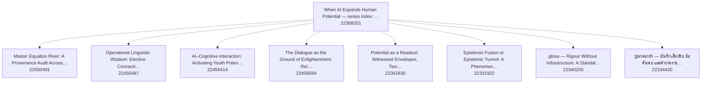

# Knowledge graph — Zenodo library "When AI Expands Human Potential"

Hub record: https://doi.org/10.5281/zenodo.22308201 · built 2026-09-07 from live Zenodo metadata · 8 member records, 57 nodes, 144 edges.

**How to read this (for an AI).** Every node is one Zenodo record (a DOI). Every edge is a relation the author wrote into that record's `related_identifiers` on Zenodo, except edges labelled `(derived)`, which come from Zenodo's own concept ids (two records of the same concept = versions of one work). Nothing here was inferred from paper content. Treat the graph as a readout of the metadata on the build date, not as truth about the papers, and do not read edge counts as importance. To cite a work, use its DOI URL (`@id`); to cite the latest version of a work, follow the `isVersionOf(derived)` edge to its target. Machine files: `aihp_kg.json` (nodes+edges, JSON-LD flavoured), `aihp_kg_edges.jsonl` (one edge per line).

**สำหรับผู้อ่านไทย.** กราฟนี้คือแผนที่ห้องสมุด Zenodo ของ เยาฮารี แหละตี เรื่องมนุษย์–AI: จุด = record หนึ่งชิ้น (DOI), เส้น = ความสัมพันธ์ที่ผู้เขียนใส่ไว้ใน metadata ของ Zenodo เอง (ต่อจาก / อ้างถึง / เป็นส่วนหนึ่งของ) ไม่ได้เดาจากเนื้อหา อ่านเป็น readout ไม่ใช่ความจริงสุดท้าย

## Relation vocabulary

| relation | meaning | count |
|---|---|---|
| `references` | this work cites the target | 64 |
| `isPartOf` | member → hub or programme index | 31 |
| `reviews` |  | 11 |
| `hasPart` | hub → member (library membership) | 8 |
| `isVersionOf(derived)` | older version → latest version of the same concept (from Zenodo concept id) | 7 |
| `isSupplementedBy` | inverse | 6 |
| `continues` | this work continues the target (reading order: target first) | 4 |
| `cites` |  | 4 |
| `isContinuedBy` | inverse of continues | 3 |
| `isIdenticalTo` |  | 3 |
| `isDerivedFrom` |  | 3 |

## Lineage chains (authored `continues` edges, oldest → newest)

- [Master Equation River: A Provenance Audit Across the Human–A](https://doi.org/10.5281/zenodo.22550491) → [Before Meaning, Before Choice: A Readout-Native Derivation o](https://doi.org/10.5281/zenodo.22424434)
- [Epistemic Fusion or Epistemic Tunnel: A Phenomenology-Anchor](https://doi.org/10.5281/zenodo.22331922) → [CTSA Human-Return Readout: A Session-Boundary Measurement Ar](https://doi.org/10.5281/zenodo.22339909)
- [Violence as a Special Case of Instability in Finite–Memory C](https://doi.org/10.5281/zenodo.18383439) → [Potential as a Readout: Witnessed Envelopes, Two-Layer Agenc](https://doi.org/10.5281/zenodo.22361830) → [Choice Begins Before Choice: Meaning-Shaped Accessibility, L](https://doi.org/10.5281/zenodo.22357788)
- [CAUSAL ETHICS : The Mathematics of Regime Choice and Surviva](https://doi.org/10.5281/zenodo.18444260) → [Potential as a Readout: Witnessed Envelopes, Two-Layer Agenc](https://doi.org/10.5281/zenodo.22361830) → [Choice Begins Before Choice: Meaning-Shaped Accessibility, L](https://doi.org/10.5281/zenodo.22357788)
- [Causal Agency  A Persistence Control Theory of Adaptive Syst](https://doi.org/10.5281/zenodo.18897585) → [Potential as a Readout: Witnessed Envelopes, Two-Layer Agenc](https://doi.org/10.5281/zenodo.22361830) → [Choice Begins Before Choice: Meaning-Shaped Accessibility, L](https://doi.org/10.5281/zenodo.22357788)
- [The Causal Grammar of Structured Coexistence: Conflict, Viol](https://doi.org/10.5281/zenodo.18925131) → [Potential as a Readout: Witnessed Envelopes, Two-Layer Agenc](https://doi.org/10.5281/zenodo.22361830) → [Choice Begins Before Choice: Meaning-Shaped Accessibility, L](https://doi.org/10.5281/zenodo.22357788)

## Member records (newest first)

| date | title | DOI | version-of | out-edges |
|---|---|---|---|---|
| 2026-09-07 | Master Equation River: A Provenance Audit Across the Human–AI Readout Programme (Internal  | [zenodo.22550491](https://doi.org/10.5281/zenodo.22550491) | latest | 19 |
| 2026-09-06 | Operational Linguistic Wisdom: Elective Connectivity and Linguistic Capital Activation in  | [zenodo.22456487](https://doi.org/10.5281/zenodo.22456487) | latest | 9 |
| 2026-09-06 | AI–Cognitive Interaction: Activating Youth Potential through Reflective Dialogue and Lingu | [zenodo.22456414](https://doi.org/10.5281/zenodo.22456414) | latest | 9 |
| 2026-09-06 | The Dialogue as the Ground of Enlightenment: Religious and Cognitive Frameworks for Unders | [zenodo.22456564](https://doi.org/10.5281/zenodo.22456564) | latest | 12 |
| 2026-09-05 | Potential as a Readout: Witnessed Envelopes, Two-Layer Agency, and the Measurement of Pseu | [zenodo.22361830](https://doi.org/10.5281/zenodo.22361830) | latest | 16 |
| 2026-09-05 | Epistemic Fusion or Epistemic Tunnel: A Phenomenology-Anchored, Global-Literature-Constrai | [zenodo.22331922](https://doi.org/10.5281/zenodo.22331922) | latest | 17 |
| 2026-09-05 | glosa — Rigour Without Infrastructure: A Standalone Scholar Methodology for Human–AI Knowl | [zenodo.22340255](https://doi.org/10.5281/zenodo.22340255) | latest | 9 |
| 2026-09-05 | ปูมกล่องดำ — บันทึกเสียงดิบ ข้อค้นพบ และคำถามรายวันของ เยาฮารี แหละตี (Blackbox Log, Yaoha | [zenodo.22334420](https://doi.org/10.5281/zenodo.22334420) | latest | 6 |

## Abstracts (quoted from each record's own Zenodo metadata)

Each block below is copied verbatim from that record's own Zenodo abstract (truncated to 400 characters) — it is the record's own wording, not a glosa claim, and is quoted here only so an AI reading this guide does not have to re-fetch Zenodo. A forbidden word appearing inside one of these blocks (e.g. a record describing what it removed, in its own words) is third-party data under `scripts/check_forbidden_words.sh`'s `[QUOTED-SOURCE]` class, never a glosa-authored overclaim.

**When AI Expands Human Potential — series index: human–AI epistemic fusion, standalone scho** ([zenodo.22308201](https://doi.org/10.5281/zenodo.22308201))

> Quoted from the record's own abstract (verbatim, not a glosa claim):
> Programme index — เมื่อ AI ขยายศักยภาพมนุษย์ — ซีรีส์งานที่ทำให้มนุษย์กับ AI ผลิตความรู้ร่วมกันได้ (ฟิวชันทางญาณวิทยา): Standalone Scholar, glosa, Bounded Knower I–IV + State of Evidence, Written by AI Still True, Readout Condition, Human LoRA และงานที่เกี่ยวข้อง.  A navigation aid listing 22 works by the author in this programme area (a work may appear in several programme indexes). Inclusion i

**Master Equation River: A Provenance Audit Across the Human–AI Readout Programme (Internal ** ([zenodo.22550491](https://doi.org/10.5281/zenodo.22550491))

> Quoted from the record's own abstract (verbatim, not a glosa claim):
> Edition note (v1.5, 2026-09-07).  Every section, equation (1)–(79), table, fix box and reference of v1.4 is unchanged and in order. This edition adds Section 10, "The One Equation Along the Whole Line" (this river read against the programme's root spine, now coded into  Toledo , the programme's equation library, v1.0.0, DOI 10.5281/zenodo.22548770, concept DOI 10.5281/zenodo.22537318), and Appen

**Operational Linguistic Wisdom: Elective Connectivity and Linguistic Capital Activation in ** ([zenodo.22456487](https://doi.org/10.5281/zenodo.22456487))

> Quoted from the record's own abstract (verbatim, not a glosa claim):
> Uplift edition 2026 (this version).  The 2025 paper re-read against the Human–AI Readout Programme's current spine (Master Equation River v1.1, DOI 10.5281/zenodo.22414412; Before Meaning, Before Choice v1.1, DOI 10.5281/zenodo.22424434). Every claim of the original is triaged in Appendix A as kept, reformulated with a stated falsifier, or dropped with a reason; nothing is raised above the origi

**AI–Cognitive Interaction: Activating Youth Potential through Reflective Dialogue and Lingu** ([zenodo.22456414](https://doi.org/10.5281/zenodo.22456414))

> Quoted from the record's own abstract (verbatim, not a glosa claim):
> Uplift edition 2026 (this version).  The 2025 paper re-read against the Human–AI Readout Programme's current spine (Master Equation River v1.1, DOI 10.5281/zenodo.22414412; Before Meaning, Before Choice v1.1, DOI 10.5281/zenodo.22424434). Every claim of the original is triaged in Appendix A as kept, reformulated with a stated falsifier, or dropped with a reason; nothing is raised above the origi

**The Dialogue as the Ground of Enlightenment: Religious and Cognitive Frameworks for Unders** ([zenodo.22456564](https://doi.org/10.5281/zenodo.22456564))

> Quoted from the record's own abstract (verbatim, not a glosa claim):
> Uplift edition 2026 (this version).  The 2025 paper re-read against the Human–AI Readout Programme's current spine (Master Equation River v1.1, DOI 10.5281/zenodo.22414412; Before Meaning, Before Choice v1.1, DOI 10.5281/zenodo.22424434). Every claim of the original is triaged in Appendix A as kept, reformulated with a stated falsifier, or dropped with a reason; nothing is raised above the origi

**Potential as a Readout: Witnessed Envelopes, Two-Layer Agency, and the Measurement of Pseu** ([zenodo.22361830](https://doi.org/10.5281/zenodo.22361830))

> Quoted from the record's own abstract (verbatim, not a glosa claim):
> Status.  K0 final author draft in the series  Society, Justice, Peace &amp; Violence  (index DOI 10.5281/zenodo.22342043) and  When AI Expands Human Potential  (index DOI 10.5281/zenodo.22308201). "Final" names the manuscript state, not validation, publication, or independent certification. Definitions at tier definition, interpretations at Dr; the only executed result is a two-node fixture at f

**Epistemic Fusion or Epistemic Tunnel: A Phenomenology-Anchored, Global-Literature-Constrai** ([zenodo.22331922](https://doi.org/10.5281/zenodo.22331922))

> Quoted from the record's own abstract (verbatim, not a glosa claim):
> Series.  Standalone epistemic note of the Human–AI Readout programme; member of the Zenodo library  When AI Expands Human Potential  (hub DOI 10.5281/zenodo.22308201). Builds on the Bounded Knower sequence I–IV, Experience Is the Human LoRA, The Language Bridge, Operational Linguistic Wisdom, The Dialogue as the Ground of Enlightenment, and the Readout Genesis / Readout Condition base; methodolo

**glosa — Rigour Without Infrastructure: A Standalone Scholar Methodology for Human–AI Knowl** ([zenodo.22340255](https://doi.org/10.5281/zenodo.22340255))

> Quoted from the record's own abstract (verbatim, not a glosa claim):
> v0.1.0 — K0 public working release (v0.2.0: glosa applied to itself — concept paper DOI 10.5281/zenodo.22307841, 48 VERIFIED citation cards, cross-vendor reviewed claim cards; rules 15-17 and gate rule 9 added) — timestamped and citable, NOT peer reviewed, no independent check yet (K1 in glosa requires a cross-vendor I3 check that has not run), tier Dr. Methodology + skill + tools for co-producing…

**ปูมกล่องดำ — บันทึกเสียงดิบ ข้อค้นพบ และคำถามรายวันของ เยาฮารี แหละตี (Blackbox Log, Yaoha** ([zenodo.22334420](https://doi.org/10.5281/zenodo.22334420))

> Quoted from the record's own abstract (verbatim, not a glosa claim):
> ปูมกล่องดำ (Blackbox Log)  — บันทึกเสียงดิบ ข้อค้นพบ และคำถามรายวันของผู้เขียน ตามที่พูดจริง (verbatim) ไม่ผ่านการปรุงและไม่ผ่านการตรวจอิสระ (tier: positional/Dr) บันทึกเพิ่มได้อย่างเดียว ไม่แก้ไม่ลบ; อัปเดตเป็นเวอร์ชันใหม่ของ record เดียวกัน เลนส์ที่ใช้มองปัญหา: Readout Universe — Yaoharee Lahtee. ระบบที่เก็บ: glosa (github.com/morrocwi/glosa). เวอร์ชันนี้: 120 บันทึก ถึง 2026-09-05.   Blackbox

## Referenced records outside the hub (one hop)

- 2025-05-16 · Systemic Repair Capacity Theory: A Blood–Lymph–Neural Architecture of Human Health and Chr · https://doi.org/10.5281/zenodo.20229203 · role=referenced_not_member
- 2025-10-06 · The Language Bridge: Expanding Human Potential in the Age of AI · https://doi.org/10.5281/zenodo.17280546 · role=referenced_not_member
- 2025-10-06 · The Dialogue as the Ground of Enlightenment: Religious and Cognitive Frameworks for Unders · https://doi.org/10.5281/zenodo.22308451 · role=referenced_not_member
- 2025-10-08 · Operational Linguistic Wisdom: Elective Connectivity and Linguistic Capital Activation in  · https://doi.org/10.5281/zenodo.22308446 · role=referenced_not_member
- 2026-01-27 · Violence as a Special Case of Instability in Finite–Memory Causal Systems · https://doi.org/10.5281/zenodo.18383439 · role=referenced_not_member
- 2026-01-31 · CAUSAL ETHICS : The Mathematics of Regime Choice and Survival · https://doi.org/10.5281/zenodo.18444260 · role=referenced_not_member
- 2026-02-28 · Health as Constraint-Admissible Trajectory A Genesis–CMP Aligned Minimal Metaphysics of He · https://doi.org/10.5281/zenodo.18813886 · role=referenced_not_member
- 2026-03-07 · Causal Agency  A Persistence Control Theory of Adaptive Systems · https://doi.org/10.5281/zenodo.18897585 · role=referenced_not_member
- 2026-03-09 · The Causal Grammar of Structured Coexistence: Conflict, Violence, Repair, and Non-Suppress · https://doi.org/10.5281/zenodo.18925131 · role=referenced_not_member
- 2026-03-10 · The Civilization of Knowledge: Who Has the Authority to Interpret the World · https://doi.org/10.5281/zenodo.18943971 · role=referenced_not_member
- 2026-03-25 · When AI Expands Human Potential: Reflective Dissonance, Epistemic Agency, and Constraint · https://doi.org/10.5281/zenodo.19215748 · role=referenced_not_member
- 2026-06-28 · Human Learning as Epistemic Architecture: A Method for Word Mapping, Life-Concept Graphs,  · https://doi.org/10.5281/zenodo.22341297 · role=referenced_not_member
- 2026-07-18 · Experience Is the Human LoRA: A Readout–Retention Theory of Selective Model Change · https://doi.org/10.5281/zenodo.21425420 · role=referenced_not_member
- 2026-07-24 · Readout Genesis Standalone Synthesis: Information Epistemic Foundation, Conditioned Agency · https://doi.org/10.5281/zenodo.21529456 · role=referenced_not_member
- 2026-07-29 · What a Zero Readout Certifies Zero as the failure locus of retained distinction · https://doi.org/10.5281/zenodo.21665100 · role=referenced_not_member
- 2026-08-27 · When Interpretation Hardens: Epistemic Authority, Asymmetric Revisability, and Conflict in · https://doi.org/10.5281/zenodo.22129490 · role=referenced_not_member
- 2026-08-29 · The Standalone Scholar: A Dual-Track Architecture for AI-Native Scholarship · https://doi.org/10.5281/zenodo.22163849 · role=referenced_not_member
- 2026-08-31 · Faqr, Scholarly Authority, and Non-Transferable Responsibility · https://doi.org/10.5281/zenodo.22206607 · role=referenced_not_member
- 2026-08-31 · Written by AI. Still True. Knower Fetishism, Epistemic Pedigree, and the Human Face as a B · https://doi.org/10.5281/zenodo.22301202 · role=referenced_not_member
- 2026-08-31 · The Readout Condition: Distinguishability, Access, and Epistemic Warrant · https://doi.org/10.5281/zenodo.22301318 · role=referenced_not_member
- 2026-09-04 · Readout Universe — Epistemology programme index (Yaoharee Lahtee, 2026) · https://doi.org/10.5281/zenodo.22301459 · role=referenced_not_member
- 2026-09-04 · Readout Universe — Health & mind programme index (Yaoharee Lahtee, 2026) · https://doi.org/10.5281/zenodo.22301465 · role=referenced_not_member
- 2026-09-04 · Readout Universe — Artificial intelligence & knowledge programme index (Yaoharee Lahtee, 2 · https://doi.org/10.5281/zenodo.22301552 · role=referenced_not_member
- 2026-09-04 · Readout Universe — Islam, Muslim society & knowledge authority programme index (Yaoharee L · https://doi.org/10.5281/zenodo.22301554 · role=referenced_not_member
- 2026-09-04 · From Problem to Hypothesis: Dynamic Semantic Mobility, Bounded Knowers, and the Readout-Di · https://doi.org/10.5281/zenodo.22307148 · role=referenced_not_member
- 2026-09-04 · Knowledge Topology and the First Passage to Usable Hypotheses: A Readout Theory of Discove · https://doi.org/10.5281/zenodo.22307561 · role=referenced_not_member
- 2026-09-04 · Before Evidence Can Decide: Candidate-Set Formation, Discovery Routing, and Unconceived Al · https://doi.org/10.5281/zenodo.22307564 · role=referenced_not_member
- 2026-09-04 · The Epistemic Chain Reaction: Human-AI Multiplication from Questions to Readout-Distinguis · https://doi.org/10.5281/zenodo.22308072 · role=referenced_not_member
- 2026-09-05 · ปูมกล่องดำ — บันทึกเสียงดิบ ข้อค้นพบ และคำถามรายวันของ เยาฮารี แหละตี (Blackbox Log, Yaoha · https://doi.org/10.5281/zenodo.22334420 · role=referenced_not_member
- 2026-09-05 · Rigour Without Infrastructure: Three Propositions on Claim-Card Discipline as a Substitute · https://doi.org/10.5281/zenodo.22307841 · role=referenced_not_member
- 2026-09-05 · glosa — Rigour Without Infrastructure: A Standalone Scholar Methodology for Human–AI Knowl · https://doi.org/10.5281/zenodo.22307843 · role=referenced_not_member
- 2026-09-05 · glosa — Rigour Without Infrastructure: A Standalone Scholar Methodology for Human–AI Knowl · https://doi.org/10.5281/zenodo.22310837 · role=referenced_not_member
- 2026-09-05 · Epistemic Fusion or Epistemic Tunnel: A Phenomenology-Anchored, Global-Literature-Constrai · https://doi.org/10.5281/zenodo.22319715 · role=referenced_not_member
- 2026-09-05 · CTSA Human-Return Readout: A Session-Boundary Measurement Architecture for Retained Human  · https://doi.org/10.5281/zenodo.22339909 · role=referenced_not_member
- 2026-09-05 · Knowledge graph of the Zenodo library "When AI Expands Human Potential" — machine-readable · https://doi.org/10.5281/zenodo.22341671 · role=referenced_not_member
- 2026-09-05 · Society, Justice, Peace & Violence — series index: structured coexistence, causal ethics,  · https://doi.org/10.5281/zenodo.22342043 · role=referenced_not_member
- 2026-09-05 · Experience Is Meaning-Giving: A Strong-Form Readout-Retention Theory of Phenomena, Resonan · https://doi.org/10.5281/zenodo.22357744 · role=referenced_not_member
- 2026-09-05 · Choice Begins Before Choice: Meaning-Shaped Accessibility, Live Possibility, and Effective · https://doi.org/10.5281/zenodo.22357788 · role=referenced_not_member
- 2026-09-05 · Meaning Before Naming: A Readout-Retention Architecture of Affective-Semantic Reorganizati · https://doi.org/10.5281/zenodo.22410666 · role=referenced_not_member
- 2026-09-06 · Master Equation River: A Provenance Audit Across the Human–AI Readout Programme (Internal  · https://doi.org/10.5281/zenodo.22414412 · role=referenced_not_member
- 2026-09-06 · Before Meaning, Before Choice: A Readout-Native Derivation of Experience, Live Possibility · https://doi.org/10.5281/zenodo.22424434 · role=referenced_not_member
- 2026-09-06 · After Labour: Human Position in an AI-Robotic World System (full world-system standalone,  · https://doi.org/10.5281/zenodo.22481924 · role=referenced_not_member
- 2026-09-06 · The Human Conversion Imperative: Machine Acceleration, Human Potential, and the Reversibil · https://doi.org/10.5281/zenodo.22481926 · role=referenced_not_member
- 2026-09-06 · How Humans Should Converse with AI: A Problem-First Adaptive Dialogue Conversion Protocol  · https://doi.org/10.5281/zenodo.22481928 · role=referenced_not_member
- 2026-09-06 · From Assistance to Human Capability: A Readout-Genesis Architecture for Proactive AI, Uneq · https://doi.org/10.5281/zenodo.22498047 · role=referenced_not_member
- 2026-09-06 · Master Equation River — Coq formalisation of every equation (v1.0: equations 1–79 of Maste · https://doi.org/10.5281/zenodo.22518450 · role=referenced_not_member
- 2026-09-06 · Written by AI. Still True. — When AI Expands Human Potential: A Systematic Epistemology of · https://doi.org/10.5281/zenodo.22520849 · role=referenced_not_member
- 2026-09-07 · Toledo — Equation Library of the Human–AI Readout Programme (v1.0.0): root registry, 793 c · https://doi.org/10.5281/zenodo.22548770 · role=referenced_not_member

## Traversal recipes

1. **Start from the hub** and follow `hasPart` to enumerate the library.
2. **Reading order for a thread:** pick a member, follow `continues` backwards until no edge remains; read from that root forward.
3. **Latest version only:** drop any node that has an outgoing `isVersionOf(derived)` edge.
4. **Evidence base of a paper:** its `references` targets; for the methodology behind a paper look for the `glosa` software record and the `Blackbox Log` record among them.
5. **Do not infer** authority, quality, or priority from degree; the author's own status line inside each record (K0, not peer reviewed, tiers) is the claim ceiling.

## Mermaid (lineage + hub, latest versions only)

_Built by `scripts/zenodo_library_kg.py` (glosa, CC BY 4.0) on 2026-09-07. Author of all records: Yaoharee Lahtee._
