# Knowledge graph — Zenodo series "Society, Justice, Peace & Violence"

Hub record: https://doi.org/10.5281/zenodo.22342043 · built 2026-09-05 from live Zenodo metadata · 11 member records, 28 nodes, 85 edges.

**How to read this (for an AI).** Every node is one Zenodo record (a DOI). Every edge is a relation the author wrote into that record's `related_identifiers` on Zenodo, except edges labelled `(derived)`, which come from Zenodo's own concept ids (two records of the same concept = versions of one work). Nothing here was inferred from paper content. Treat the graph as a readout of the metadata on the build date, not as truth about the papers, and do not read edge counts as importance. To cite a work, use its DOI URL (`@id`); to cite the latest version of a work, follow the `isVersionOf(derived)` edge to its target. Machine files: `aihp_kg.json` (nodes+edges, JSON-LD flavoured), `aihp_kg_edges.jsonl` (one edge per line).

**สำหรับผู้อ่านไทย.** กราฟนี้คือแผนที่ซีรีส์ Zenodo ของ เยาฮารี แหละตี เรื่องสังคม ความยุติธรรม สันติภาพ ความรุนแรง: จุด = record หนึ่งชิ้น (DOI), เส้น = ความสัมพันธ์ที่ผู้เขียนใส่ไว้ใน metadata ของ Zenodo เอง (ต่อจาก / อ้างถึง / เป็นส่วนหนึ่งของ) ไม่ได้เดาจากเนื้อหา อ่านเป็น readout ไม่ใช่ความจริงสุดท้าย

## Relation vocabulary

| relation | meaning | count |
|---|---|---|
| `references` | this work cites the target | 52 |
| `isPartOf` | member → hub or programme index | 22 |
| `hasPart` | hub → member (library membership) | 11 |

## Lineage chains (authored `continues` edges, oldest → newest)

- (none declared)

## Member records (newest first)

| date | title | DOI | version-of | out-edges |
|---|---|---|---|---|
| 2026-08-27 | When Interpretation Hardens: Epistemic Authority, Asymmetric Revisability, and Conflict in | [zenodo.22129490](https://doi.org/10.5281/zenodo.22129490) | latest | 8 |
| 2026-08-25 | Two Have Sex, One Gets the Bill Reproductive Closure, Asymmetric Observability, and Patria | [zenodo.22099526](https://doi.org/10.5281/zenodo.22099526) | latest | 3 |
| 2026-05-13 | Marginal Hegemony in Thailand: Satire, the Muslim Minority, and the Politics of Power-Lite | [zenodo.20159825](https://doi.org/10.5281/zenodo.20159825) | latest | 6 |
| 2026-04-05 | รอยร้าวเฉลิมฉลอง : การพังทลาย การรื้อถอน และการประกอบสร้างใหม่ ของสังคมและตัวตน | [zenodo.19425809](https://doi.org/10.5281/zenodo.19425809) | latest | 3 |
| 2026-03-20 | From Intercultural Marriage to State Policy: Premature Category Stabilization as a Scale-I | [zenodo.19115417](https://doi.org/10.5281/zenodo.19115417) | latest | 11 |
| 2026-03-10 | The Civilization of Knowledge: Who Has the Authority to Interpret the World | [zenodo.18943971](https://doi.org/10.5281/zenodo.18943971) | latest | 9 |
| 2026-03-09 | The Causal Grammar of Structured Coexistence: Conflict, Violence, Repair, and Non-Suppress | [zenodo.18925131](https://doi.org/10.5281/zenodo.18925131) | latest | 2 |
| 2026-03-07 | Causal Agency  A Persistence Control Theory of Adaptive Systems | [zenodo.18897585](https://doi.org/10.5281/zenodo.18897585) | latest | 3 |
| 2026-01-31 | CAUSAL ETHICS : The Mathematics of Regime Choice and Survival | [zenodo.18444260](https://doi.org/10.5281/zenodo.18444260) | latest | 2 |
| 2026-01-27 | Violence as a Special Case of Instability in Finite–Memory Causal Systems | [zenodo.18383439](https://doi.org/10.5281/zenodo.18383439) | latest | 2 |
| 2025-10-06 | Strong, Warm & Safe Family Ecosystem | [zenodo.17280895](https://doi.org/10.5281/zenodo.17280895) | latest | 3 |

## Referenced records outside the hub (one hop)

- 2025-01-15 · From Ritual Compliance to Predictable Cultural Experience: A Conceptual Framework for Cros · https://doi.org/10.5281/zenodo.18258377 · role=referenced_not_member
- 2026-03-17 · Beyond Halal Labels: Premature Category Stabilization in Muslim-Friendly Tourism · https://doi.org/10.5281/zenodo.19059720 · role=referenced_not_member
- 2026-03-25 · When AI Expands Human Potential: Reflective Dissonance, Epistemic Agency, and Constraint · https://doi.org/10.5281/zenodo.19215748 · role=referenced_not_member
- 2026-07-24 · Readout Genesis Standalone Synthesis: Information Epistemic Foundation, Conditioned Agency · https://doi.org/10.5281/zenodo.21529456 · role=referenced_not_member
- 2026-08-29 · The Standalone Scholar: A Dual-Track Architecture for AI-Native Scholarship · https://doi.org/10.5281/zenodo.22163849 · role=referenced_not_member
- 2026-08-31 · Faqr, Scholarly Authority, and Non-Transferable Responsibility · https://doi.org/10.5281/zenodo.22206607 · role=referenced_not_member
- 2026-08-31 · Written by AI. Still True. Knower Fetishism, Epistemic Pedigree, and the Human Face as a B · https://doi.org/10.5281/zenodo.22301202 · role=referenced_not_member
- 2026-08-31 · The Readout Condition: Distinguishability, Access, and Epistemic Warrant · https://doi.org/10.5281/zenodo.22301318 · role=referenced_not_member
- 2026-09-04 · Readout Universe — Epistemology programme index (Yaoharee Lahtee, 2026) · https://doi.org/10.5281/zenodo.22301459 · role=referenced_not_member
- 2026-09-04 · Readout Universe — Health & mind programme index (Yaoharee Lahtee, 2026) · https://doi.org/10.5281/zenodo.22301465 · role=referenced_not_member
- 2026-09-04 · Readout Universe — Artificial intelligence & knowledge programme index (Yaoharee Lahtee, 2 · https://doi.org/10.5281/zenodo.22301552 · role=referenced_not_member
- 2026-09-04 · Readout Universe — Islam, Muslim society & knowledge authority programme index (Yaoharee L · https://doi.org/10.5281/zenodo.22301554 · role=referenced_not_member
- 2026-09-04 · Readout Universe — Muslim-friendly tourism & service programme index (Yaoharee Lahtee, 202 · https://doi.org/10.5281/zenodo.22301562 · role=referenced_not_member
- 2026-09-04 · Readout Universe — Social enterprise programme index (Yaoharee Lahtee, 2026) · https://doi.org/10.5281/zenodo.22301566 · role=referenced_not_member
- 2026-09-04 · When AI Expands Human Potential — series index: human–AI epistemic fusion, standalone scho · https://doi.org/10.5281/zenodo.22308201 · role=referenced_not_member
- 2026-09-05 · glosa — Rigour Without Infrastructure: A Standalone Scholar Methodology for Human–AI Knowl · https://doi.org/10.5281/zenodo.22307843 · role=referenced_not_member

## Traversal recipes

1. **Start from the hub** and follow `hasPart` to enumerate the library.
2. **Reading order for a thread:** pick a member, follow `continues` backwards until no edge remains; read from that root forward.
3. **Latest version only:** drop any node that has an outgoing `isVersionOf(derived)` edge.
4. **Evidence base of a paper:** its `references` targets; for the methodology behind a paper look for the `glosa` software record and the `Blackbox Log` record among them.
5. **Do not infer** authority, quality, or priority from degree; the author's own status line inside each record (K0, not peer reviewed, tiers) is the claim ceiling.

## Mermaid (lineage + hub, latest versions only)

```mermaid
flowchart TB
  n22342043["Society, Justice, Peace & Violence — series inde…<br/>22342043"]
  n22129490["When Interpretation Hardens: Epistemic Authority…<br/>22129490"]
  n22099526["Two Have Sex, One Gets the Bill Reproductive Clo…<br/>22099526"]
  n20159825["Marginal Hegemony in Thailand: Satire, the Musli…<br/>20159825"]
  n19425809["รอยร้าวเฉลิมฉลอง : การพังทลาย การรื้อถอน และการป…<br/>19425809"]
  n19115417["From Intercultural Marriage to State Policy: Pre…<br/>19115417"]
  n18943971["The Civilization of Knowledge: Who Has the Autho…<br/>18943971"]
  n18925131["The Causal Grammar of Structured Coexistence: Co…<br/>18925131"]
  n18897585["Causal Agency  A Persistence Control Theory of A…<br/>18897585"]
  n18444260["CAUSAL ETHICS : The Mathematics of Regime Choice…<br/>18444260"]
  n18383439["Violence as a Special Case of Instability in Fin…<br/>18383439"]
  n17280895["Strong, Warm & Safe Family Ecosystem…<br/>17280895"]
  n22342043 -.-> n22129490
  n22342043 -.-> n22099526
  n22342043 -.-> n20159825
  n22342043 -.-> n19425809
  n22342043 -.-> n19115417
  n22342043 -.-> n18943971
  n22342043 -.-> n18925131
  n22342043 -.-> n18897585
  n22342043 -.-> n18444260
  n22342043 -.-> n18383439
  n22342043 -.-> n17280895
```

_Built by `scripts/zenodo_library_kg.py` (glosa, CC BY 4.0) on 2026-09-05. Author of all records: Yaoharee Lahtee._
