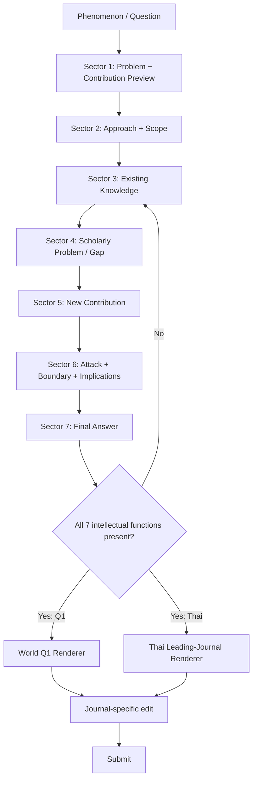

<!--
Title: Q1 World ↔ Thai 7-Sector Scholarly Article Master Schema (glosa-7ssa SCHEMA.md)
Version: v1 — schema doc "Q1 World ↔ Thai 7-Sector Scholarly Article Master Schema"
Tier: Dr (specified; independently unreviewed)
Readout, not truth: this document is a specified structure the founder authored for reuse; it is not itself a checked or independently verified claim about how any journal actually works.
Method direction: founder (Yaoharee Lahtee); main.tex is the founder's source reproduced with two recorded edits; an AI assistant drafted README.md and the P20 insertion only — see README.md "Recorded changes". This file's own content is the founder's, apart from four renamed labels recorded there.
Date registered in glosa: 2026-09-25
-->

# Q1 World ↔ Thai 7-Sector Scholarly Article Master Schema
## Universal Main Schema for Academic / Conceptual / Theoretical Articles

**Version:** 1.0  
**Status:** Standalone operational standard  
**Last updated:** 2026-09-25  
**Primary use:** Design, draft, audit, and adapt a scholarly article for either:
- **Q1 international journals**, or
- **leading Thai academic journals** that accept academic/conceptual/review articles.

**Core architecture:** `7SSA = Seven-Section Scholarly Architecture`

---

# 0. MASTER PRINCIPLE

This schema assumes that the intellectual architecture of a strong scholarly article should remain stable even when the journal format changes.

Therefore:

```text
ONE INTELLECTUAL CORE
        ↓
7-SECTION MASTER SCHEMA
        ↓
┌───────────────────────┬────────────────────────┐
│                       │                        │
Q1 WORLD RENDERER        THAI JOURNAL RENDERER   SPECIALTY RENDERER
│                       │                        │
6–8 visible sections     4–7 visible sections    review/formal/legal/etc.
│                       │                        │
same reasoning core      same reasoning core     same reasoning core
```

The article should **not** be rebuilt from zero for every journal.

Instead:

```text
CORE ARGUMENT = STABLE
VISIBLE SECTION STRUCTURE = ADAPTABLE
```

---

# 1. THE 7-SECTOR MASTER ARCHITECTURE

```text
FRONT MATTER
│
├── Title
├── Abstract / บทคัดย่อ
├── Keywords / คำสำคัญ
└── Author / affiliation / declarations as required

1. INTRODUCTION
   บทนำ
        ↓

2. APPROACH, SCOPE & KNOWLEDGE BASE
   แนวทาง ขอบเขต และฐานความรู้
        ↓

3. EXISTING KNOWLEDGE & THEORETICAL FOUNDATION
   ฐานแนวคิดและองค์ความรู้เดิม
        ↓

4. PROBLEM IN EXISTING KNOWLEDGE
   ปัญหา ช่องว่าง หรือข้อจำกัดขององค์ความรู้เดิม
        ↓

5. NEW CONTRIBUTION
   ข้อเสนอใหม่ของบทความ
        ↓

6. CRITICAL EVALUATION & IMPLICATIONS
   การวิพากษ์ ทดสอบ ข้อจำกัด และนัยสำคัญ
        ↓

7. CONCLUSION
   บทสรุป

REFERENCES
เอกสารอ้างอิง
```

---

# 2. THEORETICAL LOGIC UNDER THE 7 SECTORS

The visible sections correspond to the deeper reasoning chain:

```text
P → M → K0 → G → C → V/I → A
```

Where:

```yaml
P:
  name: Problem
  sector: 1

M:
  name: Method / Scope
  sector: 2

K0:
  name: Existing Knowledge
  sector: 3

G:
  name: Gap / Inadequacy
  sector: 4

C:
  name: Contribution
  sector: 5

V_I:
  name: Validation / Critique / Implications
  sector: 6

A:
  name: Final Answer
  sector: 7
```

Expanded:

```text
REAL PHENOMENON / INTELLECTUAL PROBLEM
        ↓
HOW THIS PAPER WILL REASON
        ↓
WHAT THE FIELD ALREADY KNOWS
        ↓
WHY THAT IS NOT ENOUGH
        ↓
WHAT THIS PAPER ADDS
        ↓
CAN THE NEW CLAIM SURVIVE CRITIQUE?
        ↓
WHAT CHANGES AFTER THIS PAPER?
```

---

# 3. Q1 WORLD SECTOR ↔ THAI SECTOR CROSSWALK

| Master Sector | Q1 World function | Thai leading-journal function | Can merge? |
|---|---|---|---|
| **1. Introduction** | Problem + scholarly conversation + gap + contribution | บทนำ + ความสำคัญ + วัตถุประสงค์/ประเด็นหลัก | Usually keep separate |
| **2. Approach, Scope & Knowledge Base** | Explicit conceptual/review/theory method; scope; corpus | แนวทางและขอบเขตการวิเคราะห์; แหล่งความรู้ | Often merged into Sec. 3 |
| **3. Existing Knowledge & Theoretical Foundation** | Theory positioning; constructs; literature foundations | แนวคิด ทฤษฎี และองค์ความรู้ที่เกี่ยวข้อง | Often merged with Sec. 2 |
| **4. Problem in Existing Knowledge** | Contradiction, inadequacy, missing mechanism, boundary problem | ประเด็นปัญหา ข้อจำกัด ช่องว่าง หรือข้อถกเถียง | Often embedded in analysis |
| **5. New Contribution** | New theory / model / construct / distinction / framework | ข้อเสนอ กรอบแนวคิด การวิเคราะห์ หรือมุมมองใหม่ของผู้เขียน | Must remain intellectually visible |
| **6. Critical Evaluation & Implications** | Objections, alternatives, boundary, limitations, implications | อภิปราย วิพากษ์ ข้อจำกัด ข้อเสนอแนะ และนัยสำคัญ | Often merged with Sec. 5 |
| **7. Conclusion** | What changed theoretically + scope + next work | บทสรุป / ข้อสรุป / ข้อเสนอแนะ | Usually keep separate |

---

# 4. DEFAULT WORLD-Q1 RENDERER

Use this when the target is an international Q1 conceptual/theoretical journal.

```text
TITLE

ABSTRACT
KEYWORDS

1. Introduction

2. Approach and Scope

3. Theoretical / Conceptual Foundations

4. The Unresolved Problem

5. Theory / Framework / New Contribution

6. Critical Evaluation, Boundary Conditions, and Implications

7. Conclusion

References
```

Alternative 8-section form:

```text
1. Introduction
2. Approach and Scope
3. Existing Theory
4. Theoretical Problem
5. New Model
6. Objections / Competing Explanations
7. Implications / Boundary Conditions
8. Conclusion
```

Rule:

```text
Q1_WORLD:
    contribution must be visible as an intellectual object
    objections should be explicit
    boundary conditions should be explicit
    literature positioning should be international
```

---

# 5. DEFAULT THAI-LEADING-JOURNAL RENDERER

Use this when the journal prefers a conventional Thai academic-article structure.

## 5.1 Seven-section Thai version

```text
ชื่อเรื่อง

บทคัดย่อ
คำสำคัญ
Abstract
Keywords

1. บทนำ

2. แนวทางและขอบเขตการวิเคราะห์

3. แนวคิด ทฤษฎี และองค์ความรู้ที่เกี่ยวข้อง

4. ปัญหา ข้อจำกัด หรือช่องว่างขององค์ความรู้เดิม

5. การวิเคราะห์และข้อเสนอใหม่ของผู้เขียน

6. การอภิปราย ข้อโต้แย้ง ข้อจำกัด และนัยสำคัญ

7. บทสรุป

เอกสารอ้างอิง
```

## 5.2 Five-section Thai compressed version

```text
1. บทนำ

2. แนวคิดและกรอบการวิเคราะห์
   = Sector 2 + 3

3. ปัญหาและข้อจำกัดขององค์ความรู้เดิม
   = Sector 4

4. การวิเคราะห์ ข้อเสนอ และการอภิปราย
   = Sector 5 + 6

5. บทสรุป
   = Sector 7
```

## 5.3 Four-section Thai compressed version

```text
1. บทนำ
   = Sector 1

2. แนวคิดและกรอบการวิเคราะห์
   = Sector 2 + 3

3. การวิเคราะห์และข้อเสนอ
   = Sector 4 + 5 + 6

4. บทสรุป
   = Sector 7
```

Invariant:

```text
VISIBLE_SECTIONS MAY MERGE
BUT
INTELLECTUAL_SECTORS MUST NOT DISAPPEAR
```

---

# 6. SECTOR 1 — INTRODUCTION
## บทนำ

### 6.1 Purpose

Sector 1 answers:

```text
What is the problem?
Why does it matter?
What conversation does it belong to?
What is missing?
What does this article argue?
What is the contribution?
```

### 6.2 Q1 World expectations

```yaml
SECTOR_1_Q1:
  phenomenon_or_problem: required
  importance: required
  current_scholarly_conversation: required
  precise_tension_or_gap: required
  central_argument: required
  contribution_statement: required
  roadmap: optional_but_common
```

Typical flow:

```text
Phenomenon
↓
Why important
↓
What existing literature says
↓
What remains unresolved
↓
"We argue..."
↓
"Our contribution is..."
```

### 6.3 Thai leading-journal expectations

Commonly acceptable:

```text
ภูมิหลัง
↓
ความสำคัญของประเด็น
↓
สถานการณ์หรือองค์ความรู้ที่เกี่ยวข้อง
↓
เหตุผลที่ควรวิเคราะห์ประเด็นนี้
↓
วัตถุประสงค์ / ประเด็นหลักของบทความ
```

To raise Thai work toward Q1 intellectual quality, add:

```text
ช่องว่างเชิงแนวคิด
+
ข้อเสนอหลักของผู้เขียน
+
สิ่งที่บทความเพิ่มต่อองค์ความรู้
```

### 6.4 Minimum output

At the end of Sector 1 the reader must be able to state:

```text
THIS PAPER EXISTS BECAUSE ______.

THIS PAPER ARGUES ______.

AFTER THIS PAPER, THE FIELD SHOULD SEE ______ DIFFERENTLY.
```

### 6.5 Fail conditions

```yaml
FAIL_SECTOR_1:
  - generic_background_only
  - "technology_is_important" opening without scholarly problem
  - gap_is_only "few studies exist"
  - no central argument
  - no contribution
  - contribution appears only in conclusion
```

---

# 7. SECTOR 2 — APPROACH, SCOPE & KNOWLEDGE BASE
## แนวทาง ขอบเขต และฐานความรู้

### 7.1 Purpose

This section explains **how the article knows what it claims to know**.

Possible labels:

```text
Approach and Scope
Conceptual Approach
Analytical Framework
Method of Analysis
Method of Synthesis
แนวทางและขอบเขตการวิเคราะห์
กรอบและวิธีการวิเคราะห์
ฐานความรู้และขอบเขตของบทความ
```

### 7.2 Q1 World expectations

Depending on article type:

```yaml
CONCEPTUAL_PAPER:
  conceptual_method: required
  source_scope: recommended
  construct_logic: required

THEORY_PAPER:
  theory_building_logic: required
  assumptions: recommended
  scope: required

PHILOSOPHICAL_PAPER:
  argumentative_method: implicit_or_explicit
  premise_scope: required
  objections_strategy: recommended

REVIEW_PAPER:
  corpus_method: required
  inclusion_logic: required
  synthesis_method: required

LEGAL_PAPER:
  legal_sources: required
  jurisdiction_scope: required
  doctrinal_or_normative_method: required

FORMAL_PAPER:
  definitions: required
  assumptions: required
  formal_system: required
```

### 7.3 Thai leading-journal expectations

Many Thai academic articles do not require a standalone “methodology” heading.

Our standard nevertheless requires the *function* to exist.

Possible compressed paragraph:

```text
บทความนี้ใช้การวิเคราะห์เชิงแนวคิด...
โดยพิจารณาวรรณกรรม...
ภายใต้ขอบเขต...
และใช้แนวคิด X, Y, Z เป็นฐานในการวิเคราะห์...
```

### 7.4 AI disclosure inside Sector 2

If AI materially assists:

```yaml
AI_USE:
  search_query_expansion: disclose_if_required
  literature_mapping: disclose_if_substantive
  translation: disclose_per_journal_policy
  drafting: disclose_per_journal_policy
  code_generation: disclose_if_relevant
  citation_authority: prohibited
  human_verification: mandatory
```

### 7.5 Fail conditions

```yaml
FAIL_SECTOR_2:
  - article_has_no_reconstructible_method
  - sources selected opportunistically with no scope
  - conceptual method undefined
  - AI summaries treated as sources
  - scope unclear
```

---

# 8. SECTOR 3 — EXISTING KNOWLEDGE & THEORETICAL FOUNDATION
## ฐานแนวคิดและองค์ความรู้เดิม

### 8.1 Purpose

Establish:

```text
K0 = state of knowledge before this paper
```

Elements:

```text
key constructs
key theories
dominant explanations
major debates
historical development where relevant
closest prior frameworks
```

### 8.2 Q1 World expectations

Do not organize as:

```text
Author A said...
Author B said...
Author C said...
```

Prefer:

```text
THEORETICAL PROBLEM A
├── Position 1
├── Position 2
└── unresolved issue

THEORETICAL PROBLEM B
├── mechanism 1
├── mechanism 2
└── unresolved issue
```

### 8.3 Thai leading-journal renderer

Thai headings may look like:

```text
3.1 แนวคิด...
3.2 ทฤษฎี...
3.3 พัฒนาการของ...
3.4 งานวิชาการที่เกี่ยวข้อง
```

But internally the logic remains:

```text
WHAT IS KNOWN
→ WHAT IS ASSUMED
→ WHAT REMAINS UNRESOLVED
```

### 8.4 Literature layers

```text
L0 Canonical
L1 Recent international
L2 Thai/local literature
L3 Competing theory
L4 Adjacent discipline
L5 Critical/opposing literature
```

A Thai article should not rely only on Thai-language literature if the topic belongs to an active international conversation.

### 8.5 Fail conditions

```yaml
FAIL_SECTOR_3:
  - literature_dump
  - only_local_sources_for_global_claim
  - ignores_closest_existing_framework
  - no rival literature
  - citations do not support statements
```

---

# 9. SECTOR 4 — PROBLEM IN EXISTING KNOWLEDGE
## ปัญหา ช่องว่าง หรือข้อจำกัดขององค์ความรู้เดิม

### 9.1 Purpose

Sector 4 converts literature into a **scholarly problem**.

Allowed gap types:

```yaml
GAP_TYPES:

  CONCEPTUAL_AMBIGUITY:
    meaning: construct is unclear or overloaded

  CONTRADICTION:
    meaning: literatures make incompatible claims

  MISSING_MECHANISM:
    meaning: relation known but how/why unexplained

  FRAGMENTATION:
    meaning: relevant knowledge exists in disconnected literatures

  BOUNDARY_GAP:
    meaning: applicability conditions unclear

  ASSUMPTION_FAILURE:
    meaning: old theory depends on questionable assumption

  FORMALIZATION_GAP:
    meaning: verbal theory lacks explicit formal structure

  CLASSIFICATION_GAP:
    meaning: field lacks useful taxonomy/typology

  NEW_PHENOMENON:
    meaning: existing theory predates a consequential phenomenon

  LEVEL_OF_ANALYSIS_GAP:
    meaning: individual/group/institutional levels not connected

  NORMATIVE_GAP:
    meaning: action/principle not sufficiently justified
```

### 9.2 Gap formula

```text
K0
+
LIMITATION
+
CONSEQUENCE OF LIMITATION
=
SCHOLARLY PROBLEM
```

Bad:

```text
"Few studies have examined X."
```

Better:

```text
"Existing accounts explain X through A or B,
but both assume C.
When C does not hold, the field lacks an explanation for Y."
```

### 9.3 Thai renderer

Possible headings:

```text
ข้อจำกัดของแนวคิดเดิม
ประเด็นปัญหา
ช่องว่างขององค์ความรู้
ข้อถกเถียงที่ยังไม่มีข้อยุติ
ปัญหาเชิงแนวคิด
```

### 9.4 Fail conditions

```yaml
FAIL_SECTOR_4:
  - artificial_gap
  - gap_based_only_on_number_of_articles
  - ignores_recent_review
  - no consequence if gap remains unresolved
  - gap is actually author's preference
```

---

# 10. SECTOR 5 — NEW CONTRIBUTION
## ข้อเสนอใหม่ของบทความ

### 10.1 Purpose

This is the article's intellectual center.

Possible contribution objects:

```text
New Construct
New Definition
New Distinction
New Mechanism
New Proposition
New Theory
New Framework
New Model
New Taxonomy
New Typology
New Ontology
New Architecture
New Formalization
New Principle
New Interpretation
New Legal Doctrine/Reading
New Research Agenda
```

### 10.2 Q1 World rule

Reviewer should be able to point to Sector 5 and say:

```text
"THIS is what did not exist before this paper."
```

### 10.3 Contribution schema

```yaml
CONTRIBUTION:
  object_name: "..."
  type: "construct/theory/framework/etc."
  problem_solved: "..."
  components: [...]
  relations: [...]
  mechanism: "..."
  assumptions: [...]
  boundary_conditions: [...]
  nearest_existing_object: "..."
  difference_from_nearest: "..."
  theoretical_consequence: "..."
```

### 10.4 Thai renderer

Common headings:

```text
กรอบแนวคิดที่เสนอ
ข้อเสนอของผู้เขียน
การวิเคราะห์เชิงสังเคราะห์
แบบจำลองที่เสนอ
หลักการที่เสนอ
มุมมองใหม่ต่อ...
```

### 10.5 Contribution ladder

```text
LOW:
summary
↓
organization of known ideas
↓
new distinction
↓
new framework
↓
new explanatory mechanism
↓
new theory
↓
formal theory / architecture with derived consequences
HIGH
```

Not every Q1 paper needs the top rung, but simple summary is normally insufficient.

### 10.6 Fail conditions

```yaml
FAIL_SECTOR_5:
  - framework_is_just_a_list
  - new_name_for_old_construct
  - no mechanism where mechanism is claimed
  - contribution cannot be stated in one sentence
  - figure has arrows but no reasoning
```

---

# 11. SECTOR 6 — CRITICAL EVALUATION & IMPLICATIONS
## การวิพากษ์ ทดสอบ ข้อจำกัด และนัยสำคัญ

### 11.1 Purpose

This section answers:

```text
Why should we trust the contribution?
Where could it fail?
What rival explanation exists?
Where does it apply?
What changes if it is accepted?
```

### 11.2 Internal structure

```text
6.1 Strongest objection
6.2 Alternative explanation / rival theory
6.3 Counterexample
6.4 Response / repair
6.5 Boundary conditions
6.6 Limitations
6.7 Theoretical implications
6.8 Methodological implications
6.9 Practical / policy implications where justified
6.10 Future research
```

### 11.3 Q1 World expectation

Explicitly distinguish:

```text
WHAT THE PAPER SHOWS
≠
WHAT THE PAPER SUGGESTS
≠
WHAT FUTURE RESEARCH MUST TEST
```

### 11.4 Thai renderer

Common compressed forms:

```text
อภิปราย
ข้อจำกัด
ข้อเสนอแนะ
นัยสำคัญ
การประยุกต์ใช้
ข้อเสนอสำหรับการศึกษาต่อไป
```

Our standard strengthens the Thai form by requiring:

```text
objection
+
alternative
+
boundary
```

not only “ข้อเสนอแนะ”.

### 11.5 Red-team loop

```text
Contribution_v1
→ strongest objection
→ repair
→ counterexample
→ repair
→ rival framework
→ repair
→ scope test
→ final contribution
```

### 11.6 Fail conditions

```yaml
FAIL_SECTOR_6:
  - only_praises_own_framework
  - no limitations
  - no boundary
  - policy recommendation exceeds evidence
  - practical claim not derived from analysis
```

---

# 12. SECTOR 7 — CONCLUSION
## บทสรุป

### 12.1 Purpose

The conclusion performs four operations:

```text
RETURN TO ORIGINAL PROBLEM
        ↓
ANSWER IT
        ↓
STATE THE INTELLECTUAL CHANGE
        ↓
STATE THE LIMIT / NEXT FRONTIER
```

### 12.2 Before → After test

```yaml
BEFORE_THIS_PAPER:
  field_understood: "..."

AFTER_THIS_PAPER:
  field_can_now:
    - distinguish "..."
    - explain "..."
    - organize "..."
    - question "..."
```

### 12.3 Thai renderer

```text
สรุปประเด็นหลัก
↓
ข้อเสนอหลัก
↓
คุณูปการต่อองค์ความรู้
↓
ขอบเขตของข้อสรุป
↓
ทิศทางต่อไป
```

### 12.4 Fail conditions

```yaml
FAIL_SECTOR_7:
  - repeats_abstract
  - introduces_new_major_argument
  - overclaims
  - no statement of contribution
```

---

# 13. FRONT MATTER SCHEMA

## 13.1 Title

```yaml
TITLE_SHOULD_SIGNAL:
  - phenomenon
  - intellectual_move
  - central_construct_or_framework
  - domain_where_needed
```

Avoid:

```text
"A Study of..."
"Some Thoughts on..."
"AI and Society"
```

Prefer:

```text
[New intellectual object]: [problem or consequence]
```

## 13.2 Abstract

Functional slots:

```text
1. Problem
2. Gap / limitation
3. Approach
4. New contribution
5. Implication
```

## 13.3 Thai abstract

Should not be a long introduction.

```text
ปัญหา
→ แนวทาง
→ ข้อเสนอ
→ คุณูปการ
```

---

# 14. WORLD ↔ THAI LANGUAGE LOGIC

Do not translate only vocabulary.

Translate **rhetorical function**.

| Q1 World phrase/function | Thai scholarly equivalent |
|---|---|
| We argue that... | บทความนี้เสนอว่า... |
| We develop... | บทความนี้พัฒนา... |
| Existing accounts cannot explain... | แนวคิดที่มีอยู่ยังไม่สามารถอธิบาย... |
| We distinguish X from Y | บทความนี้เสนอให้แยก...ออกจาก... |
| Our contribution is threefold | คุณูปการของบทความมีสามประการ... |
| Boundary conditions | เงื่อนไขขอบเขต / เงื่อนไขที่ข้อเสนอใช้ได้ |
| Alternative explanation | คำอธิบายทางเลือก |
| Implications | นัยสำคัญ / ผลเชิงทฤษฎี / ผลต่อการประยุกต์ใช้ |
| Limitations | ข้อจำกัดของข้อเสนอ/บทความ |
| Future research | ประเด็นสำหรับการศึกษาต่อไป |

---

# 15. ARTICLE-TYPE RENDERERS

The 7 sectors stay fixed internally; visible headings change by article type.

---

## 15.1 CONCEPTUAL PAPER

```text
1 Introduction
2 Conceptual Approach and Scope
3 Existing Concepts / Theories
4 Conceptual Problem
5 New Construct / Framework
6 Evaluation, Boundaries, Implications
7 Conclusion
```

---

## 15.2 THEORY PAPER

```text
1 Introduction
2 Scope and Theory-Building Approach
3 Theoretical Foundations
4 Theoretical Inadequacy
5 Theory Development + Propositions
6 Rival Theories + Boundaries + Implications
7 Conclusion
```

---

## 15.3 PHILOSOPHICAL ARTICLE

```text
1 Introduction
2 Analytical Scope / Definitions
3 Existing Positions
4 Philosophical Problem
5 Main Argument
6 Objections and Replies
7 Conclusion
```

Sector 6 becomes especially important.

---

## 15.4 LEGAL ACADEMIC ARTICLE

```text
1 Introduction
2 Jurisdiction / Sources / Analytical Approach
3 Existing Law / Doctrine
4 Doctrinal or Normative Problem
5 Proposed Interpretation / Principle
6 Counterauthority / Consequences / Limits
7 Conclusion
```

---

## 15.5 INTEGRATIVE REVIEW

```text
1 Introduction
2 Review Approach / Corpus
3 State of Knowledge
4 Contradictions / Fragmentation
5 New Synthesis / Framework
6 Evaluation / Research Agenda
7 Conclusion
```

---

## 15.6 FORMAL / MATHEMATICAL CONCEPTUAL PAPER

```text
1 Introduction
2 Scope + Formal Language
3 Existing Formal/Theoretical Basis
4 Formal Problem
5 Definitions + Axioms + Model + Derivation
6 Consistency / Countermodel / Interpretation / Limits
7 Conclusion
```

---

## 15.7 COMPUTER SCIENCE SoK / SURVEY

```text
1 Introduction
2 Scope + Search / Selection Logic
3 Existing Technical Landscape
4 Fragmentation / Terminology Problem
5 Taxonomy / SoK / Architecture
6 Comparative Evaluation + Open Problems
7 Conclusion
```

---

## 15.8 POLICY / GOVERNANCE CONCEPTUAL ARTICLE

```text
1 Introduction
2 Analytical Scope
3 Existing Governance Approaches
4 Governance Failure / Institutional Problem
5 Proposed Governance Framework
6 Trade-offs / Feasibility / Boundary / Implications
7 Conclusion
```

---

# 16. THAI JOURNAL COMPRESSION RULES

## Rule A — Never delete contribution

Even if the journal prefers 4 sections:

```text
Sector 5 must remain intellectually identifiable.
```

## Rule B — Method can be embedded

Sector 2 may become 1–3 paragraphs inside:

```text
แนวคิดและกรอบการวิเคราะห์
```

## Rule C — Sector 4 may be embedded

Thai prose may transition:

```text
จากการทบทวนแนวคิดข้างต้น พบข้อจำกัดสำคัญสามประการ...
```

This is acceptable if the gap remains explicit.

## Rule D — Sector 6 may be distributed

Objections, limitations, and implications may appear inside:

```text
การอภิปราย
```

But all functions must remain.

---

# 17. Q1 WORLD EXPANSION RULES

When moving a Thai article toward international Q1:

```text
DO NOT simply translate Thai → English.
```

Expand:

```yaml
EXPAND_FOR_Q1:
  international_conversation: required
  closest_competing_theory: required
  prior_work_collision_test: required
  contribution_statement: sharpen
  objections: explicit
  boundary_conditions: explicit
  methodology_of_conceptual_work: explicit
  international_implications: required
```

Often:

```text
Thai Sector 3
→ split into Q1 Sector 3 + 4

Thai Sector 4
→ split into Q1 Sector 5 + 6
```

---

# 18. Q1 WORLD ↔ THAI TWO-WAY RENDERER

```pseudocode
FUNCTION RENDER_7SSA(master_article, target):

    ASSERT master_article.has_all_7_intellectual_sectors

    IF target.type == "Q1_WORLD":
        KEEP sector_1
        KEEP sector_2
        KEEP sector_3
        KEEP sector_4
        KEEP sector_5
        KEEP sector_6
        KEEP sector_7

        EXPAND international_literature
        EXPAND rival_theory
        EXPAND boundary_conditions
        EXPAND explicit_contribution

    IF target.type == "THAI_LEADING_7":
        TRANSLATE rhetorical_functions_to_thai
        KEEP all_7_visible

    IF target.type == "THAI_LEADING_5":
        MERGE sector_2 + sector_3
        KEEP sector_4
        MERGE sector_5 + sector_6

    IF target.type == "THAI_LEADING_4":
        MERGE sector_2 + sector_3
        MERGE sector_4 + sector_5 + sector_6

    ASSERT contribution_not_lost
    ASSERT gap_not_lost
    ASSERT method_not_lost
    ASSERT limitations_not_lost

    RETURN journal_specific_manuscript
```

---

# 19. MASTER YAML SCHEMA

```yaml
SCHOLARLY_ARTICLE:

  metadata:
    title: ""
    language: "th|en"
    article_type: ""
    target_journal: ""
    target_system: "Q1_WORLD|THAI_LEADING"
    date_target_verified: ""

  sector_1_introduction:
    phenomenon: ""
    importance: ""
    scholarly_conversation: ""
    gap_preview: ""
    central_argument: ""
    contributions:
      - ""
    roadmap: ""

  sector_2_approach_scope:
    methodology: ""
    source_base: ""
    inclusion_logic: ""
    exclusions: ""
    scope:
      population_or_domain: ""
      geography: ""
      time: ""
    ai_use: ""
    limitations_of_approach: ""

  sector_3_existing_knowledge:
    constructs:
      - ""
    theories:
      - ""
    debates:
      - ""
    canonical_sources:
      - ""
    recent_sources:
      - ""
    competing_literatures:
      - ""

  sector_4_problem:
    gap_type: ""
    unresolved_problem: ""
    why_existing_knowledge_fails: ""
    consequence_if_unresolved: ""
    strongest_prior_attempt: ""

  sector_5_contribution:
    contribution_type: ""
    name: ""
    definition: ""
    components:
      - ""
    relationships:
      - ""
    mechanism: ""
    propositions:
      - ""
    nearest_prior_framework: ""
    difference_from_prior: ""

  sector_6_critical_evaluation:
    strongest_objection: ""
    alternative_explanation: ""
    counterexample: ""
    response: ""
    boundary_conditions:
      - ""
    limitations:
      - ""
    theoretical_implications:
      - ""
    practical_implications:
      - ""
    future_research:
      - ""

  sector_7_conclusion:
    answer_to_problem: ""
    before_state: ""
    after_state: ""
    contribution_restatement: ""
    non_claims:
      - ""
    next_frontier: ""

  integrity:
    all_claims_traceable: false
    citations_verified: false
    ai_disclosed_if_required: false
    q1_or_thai_journal_fit_verified: false
```

---

# 20. MASTER DAG FOR ARTICLE CREATION



---

# 21. SECTION DEPENDENCY DAG

```text
Sector 1
requires preview of S4 + S5

Sector 2
controls epistemic legitimacy of S3–S6

Sector 3
must justify S4

Sector 4
must make S5 necessary

Sector 5
must answer S4

Sector 6
must attack and delimit S5

Sector 7
must answer S1 using results of S5–S6
```

Formal dependency:

```text
S3 → S4 → S5 → S6
↑             ↓
S2            S7
↑             ↑
└──── S1 ─────┘
```

---

# 22. WRITING ORDER ≠ READING ORDER

Recommended authoring sequence:

```text
WRITE:
5 → 4 → 3 → 6 → 2 → 1 → 7
```

Why:

```text
5 Contribution
defines
4 Problem
which determines
3 Literature
then
6 stress-tests contribution
2 documents approach
1 introduces the completed logic
7 closes it
```

Reading order remains:

```text
1 → 2 → 3 → 4 → 5 → 6 → 7
```

---

# 23. CONTRIBUTION-FIRST BUILD PROTOCOL

```pseudocode
STEP 1:
    WRITE one_sentence_contribution

STEP 2:
    IDENTIFY scholarly_problem contribution solves

STEP 3:
    FIND closest_prior_work

STEP 4:
    TEST whether contribution already exists

STEP 5:
    BUILD literature foundation only after the gap survives the prior-work collision test

STEP 6:
    DEFINE methodology and scope

STEP 7:
    DEVELOP full contribution

STEP 8:
    ATTACK contribution

STEP 9:
    WRITE introduction and conclusion last
```

---

# 24. QUALITY GATES BY SECTOR

```yaml
GATE_1:
  sector: Introduction
  pass_if:
    - problem_is_clear
    - contribution_is_previewed
    - importance_is_field_relevant

GATE_2:
  sector: Approach
  pass_if:
    - method_matches_claim
    - scope_reconstructible
    - source_logic_visible

GATE_3:
  sector: Existing Knowledge
  pass_if:
    - canonical_work_covered
    - recent_work_covered
    - rival_literature_covered

GATE_4:
  sector: Problem
  pass_if:
    - gap_nontrivial
    - gap_documented
    - consequence_clear

GATE_5:
  sector: Contribution
  pass_if:
    - contribution_new
    - contribution_named
    - relation_to_prior_clear

GATE_6:
  sector: Critical Evaluation
  pass_if:
    - objection_present
    - boundary_present
    - limitations_present
    - implications_not_overclaimed

GATE_7:
  sector: Conclusion
  pass_if:
    - answers_original_problem
    - states_before_after_change
    - does_not_overclaim
```

---

# 25. THAI LEADING-JOURNAL QUALITY GATE

A Thai-format academic article should pass all of these:

```text
[ ] มีบทนำที่ตั้งปัญหาชัด
[ ] มีฐานวรรณกรรมไทยและสากลตามความเหมาะสม
[ ] มีวิธีการ/แนวทางวิเคราะห์ แม้ไม่ตั้งหัวข้อ Methodology
[ ] มีช่องว่างหรือปัญหาขององค์ความรู้เดิม
[ ] มีข้อเสนอใหม่ของผู้เขียน
[ ] มีการวิเคราะห์ ไม่ใช่เรียบเรียงอย่างเดียว
[ ] มีข้อโต้แย้งหรือข้อจำกัด
[ ] มีนัยสำคัญต่อองค์ความรู้
[ ] มีบทสรุปที่ตอบปัญหา
[ ] เอกสารอ้างอิงตรวจสอบได้
```

---

# 26. Q1 WORLD QUALITY GATE

```text
[ ] Current target journal is Q1
[ ] Article type is explicitly accepted
[ ] Problem matters to target readership
[ ] International scholarly conversation is current
[ ] Gap survives prior-work collision test
[ ] Contribution is non-trivial
[ ] Method–claim fit is defensible
[ ] Closest competing framework is addressed
[ ] Strong objection is addressed
[ ] Boundary conditions are explicit
[ ] Citations support exact wording
[ ] AI use complies with current journal policy
[ ] Manuscript is adapted to target journal's recent signature
```

---

# 27. GLOBAL ↔ THAI EQUIVALENCE RULE

A Thai journal version should not be treated as intellectually inferior by default.

Target:

```text
SAME CORE RIGOR
DIFFERENT RHETORICAL PACKAGING
```

Meaning:

```text
Thai article:
    may compress sections
    may use Thai scholarly conventions
    may emphasize Thai/local implications

Q1 article:
    may expand international conversation
    may separate theory/gap/objection sections
    may demand broader positioning
```

But both should retain:

```text
problem
method
knowledge base
gap
contribution
critique
conclusion
```

---

# 28. LOCAL KNOWLEDGE → GLOBAL SCHOLARSHIP BRIDGE

Use this bridge when the starting point is Thai/local/professional knowledge:

```text
LOCAL PHENOMENON
        ↓
DOCUMENT WHAT IS ACTUALLY OBSERVED
        ↓
IDENTIFY GENERAL INTELLECTUAL PROBLEM
        ↓
CONNECT TO INTERNATIONAL LITERATURE
        ↓
DISTINGUISH LOCAL SPECIFICITY FROM GENERAL MECHANISM
        ↓
FORM CONTRIBUTION
        ↓
THAI OR Q1 RENDERER
```

Never infer:

```text
"observed in Thailand"
→
"universally true"
```

without adequate warrant.

---

# 29. AI-ASSISTED 7-SECTOR WORKFLOW

```text
Sector 1
AI: problem variants / conversation mapping
Human: chooses actual problem

Sector 2
AI: methodology options / scope checklist
Human: defines legitimate method

Sector 3
AI: literature map / clustering
Human: verifies sources and interpretations

Sector 4
AI: candidate gaps / contradictions
Human: decides whether gap is real

Sector 5
AI: candidate models / theories / formulations
Human: owns final contribution

Sector 6
AI: red team / objections / counterexamples
Human: repairs and decides scope

Sector 7
AI: compression / clarity
Human: approves final claim
```

Invariant:

```text
AI CAN HELP IN ALL 7 SECTORS
BUT AI HAS FINAL AUTHORITY IN NONE
```

---

# 30. CLAIM–SECTOR TRACEABILITY

Every major manuscript claim should map to a sector:

```yaml
claim:
  id: C001
  text: "..."
  sector: 3|4|5|6
  type: literature|interpretive|theoretical|normative
  evidence:
    - source_or_argument
  human_verified: true
```

Special rule:

```text
Sector 5 claims may be AUTHOR-GENERATED
but must be supported by reasoning from S3–S4
and survive S6.
```

---

# 31. ARTICLE AUDIT TABLE

| Audit question | Sector |
|---|---|
| Why does this article exist? | 1 |
| How does it reason / what sources does it use? | 2 |
| What is already known? | 3 |
| What exactly is wrong or missing? | 4 |
| What is new here? | 5 |
| Why should we believe/use it, and where does it fail? | 6 |
| What changed by the end? | 7 |

If any answer is missing, the manuscript is structurally incomplete.

---

# 32. STANDARD FILE/FOLDER SCHEMA

```text
article_project/
│
├── 00_schema/
│   └── q1_world_thai_7sector_master_schema.md
│
├── 01_sector_intro/
│   ├── problem.md
│   ├── contribution_preview.md
│   └── roadmap.md
│
├── 02_sector_approach/
│   ├── method.md
│   ├── scope.md
│   ├── source_logic.md
│   └── ai_use.md
│
├── 03_sector_knowledge/
│   ├── literature_map.md
│   ├── constructs.yaml
│   └── theories.csv
│
├── 04_sector_problem/
│   ├── gap.md
│   ├── contradictions.md
│   └── closest_prior_solution.md
│
├── 05_sector_contribution/
│   ├── contribution.md
│   ├── model.mmd
│   ├── definitions.md
│   └── propositions.md
│
├── 06_sector_critique/
│   ├── objections.md
│   ├── alternatives.md
│   ├── boundaries.md
│   ├── limitations.md
│   └── implications.md
│
├── 07_sector_conclusion/
│   ├── before_after.md
│   └── conclusion.md
│
├── references/
│   ├── sources.bib
│   └── claim_evidence.csv
│
├── render/
│   ├── q1_world/
│   └── thai/
│
└── submission/
    ├── target_journal.yaml
    └── checklist.md
```

---

# 33. MASTER STATUS MODEL

```yaml
ARTICLE_STATUS:

  S1_INTRODUCTION:
    status: HOLD|DRAFT|VERIFIED

  S2_APPROACH:
    status: HOLD|DRAFT|VERIFIED

  S3_EXISTING_KNOWLEDGE:
    status: HOLD|DRAFT|VERIFIED

  S4_PROBLEM:
    status: HOLD|DRAFT|VERIFIED

  S5_CONTRIBUTION:
    status: HOLD|DRAFT|VERIFIED

  S6_CRITICAL_EVALUATION:
    status: HOLD|DRAFT|VERIFIED

  S7_CONCLUSION:
    status: HOLD|DRAFT|VERIFIED

  RENDER:
    q1_world: HOLD|READY
    thai: HOLD|READY
```

Submission requires:

```text
ALL S1–S7 = VERIFIED
```

---

# 34. PSEUDOCODE — BUILD ARTICLE FROM ZERO

```pseudocode
FUNCTION BUILD_7SSA_ARTICLE(topic):

    # Contribution-first design
    contribution_candidate = PROPOSE_CONTRIBUTION(topic)

    prior = FIND_CLOSEST_PRIOR_WORK(contribution_candidate)

    IF SAME_AS_PRIOR(contribution_candidate, prior):
        REFRAME()

    # Sector 4 before Sector 3
    S4 = DEFINE_EXACT_PROBLEM(prior, contribution_candidate)

    # Sector 3 now becomes targeted
    S3 = BUILD_EXISTING_KNOWLEDGE(
        only_what_is_needed_to_establish=S4
    )

    # Sector 5
    S5 = BUILD_NEW_CONTRIBUTION(S4)

    # Sector 6
    S6 = RED_TEAM(S5)

    IF S6.fatal_objection:
        REPAIR(S5)
        REPEAT S6

    # Sector 2
    S2 = DOCUMENT_APPROACH_SCOPE_AND_KNOWLEDGE_BASE(
        sources=S3.sources,
        reasoning_method=S5.method
    )

    # Sector 1
    S1 = WRITE_INTRODUCTION(
        problem=S4,
        contribution=S5,
        importance=FIELD_RELEVANCE
    )

    # Sector 7
    S7 = WRITE_CONCLUSION(
        original_problem=S4,
        answer=S5,
        limits=S6
    )

    MASTER = ASSEMBLE(S1,S2,S3,S4,S5,S6,S7)

    ASSERT all_sectors_functionally_complete

    RETURN MASTER
```

---

# 35. PSEUDOCODE — RENDER FOR THAI LEADING JOURNAL

```pseudocode
FUNCTION RENDER_THAI(master, journal):

    VERIFY journal.accepts_academic_article

    structure = journal.required_structure

    IF structure == 7:
        MAP 1:1

    ELSE IF structure == 5:
        MERGE S2+S3
        MERGE S5+S6

    ELSE IF structure == 4:
        MERGE S2+S3
        MERGE S4+S5+S6

    ELSE:
        CUSTOM_MAP_WITHOUT_DELETING_FUNCTIONS()

    ADAPT:
        terminology_to_thai_academic_register
        examples_to_relevant_context
        references_to_journal_style

    KEEP:
        international_literature
        explicit_gap
        explicit_contribution
        limitations

    RETURN thai_manuscript
```

---

# 36. PSEUDOCODE — RENDER FOR WORLD Q1

```pseudocode
FUNCTION RENDER_Q1(master, journal):

    VERIFY current_Q1(journal)
    VERIFY article_type(journal)
    VERIFY general_submission(journal)
    VERIFY current_AI_policy(journal)

    EXPAND:
        international_positioning
        competing_theories
        contribution_precision
        objections
        boundary_conditions

    ANALYZE 20_to_40_recent_articles(journal)

    ADAPT:
        section_names
        word_budget
        rhetoric
        figure_style
        abstract_style

    RUN:
        prior_work_collision
        source_audit
        desk_reject_simulation
        adversarial_review

    RETURN q1_manuscript
```

---

# 37. WORD-BUDGET HEURISTIC

Not a journal rule; use only for drafting.

For a 7,000-word conceptual paper:

```yaml
WORD_BUDGET:
  sector_1: 900
  sector_2: 500
  sector_3: 1400
  sector_4: 900
  sector_5: 1700
  sector_6: 1100
  sector_7: 500
```

Percentage:

```text
S1  ~13%
S2  ~7%
S3  ~20%
S4  ~13%
S5  ~24%
S6  ~16%
S7  ~7%
```

Core principle:

```text
S4 + S5 + S6
should normally occupy the intellectual center of gravity.
```

---

# 38. CONTRIBUTION DENSITY RULE

```text
Contribution Density
=
Useful New Intellectual Work
/
Total Manuscript Complexity
```

High word count is not rigor.

Delete text that does not help:

```text
define
position
problemize
derive
defend
delimit
implicate
conclude
```

---

# 39. WHAT THIS SCHEMA IS NOT

Not:

```text
IMRAD for empirical research
```

Not:

```text
a thesis chapter template
```

Not:

```text
a rule that every journal must print exactly seven headings
```

It is:

```text
a seven-function intellectual architecture
```

The visible article may have:

```text
4 headings
5 headings
7 headings
8 headings
```

and still comply, provided all seven functions exist.

---

# 40. MASTER INVARIANTS

```text
INVARIANT 1
Every article starts with a real intellectual problem.

INVARIANT 2
Every important claim has an identifiable warrant.

INVARIANT 3
Existing knowledge is used to construct a problem,
not merely to demonstrate reading volume.

INVARIANT 4
A scholarly gap must have consequences.

INVARIANT 5
The new contribution must be explicitly identifiable.

INVARIANT 6
The contribution must face objection, alternative, or boundary analysis.

INVARIANT 7
The conclusion must state what changed.

INVARIANT 8
Thai-format compression may merge sections,
but may not delete intellectual functions.

INVARIANT 9
Q1 expansion must add international positioning,
not merely English translation.

INVARIANT 10
AI assistance never replaces human epistemic responsibility.
```

---

# 41. ONE-PAGE MASTER VIEW

```text
┌──────────────────────────────────────────────────────────────┐
│ FRONT MATTER                                                 │
│ Title • Abstract • Keywords                                 │
└──────────────────────────────────────────────────────────────┘

┌──────────────────────────────────────────────────────────────┐
│ S1 INTRODUCTION                                              │
│ Problem • Importance • Conversation • Argument • Contribution│
└──────────────────────────────────────────────────────────────┘
                           ↓
┌──────────────────────────────────────────────────────────────┐
│ S2 APPROACH / SCOPE                                          │
│ Method • Corpus • Boundaries • Knowledge Base • AI use       │
└──────────────────────────────────────────────────────────────┘
                           ↓
┌──────────────────────────────────────────────────────────────┐
│ S3 EXISTING KNOWLEDGE                                        │
│ Constructs • Theories • Debates • Current Knowledge          │
└──────────────────────────────────────────────────────────────┘
                           ↓
┌──────────────────────────────────────────────────────────────┐
│ S4 PROBLEM IN KNOWLEDGE                                      │
│ Gap • Contradiction • Missing mechanism • Failure            │
└──────────────────────────────────────────────────────────────┘
                           ↓
┌──────────────────────────────────────────────────────────────┐
│ S5 NEW CONTRIBUTION                                          │
│ Construct • Theory • Framework • Mechanism • Model           │
└──────────────────────────────────────────────────────────────┘
                           ↓
┌──────────────────────────────────────────────────────────────┐
│ S6 CRITICAL EVALUATION                                       │
│ Objection • Alternative • Boundary • Limitation • Implication│
└──────────────────────────────────────────────────────────────┘
                           ↓
┌──────────────────────────────────────────────────────────────┐
│ S7 CONCLUSION                                                │
│ Answer • Before→After • Contribution • Limit • Next frontier │
└──────────────────────────────────────────────────────────────┘
                           ↓
                ┌────────────────────┐
                │    RENDERER        │
                └────────────────────┘
                  ↙                ↘
        Q1 WORLD 6–8             THAI 4–7
        visible sections         visible sections
```

---

# 42. FINAL SCHEMA NAME

Canonical name:

> **Q1 World–Thai Seven-Sector Scholarly Article Schema (7SSA)**

Short name:

> **7SSA**

Thai name:

> **กรอบสถาปัตยกรรมบทความวิชาการ 7 ส่วน สำหรับวารสาร Q1 และวารสารไทยชั้นนำ**

Canonical formula:

```text
7SSA =
Problem
+ Method/Scope
+ Existing Knowledge
+ Knowledge Problem
+ New Contribution
+ Critical Evaluation
+ Conclusion
```

Or:

```text
7SSA = P + M + K0 + G + C + V/I + A
```

---

# 43. FINAL STANDARD

A manuscript is structurally ready only if it can answer all seven questions:

```text
1. เรากำลังแก้ปัญหาอะไร?
2. เราใช้แนวทางใดและขอบเขตอะไร?
3. วงการรู้อะไรอยู่แล้ว?
4. ความรู้เดิมมีปัญหาตรงไหน?
5. เราเพิ่มอะไรใหม่?
6. ข้อเสนอใหม่นี้รอดจากการวิพากษ์แค่ไหน และมีผลอะไร?
7. สุดท้ายความเข้าใจเปลี่ยนไปอย่างไร?
```

If all seven are strong, the article can then be rendered into the visible structure required by a leading Thai journal or an international Q1 journal without rebuilding its intellectual core.

---

**END — Q1 World ↔ Thai 7SSA Master Schema v1.0**
